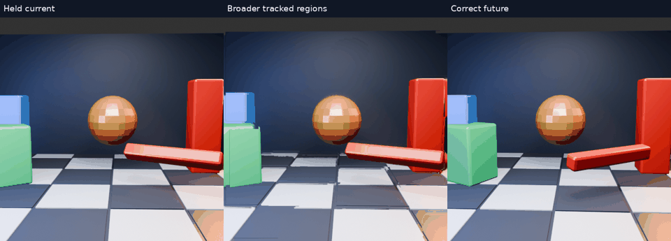
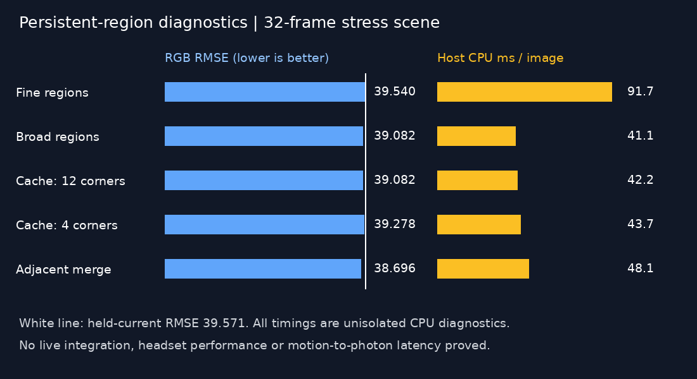

# Persistent image-only region tracking

This extends the [layer experiments](../motion-layers/README.md): keep region identities across images, wait for repeated observations, and move each accepted mask using one translation. The objective is fewer broken shapes and less unstable motion—not merely a lower pixel-error score.

## Setup and important differences

All methods are CPU diagnostics on the same 512×512 stress scene. Unlike the earlier two-image fits, these methods consume **every preceding 60 Hz frame**. After two warm-up frames, 32 predictions target two source intervals ahead (33.33 ms). Future pixels enter only scoring. The videos run at 15 fps, four times slower than their source. RGB RMSE covers the central 384×384 area; held-current mean is 39.5706 in this sRGB-only pipeline.

Disjoint hue components receive persistent IDs through scored one-to-one assignment. Matching uses circular hue distance, predicted centroid, area and covariance size. Velocity is smoothed; a track needs three observations before exposing nonzero motion. The renderer selects confidence ≥0.5 and predicted displacement between 1 and 80 pixels. This confidence is a heuristic score, not a calibrated probability. Lost tracks are discarded. Translation preserves each mask's source shape but cannot recover rotation, newly exposed faces, or a wrongly segmented silhouette.

## Animations

- [Fine colour segmentation](tracked/comparison.mp4) · [GIF](tracked/comparison.gif) · [scores](tracked/scores.json)
- [Broader regions](tracked-coarse/comparison.mp4) · [GIF](tracked-coarse/comparison.gif) · [scores](tracked-coarse/scores.json)
- [Initial background cache](tracked-history/comparison.mp4) · [GIF](tracked-history/comparison.gif) · [scores](tracked-history/scores.json)
- [Background cache with fewer required corners](tracked-history-v2/comparison.mp4) · [GIF](tracked-history-v2/comparison.gif) · [scores](tracked-history-v2/scores.json)
- [Adjacent-region merging](tracked-merged/comparison.mp4) · [GIF](tracked-merged/comparison.gif) · [scores](tracked-merged/scores.json)

Fine segmentation uses 24 hue bins and a 24-pixel component minimum. The broader version uses eight bins and a 180-pixel minimum, reducing fragmented surfaces and work. These are coupled parameter changes, so the difference is not an isolated hue-bin ablation.

The optional merge only joins masks sharing at least three 4-neighbour boundary contacts, with close circular hue and mean RGB. Area and bounding-box occupancy gates limit merging. It remains a colour heuristic and can merge separate touching objects or leave one object split.

## Background reuse: an actual activation check

The cache excludes dilated region masks, estimates a camera-like similarity transform from background corners, aligns old RGB/validity data, and updates visible background pixels. Invalid alignment discards history. When a moved region uncovers its old position, known cached pixels are used first; the remainder receives CPU inpainting.

The initial requirement of 12 tracked corners never activated reuse in this scene: **zero history pixels**, with output identical to the broader-region control. Inspection found only five eligible corners in the first frame. The revised minimum of four reused **26,612 pixels summed over 32 predictions**, but worsened mean RMSE from 39.0822 to 39.2782. Relaxing a safety gate activates a feature; it does not establish a quality improvement. The cache uses one planar-like mapping and cannot account for general parallax or newly revealed surfaces.

## Findings and limits

Smaller fragment counts reduce visible damage and CPU work, but exposed-background smears and incorrect object motion remain. Translation-only prediction leaves the rapidly rotating bar at an old orientation. Tests cover basic identity continuity, disappearance, disjoint masks, hue wrap and optional merging. They do not certify perceptual jitter, final straight-edge quality or general object tracking.

The timing table below describes one unisolated host CPU run per variant, including image loading, tracking and composition, excluding future loading/scoring and video generation. It is not a GPU benchmark, throughput claim, Pico measurement or motion-to-photon latency. **No method here is deployed.**

Scripts require NumPy, Pillow, OpenCV and ffmpeg. They retain the original sibling `nx-scratch/motion-regions` and `motion-scene` paths; adjust for another checkout. Source animation is the [earlier scene generator](../motion-scene/scene.py). All five variants are preserved, including the inactive cache experiment.

## Recorded results

| Variant | Mean RGB RMSE | Mean CPU ms | Moving regions | Better than held frames |
|---|---:|---:|---:|---:|
| tracked | 39.5403 | 91.75 | 17.72 | 17/32 |
| tracked-coarse | 39.0822 | 41.12 | 5.94 | 16/32 |
| tracked-history | 39.0822 | 42.17 | 5.94 | 16/32 |
| tracked-history-v2 | 39.2782 | 43.73 | 5.94 | 15/32 |
| tracked-merged | 38.6965 | 48.10 | 6.00 | 17/32 |
