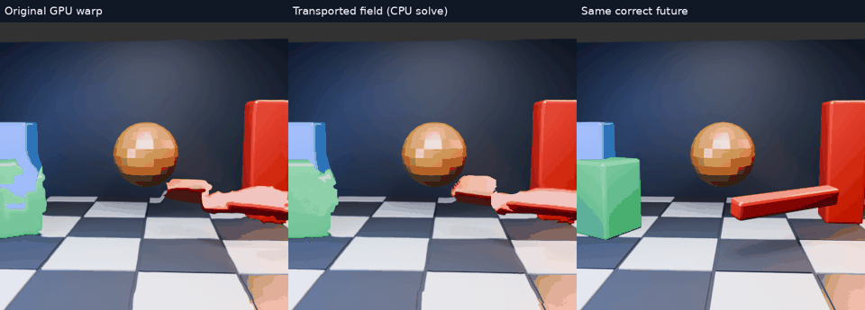

# Transporting the field: more position progress, new tearing

[Transport animation](transport/comparison.mp4) · [Fallback animation](transport-gated/comparison.mp4) · [Position scores](alignment.json)

## Hypothesis

The GPU estimates displacement at current-image locations: `current(p) ≈ previous(p − d(p))`. The existing cheap extrapolator samples current at `q = p − d(p)`. Under a constant velocity attached to moving material, a more appropriate future inverse map solves `q = p − d(q)`: evaluate motion at the source point being transported, rather than the future destination.

This is a model assumption, not a universal identity. Acceleration, rotation, visibility changes and incorrect matches can make previous displacement a bad estimate of future velocity. The [numerical regression](test_transport_inverse.py) verifies constant translation and a contractive affine case, not arbitrary optical flow.

## Experiment

Use the same actual GPU 8px fields and 32 input triples as the [GPU cap test](../motion-gpu-cap/README.md). Initialize `q = p − d(p)`, then take six damped fixed-point iterations: `q ← 0.5 q + 0.5 (p − d(q))`. Sampling uses explicit float bilinear interpolation with clamped field edges. A CPU diagnostic builds a dense inverse map; the actual GPU warp produces the image.

The second variant falls back to the original one-third shift where the final inverse-equation residual exceeds 1px. The threshold uses only field geometry, never future pixels. No timing benefit is claimed: the CPU solver and dense diagnostic mapping are not a live implementation.

## Results

| Method | Mean RGB RMSE | Mean block-centre error | Median projected position gap closed |
|---|---:|---:|---:|
| Original full GPU shift | 37.7266 | 19.75px | 34.2% |
| Transport solve | 37.9351 | 18.67px | 44.3% |
| Transport with residual fallback | 37.8285 | 21.35px | 33.5% |

Transport advances the green block farther toward its correct position on the existing centroid measure, but creates visible speckling and tearing. About **7.0%** of central samples still have inverse-equation residual above 1px after six iterations, averaged across frames and eyes. This is a numerical residual, not a calibrated confidence score; low residual does not imply a correct match or unique inverse.

The fallback improves average RGB error relative to the ungated solver but loses its position-progress advantage and introduces boundaries between different shifts. Neither variant resolves the clean-shape goal. Neither is deployed.

## Interpretation and next constraint

Simply reducing displacement gives up useful motion. Moving the field with the material can recover some position progress, but inconsistent fields and visibility boundaries prevent a clean inverse. More iterations alone do not guarantee a valid inverse when the field folds or multiple surfaces compete for a destination.

A per-pixel fallback also creates an integration constraint: the live field includes head motion, whereas submitted pose metadata describes one pose for the entire image. Arbitrarily varying the extrapolation fraction across pixels cannot be paired with one equivalent pose adjustment. Head-motion treatment and object-flow prediction need to be considered together before integrating such a method.

## Measurement boundaries

RGB scores cover all 32 central 384×384 crops of 512×512 GPU readbacks. Position scores reuse the [evaluation-only green-block mask](../motion-alignment/README.md), with 30 eligible frames and the same fixed threshold. They describe visible-centre alignment, not physical latency; distortion and occlusion can bias the centre. No new Pico run or physical movement test was performed here.

Videos contain 32 predictions at 15fps, four times slower than their 60Hz source; targets remain 33.33ms after current. GIFs skip alternate frames. The fallback clip is separately labeled. An initial implementation used OpenCV's table-based interpolation; the published images were rerun using the explicit bilinear sampler shown in the archived source.

## Reproduction

Scripts retain the original sibling `nx-scratch/motion-regions` and `motion-scene` layout. The runner reads `gpu-cap/full/*/field.f32`, solves on the CPU and invokes `build-dense/motion_gpu_truth` with a field override. Pass `--gate` for the fallback variant. The existing fixture is configured with 512px images and a 1px dense override grid. Full diagnostic maps are reproducible intermediates and are omitted from this archive. Per-frame GPU logs (trailing whitespace normalized), scores, animation runners and the numerical test output are included.
