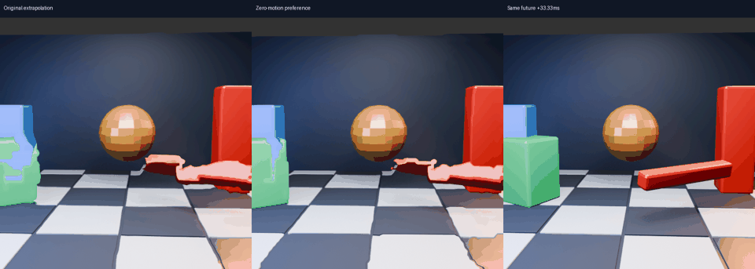
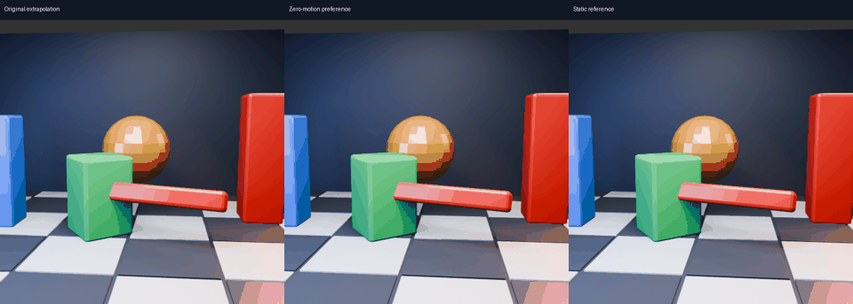

# Photometric preference for zero motion

## Question
Can comparing each estimated shift against keeping the image still eliminate invented movement without losing useful extrapolation?

**Result:** near-total suppression in the rotation-aligned static control, but less useful object advancement in the moving scene. This CPU diagnostic is not promoted to the Pico.

## Moving scene

Left: original GPU extrapolation. Middle: gated vectors through the same GPU warp. Right: independently rendered future, +33.33 ms. Thirty-two 512×512 samples, shown four times slower than their 60 Hz source timeline.

| Metric | Original | Zero preference |
|---|---:|---:|
| Mean future RGB RMSE | 37.727 | 37.801 |
| Mean green-block position error, 30 eligible frames | 19.75 px | 23.52 px |
| Median projected position gap closed | 34.2% | 22.7% |
| Central vectors retained | 100% | 31.3% |

Held-image mean RMSE is 39.670; held block position error is 31.64 px. Rejecting vectors preserves some benefit over holding, but loses useful movement. Large deformations remain visible. Position progress is not a latency measurement. The green colour mask is evaluation-only, with the same thresholds and eligibility rules as the earlier alignment study; occlusion and deformation can bias centroids.

## Static control

Seven pairs from the previous fixed-position camera-rotation test. Previous images were aligned to current orientation before estimating flow. The world is static, so the correct residual object motion is zero.

| Metric | Original residual field | Zero preference |
|---|---:|---:|
| Mean extrapolated RGB RMSE against current static reference | 1.471 | 0.022 |
| Mean per-pair p95 vector magnitude | 5.225 px | 0 px |
| Central vectors retained | 100% | 0.0124% |

Holding is exactly correct in this control (RMSE zero). This is a diagnostic of false residual movement, not an independently rendered future or a complete head-pose presentation test.

## Method

Each 8px grid node uses its corresponding 8×8 full-resolution patch. Compare mean absolute linear-RGB error for the proposed backward match `previous(p - d)` against the zero-displacement match `previous(p)`. Keep the vector only if improvement exceeds `max(10% of zero cost, 1/255)`. Otherwise set it to zero. Shifted patches crossing image boundaries are rejected. The shader then bilinearly interpolates the filtered node field as usual.

The threshold was fixed for this experiment, not optimized against future images. The test uses no future image, mask, depth or object identity to select vectors. The mixed-motion control uses the original unaligned field so its existing future reference remains comparable; it does not validate a combined rotation-separated moving-scene pipeline. A piecewise gate can introduce new field gradients, and lower historical match error does not establish correct motion or straight future edges.

All 39 GPU calls completed with Vulkan validation enabled and no reported validation errors. The gate runs on CPU and adds work; no runtime or physical-latency improvement is claimed. Synthetic checks pass for static texture, flat texture, known two-pixel translation and a wrong-direction ramp. A stricter random-texture wrong-direction rejection assumption failed during development: accidental patch matches are possible, so the gate is not a correctness certificate.

## Decision

Keep as a static-confidence diagnostic. Do not deploy this threshold as a general motion solution. The next useful experiment should preserve coherent movement across a surface rather than independently cutting vectors to zero; compare straight-edge stability and object advancement together. Live configuration remains unchanged.

## Reproduction

Run `test_zero_gate.py`, then `zero_compare.py` and `zero_alignment.py` in the existing `nx-scratch/motion-regions` layout. Dependencies: NumPy, Pillow, ffmpeg, the prior `rotation-control` and `gpu-cap` artifacts, original scene linear frames, and the 8px `motion_gpu_truth` fixture. Scores, source scripts, raw GPU logs and animations are included. Applied override maps use a distinct filename from fixture field exports.
