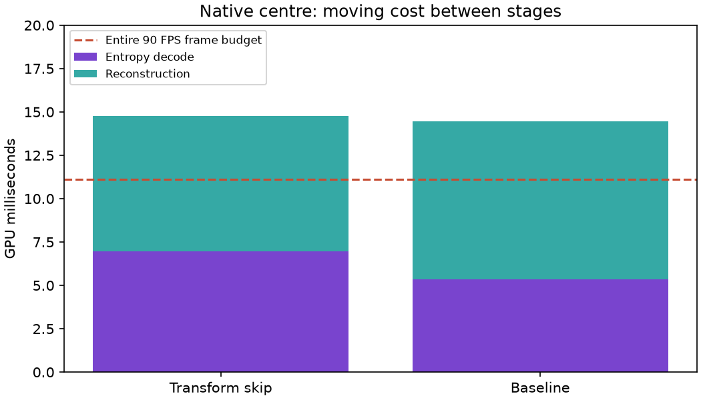

# Native-centre transform-skip screen

Existing transform skip was enabled through a guarded encoder API experiment. Native centre dimensions remain 1024px at 2688 pixels per eye. CPU and GPU decode agree exactly for each generated fixture; transform-skip and baseline pictures differ because quantization changes. The QP40 LITE fixture grows from 1,450,302 to 1,643,482 bytes (+13.3%). The candidate fixture contains 416 transform-skip tiles.

Two 30-second live screens completed. Post-warm two-second summary means follow; these are screening results, not per-frame percentiles or physical latency.

| Mode | Fresh selections/s | Pass A ms | Pass B ms | Decode GPU ms | Source proxy ms |
|---|---:|---:|---:|---:|---:|
| tskip-on-a-client | 45.44 | 6.956 | 7.822 | 14.789 | 85.48 |
| tskip-off-b-client | 46.67 | 5.356 | 9.089 | 14.467 | 85.38 |

Removing the inverse transform lowers Pass B work, but increases entropy-decoding work in Pass A. This short screen does not show an overall win. The prototype is retired and the original automatic-pacing, large-centre profile restored. Reaching 90 fresh FPS needs lower combined entropy and reconstruction cost, not merely shifting work between stages.

Raw logs, exactness results, orchestration and source patch are in [raw](raw/). No binaries or raw pixel payloads are included.

This session’s baseline is roughly 45–47 fresh selections/s, below the earlier overnight 53/s. These short runs do not establish the cause; comparisons use nearby controls, not the overnight measurement.
