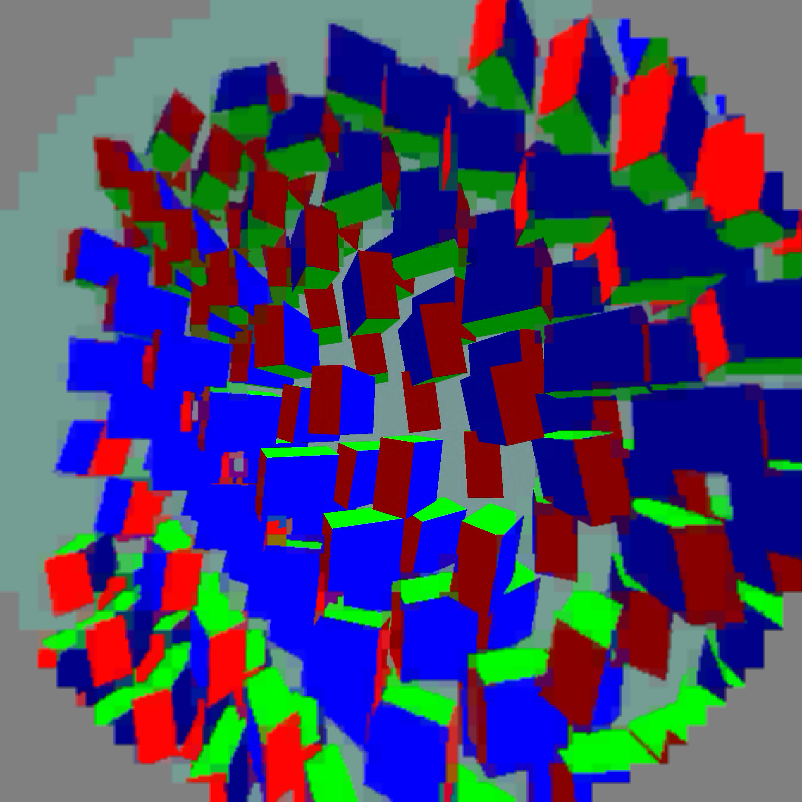

# Stop manufacturing large peripheral squares

The graduated encoder averaged neighbouring 8px cell means into 16px and 32px groups before choosing a tile palette. This deliberately removed contour detail even though the transmitted map still reserved one bit per 8px cell. `NXVC_PLANAR_NO_GROUPS=1` disables that averaging. The centre and fine ring are unchanged; outer cells retain 8px detail. R2 payload sizes remain 27/51 bytes per coarse/fine PLANAR tile, and no new decoder mode is needed.

## Four live motion trials

2688² per eye, corrected1024px native centre, existing smoothing5, priority1/JIT5ms/readywait1ms. Base A → candidate A → candidate B → base B, 60seconds each, no screenshot capture during timings. All four completed with30 render/decode windows and live advancing animation. Values below average post-warm-up logged windows, not per-frame distributions.

| Metric | Grouped cells | No grouping |
|---|---:|---:|
| Fresh selections/s | 50.49 | 50.45 |
| Decode GPU | 12.880 ms | 12.924 ms |
| Source-offset proxy | 81.72 ms | 81.14 ms |

Throughput is essentially unchanged. The submillisecond proxy difference is not evidence of a meaningful latency win. This removes an unnecessary quality loss at unchanged PLANAR body size. Current per-tile two-colour palette boundaries remain a separate artifact.

## Pico captures

Separate25second animated runs. Different animation instants, so these illustrate contour detail rather than a pixelwise controlled comparison. These are presentation-pass captures before lens composition.

Reproduction: [run script](run_trials.py), [per-run status](statuses.json), [window summaries](summary.json), [raw logs](live-logs.tar.gz). Source offset remains a software proxy, not motion-to-photon latency. This is not90freshFPS or240FPS proof.
