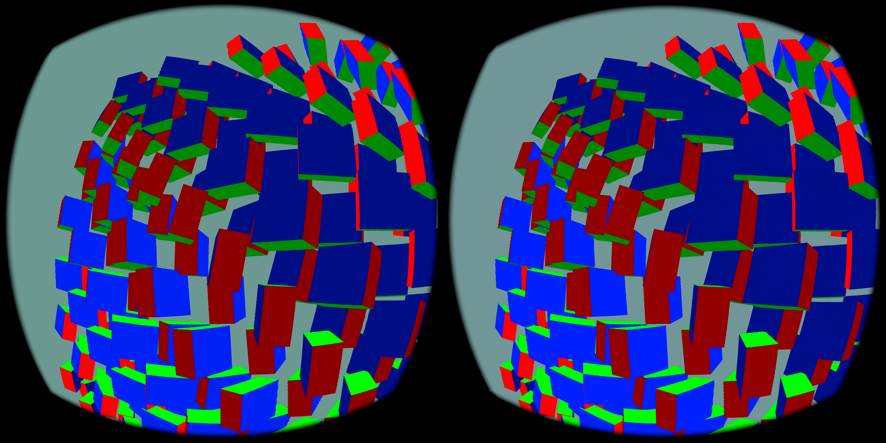

# Pico: 11.1ms motion cap installed and activated



[Actual headset screen recording, 8 seconds](pico-video.mp4) · [Installed APK identity](apk.json)

## What was tested

The signed WiVRn NX `.warp` APK was built and installed on the connected Pico. A reversible client switch caps the optical-flow extrapolation horizon at 11,111,111ns, using the same selected field interval as existing timing. The clamp executes **before pose compensation**, keeping both calculations on the same step. Unset/default behavior is unchanged; Android `debug.wivrn.nx.motion_cap=1` or host `WIVRN_NX_MOTION_CAP=1` enables the test. `0` disables it.

The server temporarily used the existing VAAPI HEVC 10-bit profile with source pacing at 60fps, motion fields enabled, and headset motion mode. Two short headless full-field moving-scene runs completed: 30 seconds for the functional smoke test and 20 seconds for the capture run. This is the existing moving-cube fixture, not the earlier Blender clip.

## Activation evidence

The actual client log reports:

```text
motion cap applied: horizon 11111111 ns, span 16666667 ns, step 3.0000 -> 0.6667
```

This demonstrates that the installed presentation path reduced a real selected motion step. Later log windows also show active motion and applied pose compensation, with no missing/unsafe predecessor cases in the inspected windows. Both trial status files report completion and a live client process at the end. This is successful functional integration, not a proof of subjective smoothness or reduced latency.

## Performance limits

The smoke log's 16 windows total 33.6 seconds, averaging **79.14 render iterations/s and 32.59 new-source selections/s**, including startup and screenshot capture. Later windows approach 90 render iterations/s. These quantities are distinct: **this does not establish 90 fresh FPS**. The screen-recording run has extra capture overhead and is not a performance comparison. There is no matched cap-off trial here.

Some existing timestamp diagnostics report negative source-to-first intervals. Those cannot support a physical end-to-end latency claim. No motion-to-photon improvement is asserted. The headset was tested off-head with an animated scene; physical head movement and perceived comfort remain untested.

## Captures and restored state

The screenshot is the actual Pico stereo compositor capture. The 8-second Android screen recording is resized to 960×480 for this page; it is not a high-speed display measurement. Visible block/edge artifacts remain.

After testing, the server's original large-centre NX codec configuration and the default motion-mode selection were restored and the client relaunched. The installed APK retains the cap feature, and its opt-in property is left at `1` for subsequent headset-motion testing. This does not turn the NX profile into the HEVC motion profile.

An initial cleanup command failed while restoring an empty Android property. It did not invalidate the completed smoke run. The subsequent capture run restored the original server configuration successfully, and process arguments were checked. Archived scripts handle empty property values explicitly.

## Evidence

Per-run client/server/scene logs (trailing whitespace normalized) and completion status files are included, together with the build log and APK hash. The scripts preserve the original local test paths and depend on the existing `motion-live` helpers, so they require adaptation outside that checkout. The new cap is a small reversible client change; no renderer grid, codec quality setting or source-clock default was changed by the APK.
