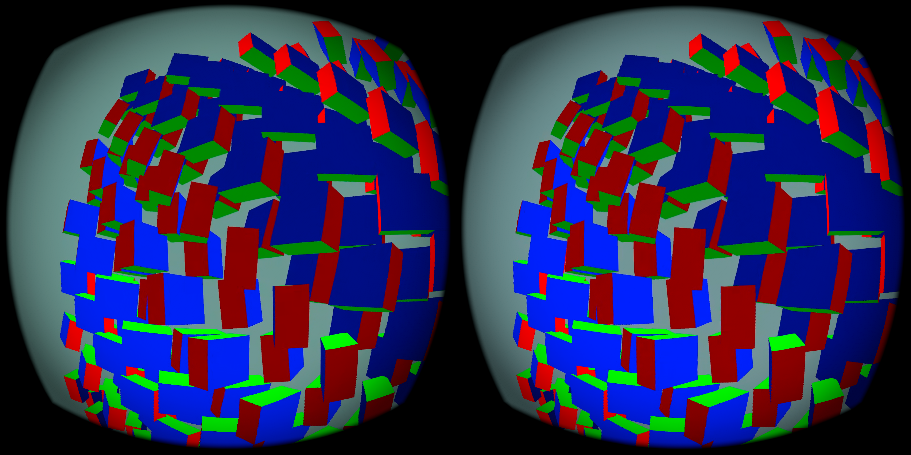

# Predicting toward display time: image time and head pose

[8-second headset recording](pico-video.mp4) · [Trial status](pico-source-clock-check-status.json) · [Motion counters](motion-summary.json)

## Goal and distinction

The goal remains to present pixels where their content should be at display time, including while the user moves. A cap is a quality compromise, not completion of that goal. Two corrections must be distinguished: extrapolating independently moving content, and correcting the submitted image for the headset's latest pose.

The measured optical-flow field already contains head motion between its two source images. The client therefore advances its submitted pose metadata by the **same fraction applied to that field**. The runtime can then correct the residual to its latest pose. Capping flow does not inherently freeze the final head-pose correction at the capped time. This describes the intended bookkeeping; it does not prove exact correction for translation, missing depth, nonlinear deformation or physical headset movement.

## Clock audit

`source_time_ns` is the application's requested display timestamp, converted into the headset clock domain. It is **not** the wall-clock instant when capture or encoding finished. The normal path uses the compositor's display timestamp; the optional app-time path uses this source timestamp and its interval. Both compare against the intended headset display time, rather than counting refreshes.

The synthetic scene used here animates objects from its predicted display timestamp. Other applications may relate simulation state to that timestamp differently. These metadata alone cannot establish physical motion-to-photon latency or precise object-state age.

A proposed change to give image warp and submitted-pose compensation independent fractions was rejected during review. In an idealized linear model, residual head error is `(pose_fraction − image_fraction) × pose_delta`. Equal fractions cancel the head component while retaining predicted object movement. The [small numerical regression](motion_clock_consistency.py) and [output](consistency-test.log) illustrate this invariant. It is not a full 3D compositor test or evidence that the optical-flow estimator is correct.

## Pico functional test

The existing installed cap APK was used without new shader behavior. The server temporarily ran HEVC 10-bit with source pacing and motion fields; headset mode, app-time mode and the 11.1ms cap were enabled. A 20-second moving-scene run completed and the client remained alive. Across 11 logged windows, the client counted **1,157 source-clock pose adjustments**. An actual cap message shows `step 3.0000 -> 0.6667` for a 16.67ms field interval.

These are branch-activation and completion checks. There is no matched control trial here, no physical head movement, and no claim of lower latency, improved perceived smoothness or 90 fresh FPS. The Android recording adds capture overhead and is resized to 960×480 for the page; its frame cadence is not a display-performance measurement.

## Restored state and next requirement

Afterward the original large-centre NX server configuration, default motion selection and source-clock setting `0` were restored and checked. The installed cap property remains enabled for future headset-motion tests. No clock default was promoted from this functional trial.

The next useful validation must measure object-motion alignment against a time-labeled reference while keeping head correction consistent. A prediction fraction or successful frame submission is not itself proof that a moving object is visually current.

Logs have trailing whitespace normalized. The archived local trial script depends on the existing `motion-live` helpers and machine-specific paths. Its recording and screenshot are from this Pico run; the algebraic regression is explicitly a separate toy model.
