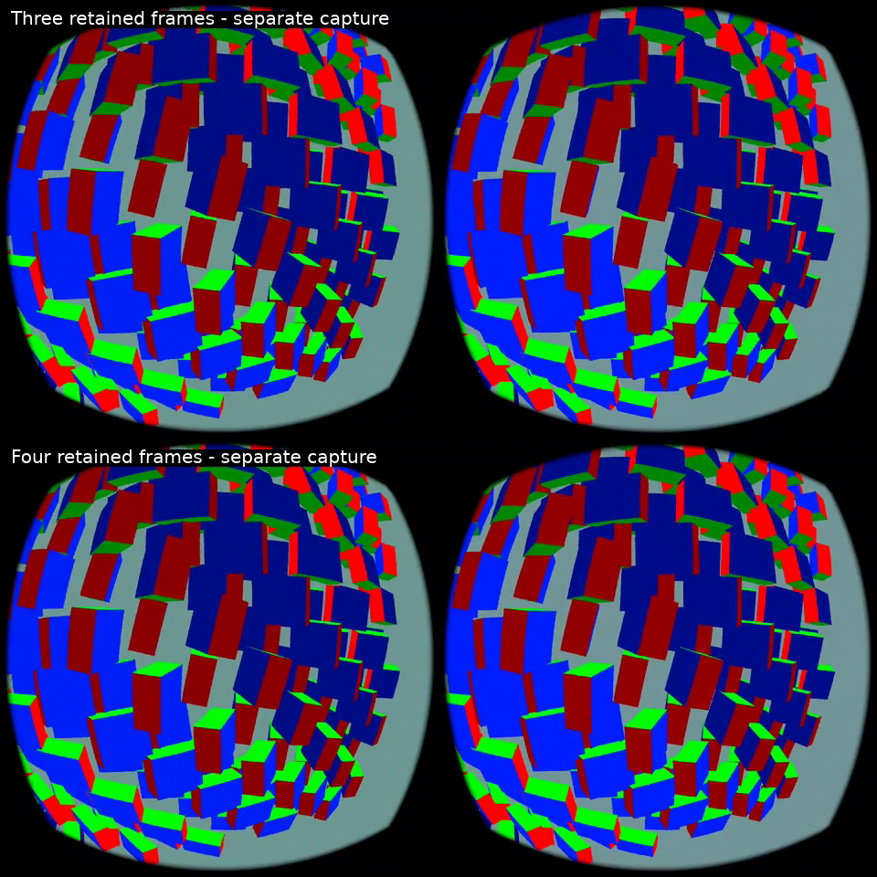

# Retained-source repeat and actual Pico recordings

The timing improvement repeats in a second short pair. This supports steadier **estimated content-time advancement**, not proven visual smoothness or physical latency.

[Watch the actual Pico comparison](comparison.mp4) · [Three retained frames](pico-0.mp4) · [Four retained frames](pico-1.mp4)

Top/bottom are separate captures of the same moving cube fixture. They are not frame-exact synchronized. Screen recording adds load and does not capture every headset refresh; use the clips to inspect artifacts, not judge 90Hz pacing. A sampled still was checked to confirm both captures show the intended stereo scene. Physical head motion was not exercised.

## Repeat timing, without screen recording

Two 20-second headless Pico runs, cap on, blur off, past-source preference on. First 300 traced presentations excluded from the timeline measurements. Both finished with client alive.

| Metric | Three retained frames | Four retained frames |
|---|---:|---:|
| Timeline stalls under 1ms | 518/1587 (32.6%) | 41/1584 (2.6%) |
| Median timeline advance | 16.386ms | 11.111ms |
| RMS deviation from requested display step | 8.53ms | 6.29ms |
| Backsteps greater than 1ms | 3 | 4 |
| Active warp samples | 4.5% | 77.8% |

Across all eleven render logging windows, including startup: render iterations 81.83/s versus 81.81/s; fresh-source selections 54.04/s versus 53.90/s. Client GPU pass averages 5.40ms versus 7.89ms. The fourth frame enables more warping, so the extra GPU work is a real tradeoff, not a speedup. Mean compositor source offset rises from 0.02ms to 13.21ms; older decoded sources are being extrapolated. These offsets are not measured image age or physical latency.

The previous pair also showed fewer stalls (30.4% to 7.4%). This repeat supports the direction, but remains a short synthetic test with no thermal soak, gameplay proof or jitter-free guarantee. A zero or 11ms timestamp gap does not prove the image predicts objects correctly.

## Separate visual recordings

Two additional 20-second runs captured eight seconds each through Android screenrecord at 1920×960; published clips are resized to 960×480, then stacked. Timing results above exclude these recording runs. No AI-generated imagery is used. Logs and launch scripts accompany the clips.

## Left enabled

HEVC 10-bit, capped warp, four retained sources and past-source preference. Blur and verbose tracing are off. The extra retention remains opt-in rather than a global default. To revert, set `debug.wivrn.nx.motion_retain4=0` and `debug.wivrn.nx.motion_past=0`, then restart the client. The source resolution is unchanged.
