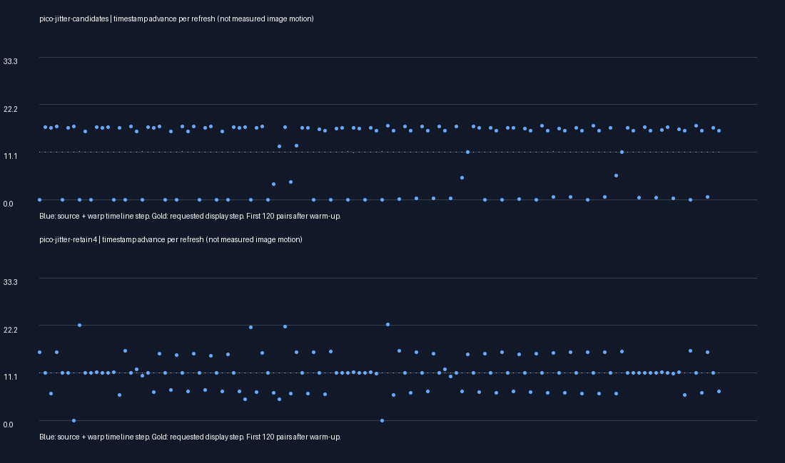

# Retain one more source for capped warp

**Short Pico test: fewer stalls in the estimated content timeline. Visual jitter reduction remains to be judged.**

## Finding

The three-slot source buffer frequently held only future-dated frames relative to the requested display time. In the instrumented control, 79.2% of candidate observations after warm-up had no past candidate. The past-source selector therefore could not usually select a frame that the warp could advance. Alpha gating was false throughout these observations.

The new opt-in fourth slot retains one more decoded image per stream. The existing experimental selector then chooses the most recent shared past source within 33.33ms, falling back to the original nearest-source selection if unavailable. Exact stereo frame matching remains required. This does not interpolate between decoded frames or change the motion estimator.

## Two 20-second headless Pico runs

Both complete, client alive. HEVC 10-bit, capped warp, blur off, same moving scene. Both use past-source preference; only the second enables four-frame retention. First 300 traced presentations excluded from timeline analysis.

| Metric | Three slots | Four slots |
|---|---:|---:|
| Near-stationary timeline steps | 482/1587 (30.4%) | 116/1560 (7.4%) |
| Active warp samples | 16.1% | 85.1% |
| Median timeline step | 16.08 ms | 11.11 ms |
| RMS deviation from requested display step | 8.18 ms | 7.42 ms |
| Timeline backsteps >1ms | 2 | 5 |

The stronger result is fewer stalled timeline steps, not an absence of jitter: backward steps remain and the upper tail is irregular. These are short sequential runs, without repeated trials or statistical confidence estimates. Per-frame logging itself adds overhead.

The four-slot run averages 80.6 render iterations/s and 52.9 fresh source selections/s across all eleven logging windows, including startup. Its client GPU pass averages 7.45ms. It does not establish 90 fresh FPS. More frequent warping costs GPU work, and selecting a past source can increase raw source age. The mean compositor timestamp offset is +8.03ms in this run; this is not physical latency. Neither timestamp advancement nor the synthetic scene proves correct object position, comfort or physical head-motion latency.

## Integration

Opt-in `debug.wivrn.nx.motion_retain4=1` is sampled at process startup. Off retains the original three-slot indexing. Lookup and insertion share the same active count. The array/ImageReader capacity supports the fourth image, increasing potential decoded-image memory use; no long thermal/memory soak was done. `debug.wivrn.nx.motion_past=1` enables the matching selection experiment.

The tested four-slot/past-source profile is left enabled for subsequent evaluation; capped warp stays on, blur stays off, source clock stays off, verbose trace is disabled. No source resolution reduction was made. This remains experimental rather than a new global default.

Included logs, scores and plotting scripts document the short runs. Scripts retain the local scratch layout. Plots show estimated represented timestamps (source anchor plus applied warp interval), not measured visible motion. The next check is an actual visual comparison under motion and a short repeat for timing stability.
