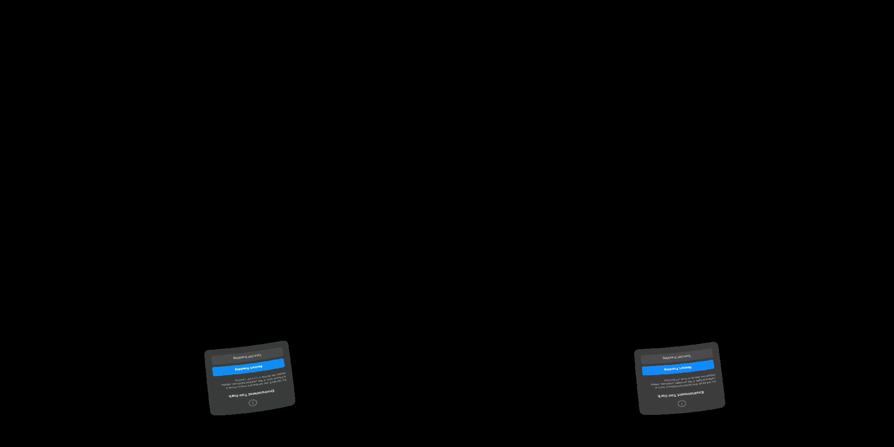

# Source-rate follow-up: network caveat and blocked visual capture

The earlier short source-rate trials showed about 83 fresh source selections/s without the experimental 60 FPS cap. Their existing server logs also show automatic bitrate congestion events in **both** modes. These must accompany any performance comparison.

## Controller event snapshots

The 60 FPS trial records six adjustment events; the uncapped trial records four and its repeat two. Every run drops from the 56 Mbit/s ceiling to 22.4 and then 10 Mbit/s. Some runs rebound toward 20 Mbit/s before dropping again. Event counts are not comparable total loss rates: logs are triggered by decisions, do not cover every interval, and startup/adaptation differ. Requested target bitrate is not measured delivered bandwidth. The data does not establish equal quality or that uncapping is network-neutral.

The controller's recovery path doubles bitrate after a healthy confirmation period. That explains the 10→20 transitions; it does not establish whether recovery is incorrect. A future controlled fixed-bitrate comparison can isolate source cadence from this adaptation. No rate-control code or live bitrate preference was changed.

## Visual attempt failed

The sampled headset capture displays the runtime's **Environment Too Dark** tracking dialog, rather than the test scene. Consequently these recordings cannot validate visual quality or smoothness. The capture helper reported completed scene animation and a live client, demonstrating why those checks alone are insufficient for a successful visual test. This follow-up is recorded as a capture failure, not an animation result.

The earlier rate figures describe application render/submission and source-selection counters; they do not prove visible panel content. Any subsequent visual claim needs an inspected headset capture with tracking working.

After the attempted captures the original 60 FPS source configuration was restored and the client relaunched. 100% resolution, four retained frames, past-source preference and capped warp remain; blur stays off. No unsupported visual comparison is published.

The event extraction JSON, parser, capture script and attempt logs are included. Failed videos remain local; the screenshot records the blocking condition.
