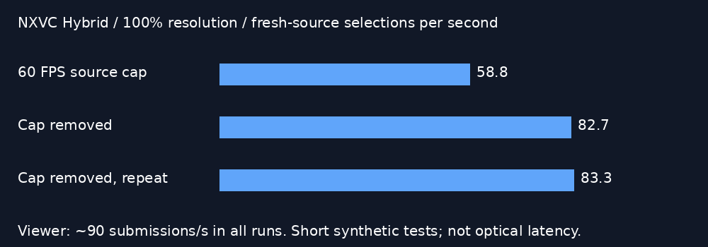

# NXVC Hybrid: remove the experimental 60 FPS source cap

At 100% resolution (2176×2176 per eye), hardware HEVC has enough headroom in this fixture to deliver more fresh source images. Removing the experimental server cap raises fresh selections from about 59/s to 83/s while preserving roughly 90 viewer submissions/s. This repeated short result is a useful candidate, not proof of 90 fresh FPS or lower physical motion-to-photon latency.

## Three short Pico runs

20 seconds each, continuously awake Pico, headless moving cube scene. Same HEVC 10-bit, four retained sources, past-source preference, 11.11ms motion cap, blur off and 5ms JIT sleep limit. The only requested change is removing `WIVRN_NX_SOURCE_FPS=60`; the display refresh remains 90Hz. Each client completed alive.

First two render logging windows excluded. Values are arithmetic means of subsequent windows, not all-run throughput.

| Metric | Source capped 60 | Uncapped | Uncapped repeat |
|---|---:|---:|---:|
| Viewer iterations/s | 89.97 | 89.95 | 89.98 |
| Fresh-source selections/s | 58.83 | 82.69 | 83.33 |
| Client GPU pass | 6.22ms | 5.85ms | 6.18ms |
| Decode to selection | 57.44ms | 38.59ms | 35.20ms |
| Selection to predicted display | 30.53ms | 30.49ms | 29.96ms |
| Reported late counter mean | 0 | 0 | 0 |

The decode-to-selection diagnostic drops by about 19–22ms. This is measured bookkeeping between client timestamps, not optical motion-to-photon latency or a guarantee that motion prediction is correct. Older-frame retention and prediction remain enabled; not every iteration has a distinct fresh source. Network bitrate adaptation, source/render load and thermal conditions were not controlled by repeated randomized trials. Three short runs do not establish sustained gameplay performance, equivalent image quality, bandwidth or thermal behavior.

No visual reconstruction algorithm changed, and no resolution reduction was applied. The existing 60 FPS source limit was an experimental pacing constraint for lower-source-rate warping. It is not necessary to assume every HEVC image must remain limited to 60 FPS at this resolution.

The original 60 FPS source configuration was restored after testing. The candidate can be enabled by restarting the owned server without `WIVRN_NX_SOURCE_FPS=60`; headset cap, blur, retention and resolution settings need not change. No production default was silently changed.

Logs, launch and summarization scripts accompany the chart. The repeat used the same uncapped launch/capture procedure. Future work: user visual check of this mode and a bandwidth/quality comparison before promoting it.

Follow-up: [network-event review and blocked visual capture](../pico-source-network/README.md). Both modes reached the bitrate floor with congestion events, and a later headset recording was obscured by a dark-environment tracking dialog. The fresh-rate counters must not be read as proof of displayed quality or network neutrality.
