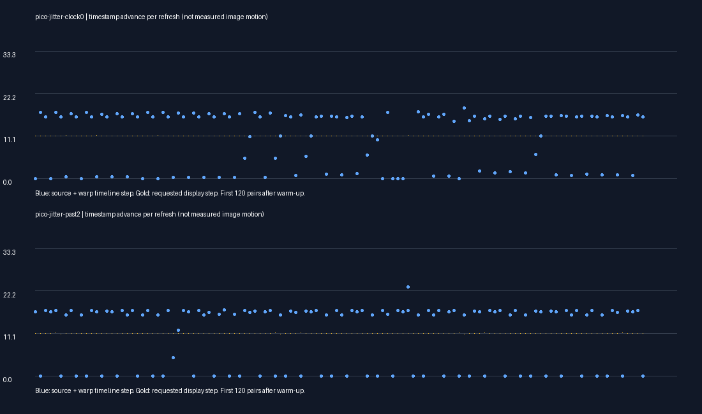

# Pico warp jitter: presentation timeline trace

User judged capped HEVC warp serviceable but jittery, and requested blur disabled. All tests retain the cap and disable tiny motion blur.

Four short 20-second headless moving-scene runs completed with the Pico client alive. An opt-in per-presentation trace records requested display time, selected frame, compositor timestamp, chosen warp anchor/span, final step, field availability and cache reuse. This is timestamp arithmetic, **not measured image displacement or physical motion-to-photon latency**.

## Results

First 300 traced presentations excluded. Comparisons are sequential exploratory runs, not controlled repeated performance benchmarks.

| Variant | Active warp | Near-stationary timeline steps | RMS deviation from display step |
|---|---:|---:|---:|
| Existing capped profile | 28.9% | 443 / 1578 | 8.30 ms |
| Prefer past source, prevent index rewind | 21.8% | 468 / 1560 | 8.74 ms |
| Prefer past source, allow index changes | 17.3% | 465 / 1566 | 8.86 ms |

The median timeline advance stays about 16.1 ms, with the fifth percentile at zero. Backsteps greater than 1 ms numbered 4, 4 and 6 respectively. Lower active/inactive toggle counts did not establish smoother progression.

The alternate app-source-clock run recorded zero source-clock pose adjustments; it therefore does not validate that clock as an alternative in this session. Its logs are preserved, without treating the requested property as proof of activation.

The experimental past-source preference preserves exact stereo selection and considers only sources within 33.33 ms of its target. It falls back to the original selector if no such source exists. These trials do not record candidate availability, so they do not establish how often this preference changed selection. Neither variant provides evidence of a jitter improvement; the property is restored to off.

## State and next investigation

Capped HEVC warp remains selected, blur remains off, alternate clock remains off, verbose tracing is off. No successful jitter fix is claimed. Next trace should include candidate availability and motion-field changes, distinguishing source delivery/retention from changing spatial estimates. Do not smooth the image-warp step independently of its matching pose compensation.

Sources: WiVRn client `stream.cpp` opt-in properties `debug.wivrn.nx.motion_trace` and `debug.wivrn.nx.motion_past`. The final past-source implementation is opt-in/default off. `analyze.py` derives represented time as anchor + span × final step when a field exists, otherwise compositor timestamp; it includes cached image reuse. Invalid inter-presentation gaps (nonpositive or ≥100 ms) are excluded. A represented timestamp is a motion-model assumption, not evidence pixels match that time.
