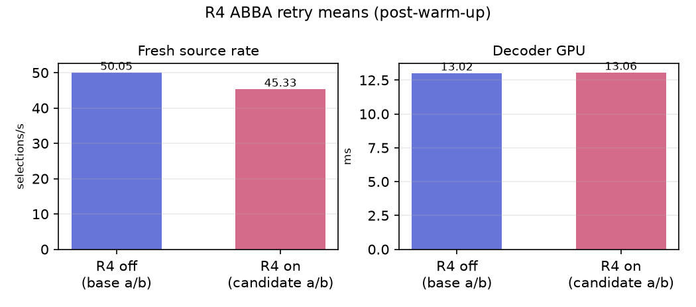
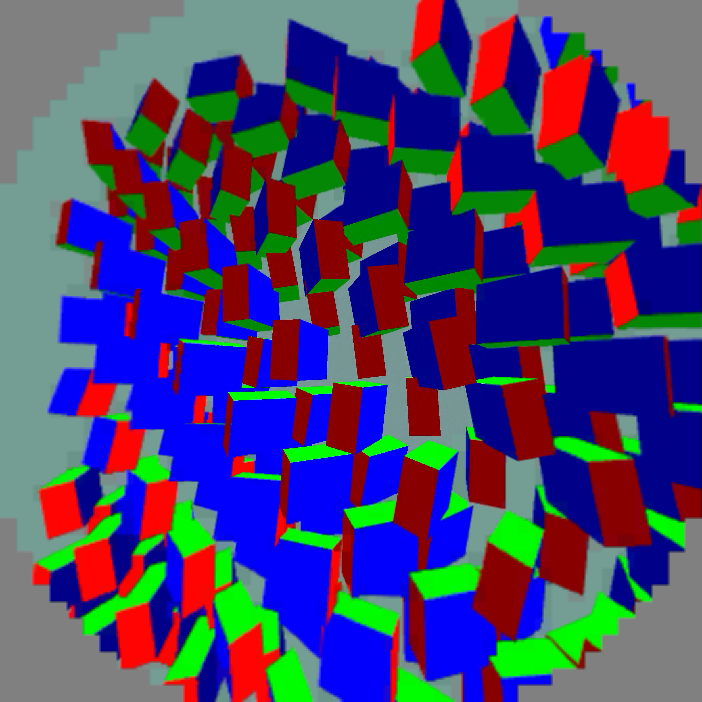

# R4 flat palette evidence — 2026-09-11

This is a bounded validation of the existing PLANAR body format. R4 uses the
existing two-bit labels and four DC endpoints; no new stream syntax is used.

## Bitstream and decoder agreement

The 5376×2688 stereo fixture was encoded at QP 24, inter, intra-period 1,
centre-quarter, graduated PLANAR. R2 is 1,278,276 bytes and R4 is 1,376,852
bytes (+7.71%). The compact 2880×1440 NV12 output is 6,220,800 bytes.

For both R2 and R4, CPU `nxv-dec`, GPU generic Pass-B, and forced flat Pass-B
decoded to identical dense NV12 bytes (21,676,032 bytes). The compact generic
and `compact-flat64` paths also matched byte-for-byte. See
[`cpu-validation.json`](cpu-validation.json) and
[`cpu-validation.log`](cpu-validation.log).

## Live ABBA retry

The four completed 60-second runs used the same full-field scene, FDM 3,
ready-wait 1 ms, and smoothing 5. Both modes retain ungrouped cells,
2688² per eye and the 1024px native centre. Tested core revision: `2f58ed8`;
WiVRn NX: `b56d60e4`. Values below are post-warm-up means from
`sha2-transport/analyze_warm.py`; they are scheduling/decoder proxies, not
motion-to-photon or vendor MTP measurements.

| run | mode | fresh source/s | decoder GPU ms | pass-B ms | source offset ms |
|---|---|---:|---:|---:|---:|
| base-a | R4 off | 49.98 | 13.09 | 8.10 | 81.45 |
| candidate-a | R4 on | 45.06 | 13.33 | 8.36 | 81.72 |
| candidate-b | R4 on | 45.60 | 12.80 | 8.28 | 78.91 |
| base-b | R4 off | 50.13 | 12.96 | 8.18 | 81.08 |

The R4 candidate mean is 45.33 fresh source/s and 13.06 ms decoder GPU;
the R4-off mean is 50.05 fresh source/s and 13.02 ms decoder GPU. The source
rate difference is visible in both candidate runs, while decoder GPU means
are effectively similar at this sample size. Full status records are in
[`retry-statuses.json`](retry-statuses.json), with client logs in `logs/`.

## Image evidence

The R2 no-group capture is the paired `base-eye0.png`/`candidate-eye0.png`
comparison from the preceding run. R4 capture images are `eye0.png` and
`eye1.png`, copied from the same scratch run. They are different animation
instants, so image differences are illustrative rather than pixelwise proof.

The no-group change removes the deliberate 16/32-pixel pre-averaging while
retaining the R2 body size. R4 adds endpoint capacity, but per-tile palette
boundaries remain a separate visual artifact.

## Failed first control

The original control attempt was not counted as a completed trial: the client
reported `vk::Device::waitForFences: ErrorInitializationFailed` at
00:53:16.936, after which telemetry became stale (`14` render and `13` decode
windows). This is retained as
[`logs/original-control-fence-failure-client.log`](logs/original-control-fence-failure-client.log).

The run was not treated as an MTP result. No R4 conclusion is based on that
failed control; the conclusions above use only the four completed retry runs.

## Smoothing ABBA follow-up

A second four-run ABBA sequence held R4 and the ungrouped-cell path constant
and compared presentation peripheral smoothing 5 → 3 → 3 → 5. All runs
completed 60 seconds with 30 render/decode windows. Post-warm-up means from
the same analyzer were:

| smoothing | fresh source/s | own presentation GPU ms | decoder GPU ms | pass-B ms | source offset ms |
|---:|---:|---:|---:|---:|---:|
| 5 (a,b) | 45.80 | 3.28 | 13.31 | 8.34 | 82.28 |
| 3 (a,b) | 45.72 | 2.73 | 12.91 | 8.36 | 79.11 |

Smoothing 3 therefore saved about 0.55 ms of the presentation GPU proxy and
3.17 ms of the source-offset proxy, with essentially unchanged fresh source
rate (−0.08/s). These are software scheduling/display proxies, not MTP or
motion-to-photon measurements, and this result is not a selection decision.
Raw statuses are in [`smooth-statuses.json`](smooth-statuses.json), the run
record in [`smooth-trials.log`](smooth-trials.log), and the four client logs
under `logs/r4-smooth*-client.log`.

A separate Pico capture with smoothing 3 preserves the larger native centre and
the R4 colour improvement. Cell stair-steps remain visible: this does not
eliminate all peripheral artifacts. Smoothing 3 is the candidate for longer tests.

## Longer transport-acceleration test interrupted

A 120-second R4/smoothing-3 control with transport SHA2 acceleration off
completed. The following SHA2-on run stopped producing decoded output after
502 decoded frames and returned to the lobby; network reception continued.
The harness rejected it for stale telemetry. Authentication-failure counters
remained zero, and no decoder exception was logged in this run. This does not
establish that SHA2 caused the stall. Acceleration remains off while worker
stability is investigated; the incomplete pair supports no performance claim.
Raw logs and status files are retained under `logs/r4-sha-*`.
