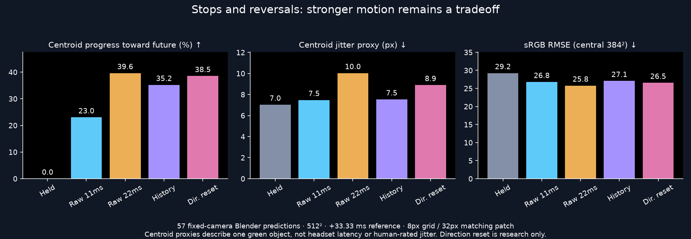
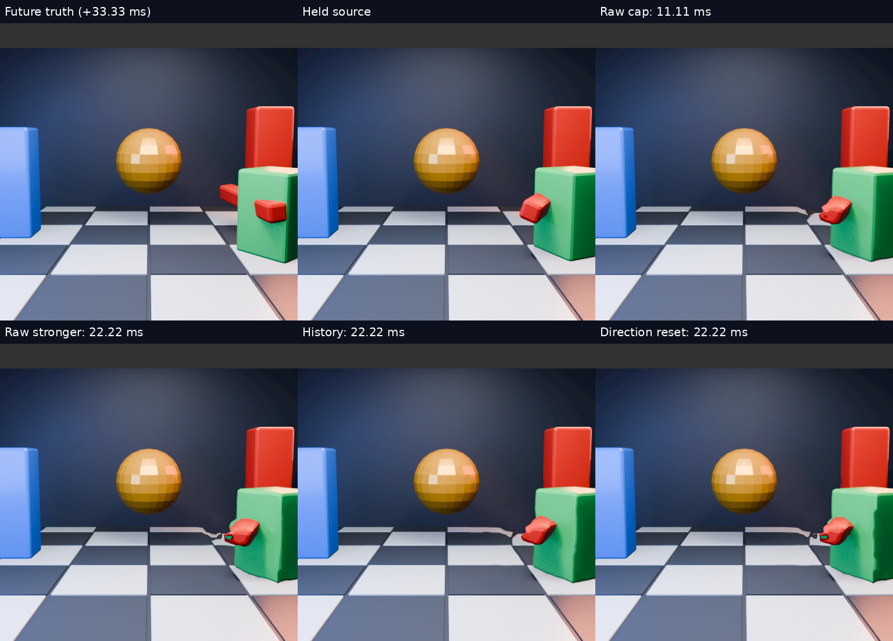

# Motion history under stops and reversals

**Offline quality test; not Pico latency or FPS evidence.** A fixed-camera Blender scene adds a translating green block that stops and reverses, an independently moving/rotating red bar, and occlusion. The estimator sees only the preceding and current image. The future image is used only as a reference.

## Matched comparison

| Method | Forward prediction cap | sRGB RMSE ↓ | Green-centroid jitter proxy ↓ | Projected progress ↑ |
|---|---:|---:|---:|---:|
| Hold current image | 0 ms | 29.23 | 7.03 px | 0% |
| Raw conservative warp | 11.11 ms | 26.77 | 7.47 px | 23.0% |
| Raw stronger warp | 22.22 ms | 25.76 | 10.03 px | 39.6% |
| Quantized history EMA | 22.22 ms | 27.06 | 7.53 px | 35.2% |
| History with per-cell direction reset | 22.22 ms | 26.55 | 8.90 px | 38.5% |

History reduces the stronger warp's centroid jitter proxy by 24.9%, while giving up some progress and increasing image error. It is near the conservative cap on this proxy, with more motion advance. This is a tradeoff, not a clean-shape guarantee: silhouettes and intersecting surfaces still deform.

## Watch it

[All main methods, 4x slow replay](comparison.mp4) · [Smaller matching patches](history_windows.mp4)

Both animations contain all 57 chronological predictions. Each source interval is 16.67 ms; reference images are 33.33 ms ahead of the current source. Videos play at 15 fps to expose artifacts. The shader converts linear input to sRGB; its readbacks are displayed directly. RMSE compares sRGB values in the central 384×384 region, excluding a 64px border. There is no motion blur or generated imagery in these comparisons.

The direction-reset experiment discards history for zero or oppositely directed current vectors. It improves RMSE/progress over ordinary history but worsens the jitter proxy by 18.2%. It is **not promoted**; temporal stability remains the priority. The corrected GPU runner uses a numeric 1.333333 prediction step, not an unevaluated fraction string.

## What smaller patches did

All variants keep the same 8px motion-vector grid. Matching patch widths are 32, 16, and 8 source pixels (8, 4, and 2 level-zero pyramid texels). For history, mean RMSE worsens from **27.06 → 28.38 → 30.59**. Smaller patches are not promoted. The live server source currently defaults to 64px vector spacing; these fine-grid fixtures must not be described as deployed headset behavior.

## Method and limits

- Actual Vulkan estimation and warp, AMD Radeon RX 7900 XTX (RADV NAVI31), 512×512 per eye; identical eye inputs, fixed camera.
- Blender 5.2 Eevee generates 60 source frames at 60 Hz. Source frames 2–58 produce 57 predictions; truth frames are 4–60. No renderer IDs, depth or motion vectors enter the estimator.
- The production `motion_field_ema_blend` helper from WiVRn `e44d306e` processes quantized signed-byte fields, including source continuity and scale/span normalization. The fixture uses valid equal 16.67 ms spans. It does not execute the headset's pose gate, runtime compositor or network path.
- Green-mask centroid: G>1.4R, G>1.15B, G>35, at least 100 pixels. Error is predicted centroid minus truth centroid. Jitter proxy is the RMS magnitude of its chronological second difference. It is not human-rated jitter; occlusion and visibility can move this centroid.
- Progress is the mean projection of predicted-minus-held centroid onto truth-minus-held displacement, normalized by squared displacement; only held-to-truth distances ≥4px qualify. It is neither a latency measurement nor a percentage of correctly reconstructed pixels.
- Phase labels join actual renderer trajectory by source frame. Scores and phase summaries are in `metrics.json`; frame-level values in `per_frame.csv`. Each prediction's sRGB RMSE covers the central 384×384 region of both eyes; centroid metrics use the full first-eye image.
- Vulkan validation reported no errors. This short synthetic scene does not prove real-game quality, head-motion behavior, thermal stability, or readiness for unrestricted stronger warping.

## Reproduction material

`reversal_blender.py` and trajectory files describe the real 3D scene. `motion_history_replay.cpp` uses the production client helper. `run_reversal_gpu.py` performs GPU readbacks; `evaluate.py` computes metrics and animations. These scripts preserve the scratch experiment layout (`reversal-blender`, `reversal-gpu`, and `window-study` under one root); fixture binaries come from WiVRn `tests/motion_gpu_truth` with `MOTION_TRUTH_SIZE=512` and `MOTION_TRUTH_BLOCK=8`. Convert rendered sRGB PNGs into linear 8-bit RGBA before supplying the fixture. Estimation shaders differ only in `MOTION_WINDOW`. Source images and large transient readbacks remain local and can be regenerated.
