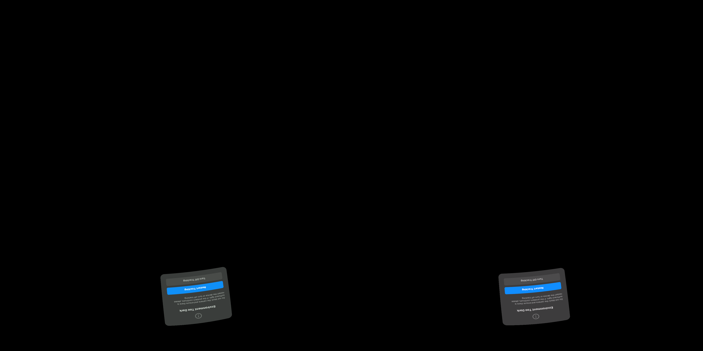

# Guarded motion-history client installed

User-authorized installation of WiVRn NX f799d6b9 completed. Android assembleRelease passes; motion-history and retained-slot host tests pass. APK hash and package are recorded in install.json. This build also installs the previously built distinct-ID retention fix.

`debug.wivrn.nx.motion_ema=1` opts into alpha=.5 same-pixel motion history. A compatible consecutive selected source, valid metadata and nearly stationary source head poses are required. Fields are normalized by span and rescaled without saturation. Stable active history permits up to22.22ms extrapolation; otherwise the existing11.11ms cap remains. Image/pose fractions are recomputed together. History resets across incompatible source selections; uploader and presentation caches distinguish raw/filtered fields. This is a guarded adaptation of the offline experiment, not identical to that fixture or a solved separation of object/head motion. It adds no image blur.

The installed client connected and configured2176² per-eye HEVC decoders and90Hz. **Activation and visual quality remain unverified:** the actual capture shows the Pico's Environment Too Dark tracking dialog. Do not interpret decoder setup or a running process as a successful motion test.

A rollback APK was saved locally before installation. Set motion_ema=0 and restart the client to disable the new mode; the complete older APK is also retained. Other live profile settings were preserved. No claim of improved live jitter or physical latency is made.
