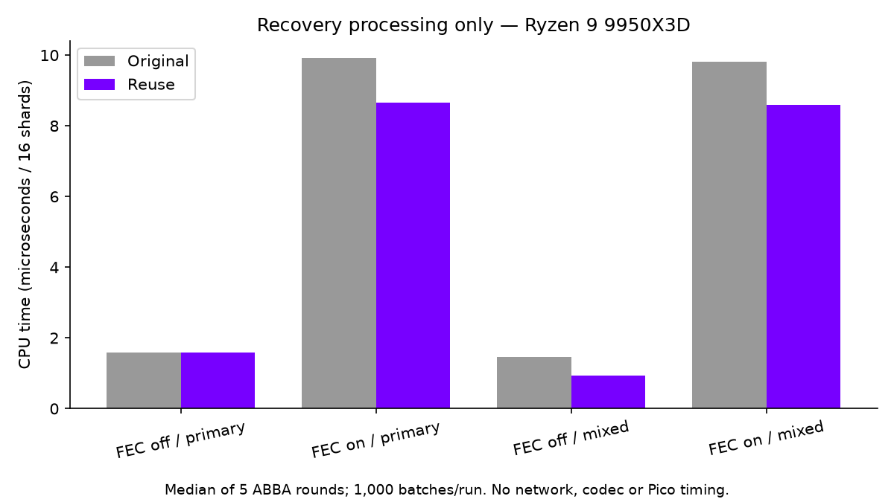

# Serialize recovery data once

The sender used to serialize every shard twice when both forward error correction (FEC) and retransmission history were enabled: once to build parity, then again to keep a recovery copy. It also serialized secondary TCP shards for history even though history immediately discarded them.

The new path borrows the recovery blob already produced by FEC. History copies it into its existing bounded ring before the next shard overwrites the scratch buffer. With FEC disabled, primary shards still get their independent history encoding. Secondary shards skip history encoding altogether. Parity still goes out before the history copy; packet formats, recovery protection, payload quality and pacing configuration are unchanged.

## Local measurements



| Recovery path | Original µs / 16 shards | Reuse µs / 16 shards | CPU time reduction |
|---|---:|---:|---:|
| FEC on, all primary | 9.917 | 8.664 | 12.63% |
| FEC on, mixed secondary | 9.819 | 8.588 | 12.53% |
| FEC off, all primary | 1.579 | 1.582 | -0.18% (effectively unchanged) |
| FEC off, mixed secondary | 1.458 | 0.929 | 36.31% |

AMD Ryzen 9 9950X3D, GCC 16.2.1, `-O2`, ordinary host scheduling. Five ABBA rounds, each run processing 1,000 batches of 16 shards with 1,200 payload bytes each; 100-batch warmups precede each round. Values are medians of the five paired run averages, not individual-frame percentiles. FEC uses groups of eight, depth one. Mixed mode routes six of sixteen shards to the secondary path. First/last shard metadata is populated. History and buffers are allocated outside timing and reused; history remains enabled in every case. These cases do not cover every production layout or configuration.

The main FEC case saves about **1.25 µs per 16-shard batch** here. It is a modest removal of unnecessary CPU work, not a solution to a multi-millisecond queue delay. No desktop load isolation, clock lock, or power measurement was used. Raw ABBA samples are in [benchmark.txt](benchmark.txt); [summarize.py](summarize.py) recreates the chart.

## Scope

This is a sender CPU optimization. It does not reduce decoder work, motion-estimation work, network bytes or the display refresh interval. Less packet preparation can provide sender headroom; an end-to-end latency improvement has not been measured.

## Validation

- Existing FEC suite: 2,101 checks, zero failures.
- Existing NACK/history suite: 292 checks, zero failures, also passing with AddressSanitizer and UndefinedBehaviorSanitizer.
- Actual `video_encoder.cpp` translation unit compiled with the configured server flags, without diagnostics. This is not a full linked-server or streaming-session test.
- No Pico deployment or test was performed.

Raw verification logs and benchmark results are alongside this report. The native benchmark uses production FEC/history headers, but excludes sockets, encryption, encoding and decoding. Its savings must not be presented as whole-stream latency savings.

## Reproduction and source

WiVRn NX commit [4f2ffd1](https://github.com/nerdrx/wivrn-nx/commit/4f2ffd1), including [the standalone benchmark](https://github.com/nerdrx/wivrn-nx/blob/4f2ffd1/tests/fec_history_bench.cpp). Set `BOOST_INCLUDE` to the fetched Boost PFR include directory and `CONFIG_INCLUDE` to the configured build's `common` directory. From that checkout:

```sh
g++ -std=c++23 -O2 tests/fec_history_bench.cpp common/smp.cpp \
  -Icommon -Iserver/encoder -Iexternal \
  -I"$BOOST_INCLUDE" -I"$CONFIG_INCLUDE" -lcrypto -o /tmp/fec_history_bench
/tmp/fec_history_bench > benchmark.txt
```

The benchmark verifies byte-identical serialized parity and all requested history entries, including copying the borrowed bytes after parity draining and retrieving them after later shards replace the scratch buffer. The same benchmark also passed ASan/UBSan; sanitizer timings are diagnostic only and excluded from the chart. This exercises actual helper implementations, not the entire live `SendData()` call.
