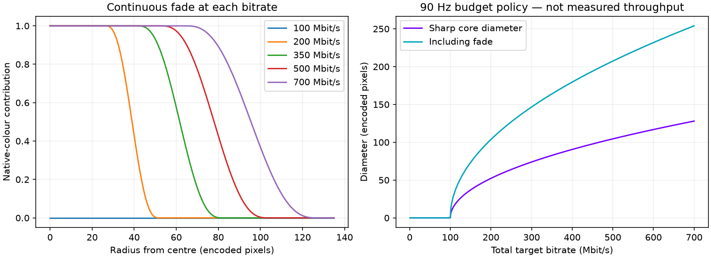

# Adaptive round colour foveation

The sharp colour region and its continuous fade now share the encoder's bitrate budget. This remains a native-colour enhancement inside the existing spatial foveation pipeline, not a replacement of the renderer's projection map.

At the highest setting (700 Mbit/s total at 90 Hz, including 20 Mbit/s safety), the native-colour core is 128 pixels in diameter, followed by a 63-pixel-wide continuous fade on each side. The 256×256 capture contains this circular region. Lower bitrate reduces the radius continuously; the tiny core also fades in smoothly. No discrete spatial quality rings are introduced.

Native tiles with no contribution are omitted from the payload. At 100 Mbit/s total/90 Hz, the 20 Mbit/s safety allocation leaves 80 Mbit/s, so the native enhancement is off and all main-stream budget returns to the normal representation. Tile storage changes in discrete allocations, but the added visual contribution tends continuously to zero at their boundaries. Changes in the existing baseline planner can still be visible.

This deliberately trades centre size against bandwidth. It does not guarantee native detail at every bitrate, eliminate baseline palette blocks, or guarantee fresh 90 FPS. Reserved bytes include conservative raw native storage and transport allowance; LZ4 may reduce actual traffic. Enlarging the high-budget centre is not a bandwidth-saving comparison against the previous smaller centre.

Protocol 9/10 expands native buffer capacity; updated clients retain support for old 7/8 streams. No new headset draw pass or blur filter. CPU blend weights are cached per encoder thread/radius.

## Verification

CPU round/budget/bounds tests and sanitizer run passed. Actual Vulkan foveation shader captured 131072 exact RGB pixels in a synthetic 1:1 fixture. Vulkan encode/LZ4/safety fixture passed with the larger native core. Host and Android builds passed. Live smoke results follow separately below.

## Live smoke limitation

Short connected Pico runs requested 100 and 700 Mbit/s, with adaptive rate control still active. The network controller reduced the effective sender budget substantially, so these runs demonstrate negotiation and continued rendering under adaptation, not sustained 700 Mbit/s or a full-sized centre at 700. Late sender windows were about 80 fresh FPS in the 100 preset and about 50 fresh FPS in the 700 preset. These are not paired performance wins. Do not equate headset refresh with fresh frames. See filtered logs. Native high-budget correctness is established locally by the Vulkan fixture; human quality approval remains pending.
