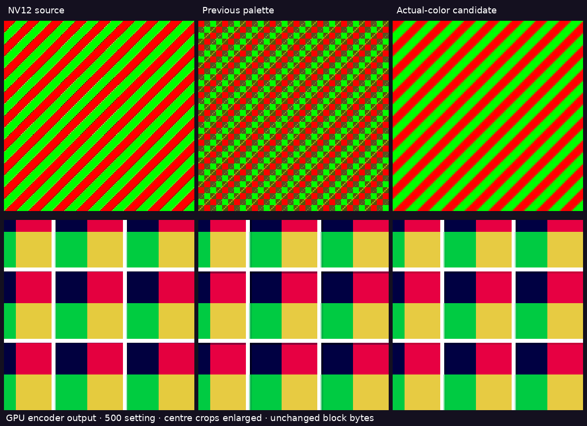

# Better color fitting, unchanged Pico decoder

The direct encoder previously chose the minimum and maximum of each RGB channel
independently. Those corners need not be colors in the block: saturated red and
green can produce artificial black/white endpoints and muddy reconstructed colors.
The new host shader also tests actual sample endpoints along the widest channel,
then performs one least-squares refinement. Each candidate must reduce total
quantized RGB error before replacing the existing fit. The original fit remains
a fallback. This is deterministic fitting, not added temporal processing.

Top: saturated diagonal edges. Bottom: thin white lines over colored regions.
These are crops from production GPU-encoded 2176²-per-eye fixtures, decoded by
the CPU using the existing format. The 500 setting is a representation budget,
not measured network bandwidth. Nearest enlargement exposes the actual blocks.
The second pass is included in the right column. Some fringes remain: four colors
on one palette line cannot represent every combination of white and several hues.
Source chroma subsampling and coarse sampling also remain.

## Results

At the 500 Mbit/s encoder setting, mean squared error against the NV12-decoded
source fell by **85.8% for saturated diagonals, 13.0% for the white-edge fixture,
30.5% for the photo and 10.2% for the rendered room**. All twelve combinations
(four fixtures at 160/200/500) improved in this metric. These are static image
checks, not proof of subjective quality or temporal stability in a game.

Uncompressed block bytes are identical in count. **Compressed bytes can change:**
64 KiB LZ4 chunks grow 28.3% on the pathological diagonal-color fixture at 500,
while the edge/photo/room fixtures shrink approximately 1.4%/0.1%/1.3%.
Better fitting is not a promise of identical radio traffic. Raw measurements
are in `quality.json`. Palette fitting does not add headset decode work or a
new shader pass.

One short paired host test on the photo measured completed encode p50
**0.325 → 0.354 ms** at 500, **0.389 → 0.405 ms** at 200, and
**0.504 → 0.564 ms** at 160. Ten warmup calls are excluded, thirty are measured;
raw p50/p95 values are supplied. These are repeated resident-input GPU encoder
calls with fence completion, without LZ4, network or compositor scheduling.
The pair ran on a shared host and is a cost screen, not a statistically controlled
latency claim. Lower rate does not necessarily mean a faster encoder: coarse
source samples still average many original pixels.

## Shipping state

[WiVRn NX commit `1f3b50e`](https://github.com/nerdrx/wivrn-nx/commit/1f3b50e)
contains the new fit and raises the normal headset bitrate slider ceiling from
500 to **700 Mbit/s**. Extended mode remains 800. Neither change automatically
selects 700. The Android release builds and is installed; the updated host is
running with LZ4 enabled and the saved bitrate setting. No new live FPS claim
is made here. The headset's reconstruction format is unchanged.

## Reproduce

`make_fixtures.py OUTPUT_DIR NX_WARP_ROOT` produces the NV12 fixtures with NumPy
and Pillow, including the existing public-domain astronaut photo and rendered
room source. Compile the old shader from integration commit `33993ac5` and the
new shader from `1f3b50e` with `glslangValidator -V -S comp`.

`timed_fixture.cpp` links with the production `nxwarp_codec_direct.cpp.o`,
`shader_map.cpp`, LZ4 and Vulkan. Set `NX_PALETTE_SPV` to the corresponding
compiled shader, and run `timed_fixture INPUT.nv12 OUTPUT_PREFIX`. It writes
160/200/500 NXDF units and prints encode p50/p95. Use `OUTPUT_DIR/before/NAME`
and `OUTPUT_DIR/after/NAME` prefixes for each fixture, then run
`python3 compare.py OUTPUT_DIR` to regenerate image and quality metrics.
The source conversion and independent decoder are included, not an AI-generated
approximation of codec output. LZ4 sizes were measured with the sibling
[`lz4/bench.cpp`](../lz4/bench.cpp), 65,536-byte chunks.
