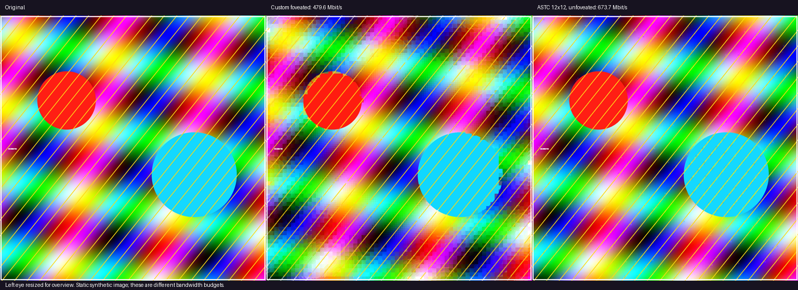
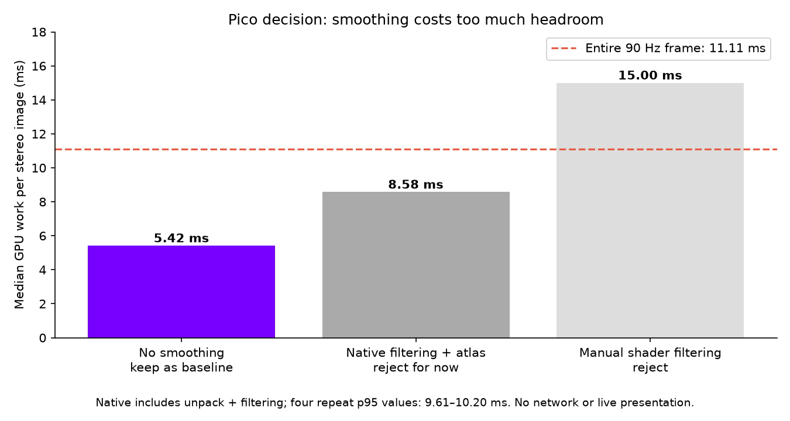
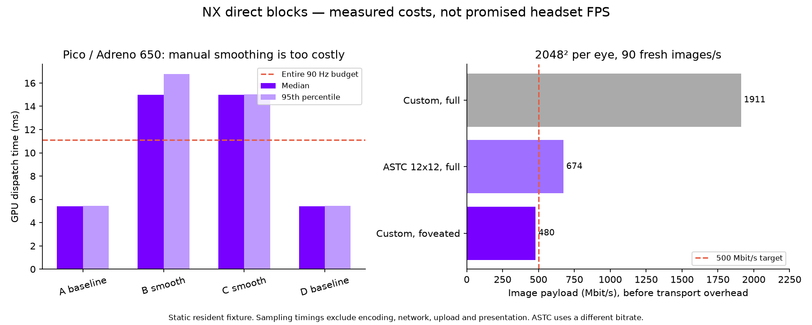
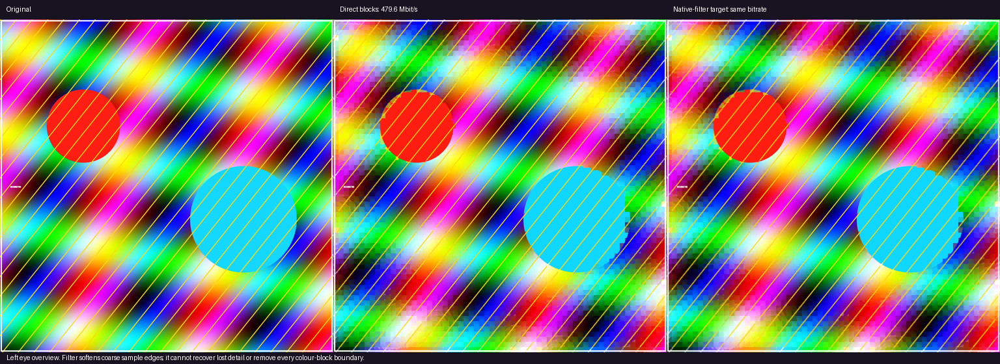

# Direct-sampled blocks: offline feasibility prototype

This experiment spends bandwidth to remove video-decoder stages. Each independent 8×8 sample block holds two RGB565 endpoints and 64 two-bit selectors: 20 bytes total. A sample reads its block and interpolates one of four colours. There is no entropy decoding, temporal reference, motion compensation, or intermediate reconstructed source image in the shader prototype.

The current GPU executable is a **compute surrogate**: it samples packed blocks and writes one RGBA result per output pixel. It is not yet integrated into the presentation fragment shader, the live sender, or the headset. Its output buffer models the unavoidable final pixel write, not a measured OpenXR presentation path.

## Budget and quality constraints

The example eye is 2048×2048 at 90 Hz; stereo bandwidth is calculated from two equally sized eyes. These dimensions are an explicit test fixture, not a query of the current headset render target. Tiles are 32×32 display pixels. Radius below 0.42 uses full sampling; below 0.72 uses half sampling on each axis; outside uses quarter sampling. Radius is normalized to half the eye width. Each tile has a four-byte descriptor.

This layout keeps only about 14% of the image at full spatial sampling. Even that centre has four-colour-per-block quantization; it is not lossless. The prototype deliberately exposes the quality cost rather than claiming a large perfect centre at 500 Mbit/s. Ring boundaries are currently discrete and peripheral samples use nearest reconstruction. Neither this geometry nor these filters are a proposed production default.

Image payload excludes network headers, parity, retransmissions and control traffic. A nominal 500 Mbit/s image budget does not mean the stream fits a 500 Mbit/s usable link. Saturation can increase latency.

## Limits

Initial host tests were followed by the isolated Pico tests below. No live application, motion-to-photon, radio, sustained thermal or power test. The Python encoder is a correctness/quality reference, not a real-time GPU encoder. Static image metrics do not establish motion stability. No claim of being faster than hardware HEVC is made.

## Results



| Path | Stereo image payload at 90 Hz | RGB PSNR on this synthetic fixture |
|---|---:|---:|
| Custom blocks, three sampling regions | 479.55 Mbit/s | 21.27 dB |
| ASTC 12×12, no foveation | 673.71 Mbit/s | 28.37 dB |

**The first custom format is visibly too blocky to promote.** This is a feasibility baseline, not a visual-quality win. The ASTC comparison has 40% more bandwidth and different spatial allocation; it does not isolate codec efficiency at equal rate. Endpoint selection is deliberately primitive (minimum/maximum luminance), so better fitting is also untested. The test uses a deterministic gradient/shape/line fixture, not a game capture.

The custom stream contains 666,048 bytes per stereo image, including its descriptor table. Full sampling everywhere with this format would need 1,911.03 Mbit/s. Adding even 15% transport/recovery allowance to the tested custom image payload reaches 551.49 Mbit/s. No packet transport was implemented here.

### Host GPU sampling

On Radeon RX 7900 XTX / RADV NAVI31, 10 warmup and 50 measured dispatches gave **1.096 ms p50 / 1.126 ms p95** for the combined 4096×2048 image. GPU output matched the CPU's packed-format reference for every pixel. Vulkan validation reported no warnings/errors on the final run. The reused benchmark helper needed two lifecycle fixes: remove obsolete device-layer enabling and destroy its debug messenger.

These timestamps cover one compute dispatch, using host-visible coherent buffers and repeatedly sampling the same resident data. They exclude encoding, data arrival, buffer uploads, queue waiting, network work, lens mapping, OpenXR and scanout. The output is read back only after the run for verification. This is not a measured 90 FPS stream, and the p95 is only this short stationary workload's distribution.

### ASTC reference

Arm's **astcenc 5.3.0**, AVX2, `-cl 12x12 -fastest`, supplied the offline reference. [Upstream implementation and license](https://github.com/ARM-software/astc-encoder) (Apache-2.0; no upstream source copied here). CPU coding time in this one run was 43.3 ms; this encoder does not establish a real-time solution. The host reports `textureCompressionASTC_LDR=false`, so **no ASTC hardware sampling timing** is available. The bitrate includes padded edge blocks and excludes the 16-byte ASTC file header. Raw logs and metadata are alongside this report.

## Reproduce

From the repository root, with NumPy, Pillow, a C++17 compiler, Vulkan loader/headers and `glslangValidator` installed:

```sh
python3 -m unittest discover -s tools -p test_direct_blocks.py -v
python3 tools/direct_blocks.py --size 2048 --out /tmp/nx-direct
# CPU input defaults to a generated stereo fixture; --input supplies your own image.
glslangValidator -V bench/shaders/direct_blocks.comp -o /tmp/direct_blocks.spv
g++ -O2 -std=c++17 tools/direct_blocks_gpu.cpp bench/src/core/nxb_vk.cpp \
  -I"$VULKAN_HEADERS" -lvulkan -o /tmp/direct_blocks_gpu
/tmp/direct_blocks_gpu /tmp/direct_blocks.spv /tmp/nx-direct/descriptors.bin \
  /tmp/nx-direct/blocks.bin /tmp/nx-direct/cpu.rgba 4096 2048 /tmp/gpu.rgba
# Optional ASTC reference, using Arm astcenc:
astcenc-avx2 -cl /tmp/nx-direct/source.png /tmp/reference.astc 12x12 -fastest
astcenc-avx2 -dl /tmp/reference.astc /tmp/astc-decoded.png
```

The independent CPU test covers both eyes, all three spatial scales, descriptor order, selector word boundaries, and exactly representable solid colours. The native harness rejects invalid descriptor sizes, unsupported scale bits and out-of-bounds blocks before dispatch. It is an offline harness, not a hardened network parser.

## Initial next gate

Keep this prototype isolated. Before integration: improve edge/colour quality at a matched total bitrate, compare a foveated hardware-texture representation, implement/measure real-time encoding and fresh-buffer upload, and then test direct presentation sampling on the actual headset. A low desktop sampling time alone is insufficient justification to switch the live client.

## Pico follow-up: speed wins over smoothing





Connected device: Pico A8110, Adreno 650. Native arm64 benchmark, 4096×2048 output, ten warmup dispatches and fifty measured dispatches per run. The client was not replaced and no live application was running. Android tests did not establish validation-layer availability.

| Variant | Median GPU work | Observed run p95 | Decision |
|---|---:|---:|---|
| Direct sampling, no smoothing | 5.42 ms | 5.42–5.43 ms | Baseline candidate |
| Four manual samples outside the centre | 15.00 ms | 15.01–16.78 ms | Reject |
| Reduced-sample atlas + native bilinear filter | 8.53–8.61 ms | 9.61–10.20 ms | Reject for now |

The first comparison used baseline/smooth/smooth/baseline ordering. The native-atlas logs labelled A/B/C/D are **four atlas repeats**, not ABBA; their temperature log's original ABBA heading is inaccurate. Native unpack alone cost about 4.82 ms, with filtering/output around 3.71–3.79 ms. The full two-pass cost is reported, not just the cheap-looking filtering component. A 90 Hz frame lasts 11.11 ms before accounting for other work, so neither smoothing variant earns promotion.

Direct and manual-filter outputs matched their integer CPU references exactly. Native filtering differed by at most one value in an 8-bit channel, consistent with hardware interpolation rounding; no channel exceeded that tolerance. Native tile gutters repeat border samples; this is a cheap reconstruction experiment and can still expose tile boundaries. The reference and images do not claim otherwise.



**No live codec switch was made.** The custom representation runs correctly in a native Pico test, but live transport negotiation, GPU texture input, frame ownership, presentation integration and queue behavior still need implementation/validation. The existing NXVC/ATLAS wire format is not interchangeable with these standalone blocks.

### Server GPU encoder prototype

A matching Vulkan encoder now creates exactly the same packed blocks as the CPU reference. On RX 7900 XTX, this stationary fixture measured 2.83 ms p50 and 3.28 ms p95; every packed output word matched. It uses a static CPU-prepared block job table and RGBA source buffer. These timings exclude live renderer image access, copies, readback, transport and synchronization with the game. It is not an integrated server encoder.

### Continuous radial experiment

A separate CPU-only radial atlas retains a radius-0.42 full-sampling core and smoothly reduces spatial density outside it. This first mapping used 842.14 Mbit/s and scored only 14.72 dB on the line fixture: not a quality or bandwidth win, and not promoted. Reproduction: `python3 tools/direct_radial.py --size 2048 --out /tmp/nx-radial`. Keeping a large core plus a gradual falloff is expensive with this primitive block representation; we will not hide that cost by silently shrinking the centre.

### Reproduce the additional GPU paths

`tools/direct_blocks_jobs.py --size 2048 --out /tmp/nx-jobs` produces source RGBA, block jobs and the expected encoded bytes. Compile `bench/shaders/direct_blocks_encode.comp` and pass its SPIR-V, `jobs.bin`, `source.rgba`, `expectedblocks.bin`, dimensions, output path and `--encode` to `direct_blocks_gpu`.

For smoothing, `tools/direct_blocks_smooth.py /tmp/nx-direct /tmp/smooth.rgba` creates the manual-filter oracle; add `--tile-clamp` for the atlas oracle. Compile `direct_atlas_unpack.comp` and `direct_atlas_sample.comp`. Build `tools/direct_atlas_gpu.cpp` with the same `nxb_vk.cpp` and flags as the direct harness. Its arguments are unpack SPIR-V, descriptors, blocks, oracle RGBA, width, height, output RGBA, sample SPIR-V. On Android, build with the NDK's aarch64 compiler, `-static-libstdc++ -lvulkan -llog -landroid`, then run from a dedicated `/data/local/tmp` directory. These are isolated tests, not a client installer.
