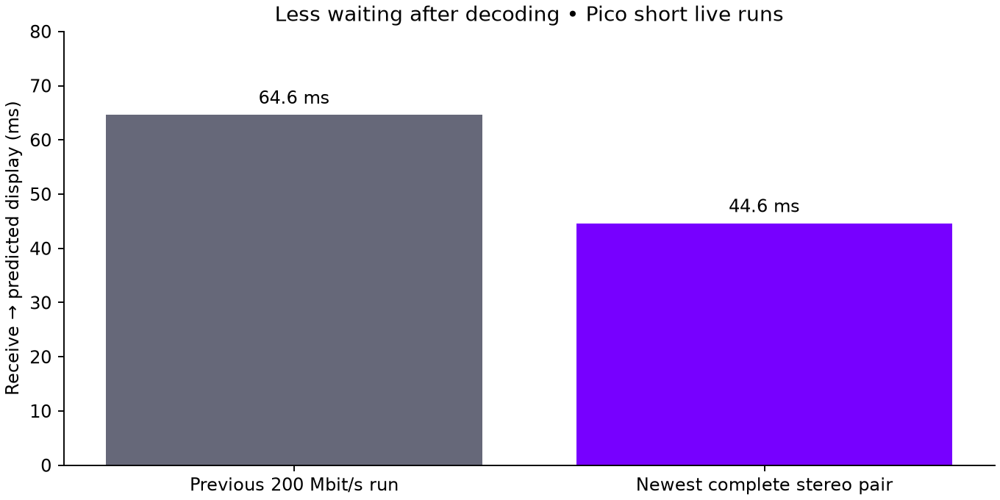

# Direct-frame freshness and missing-prefix repair

The Pico client now chooses the newest complete stereo pair for independent
NX direct frames. Previously, choosing the timestamp nearest the display target
could retain an older image despite a newer decoded pair being available.
Other codec paths retain their existing selection policy.

| Requested bitrate | Fresh FPS after startup | Viewer submissions/s after startup | Receive → predicted display | Decode → selection |
|---|---:|---:|---:|---:|
| 200 Mbit/s | 83.6 | 89.5 | 44.6 ms | 5.4 ms |
| 500 Mbit/s | 14.0 | 88.9 | 159.6 ms | 114.0 ms |

The earlier 200 Mbit/s run measured 64.6 ms receive-to-predicted-display:
this run is approximately 20.0 ms / 31% lower. These sequential short runs
are not a controlled optical comparison. Network and runtime conditions vary.
There were zero selections of older images when a newer complete pair was ready.
**500 Mbit/s remains unsuitable on this tested connection:** missing frames
force repetition. A 90 Hz viewer does not mean 90 fresh images per second.

## Why complete frames were rejected

The generic sparse reassembler treated the lowest received tile as a length
prefix. Direct frames use fixed chunks instead. Losing chunk zero allowed
body bytes from another chunk to masquerade as a plausible length and make
an incomplete frame appear complete. A captured rejected unit was 65,535 bytes
instead of the expected 473,488-byte NXDF unit and began with payload data.

Direct reassembly now requires chunk zero, an exact total length, contiguous
indices, and exact chunk sizes including the final remainder. Sparse/span
mapping retains its prior behavior. Both short runs had **zero direct-frame
bounds/size rejections**, compared with 139 in the earlier 500 Mbit/s run.
This repairs false completion; it cannot recover missing network packets.

## Method and limits

Matching release APK installed on Pico; animated full-field OpenXR scene in
headless gamescope; 2176×2176 encoded pixels per eye; requested 90 Hz;
fixed requested bitrate; trusted-LAN transport. No cursor interaction.
The 200 run contains 15 two-second windows; the 500 run contains six.
FPS above excludes the first startup window only. Including startup gives
78.3 and 11.8 fresh FPS respectively. Durations use rounded logged seconds.
Latency aggregates weight each telemetry window by selected-frame count,
retain repeated images, and exclude windows with at most ten selections.
Sanitized render telemetry and numeric aggregates accompany this page.

**No physical photon latency was measured.** The interval starts at first
packet arrival and ends at runtime-predicted display time. It excludes server
rendering/encoding before arrival, physical movement, scanout and panel response.
The source timestamp can be a future prediction, so source-to-first is excluded.

Regression tests cover missing prefix/middle/tail, plausible false prefix,
short chunks, final partial chunk, surplus bytes, valid fixed frames and legacy
spans. AddressSanitizer and UndefinedBehaviorSanitizer passed. Android release
build and installation passed. The optical test still needs a camera or sensor.

Tests stopped and temporary wake/test properties cleared. The saved test preset
is 200 Mbit/s / 90 Hz. No locked-90 or stable-500 claim is made.
