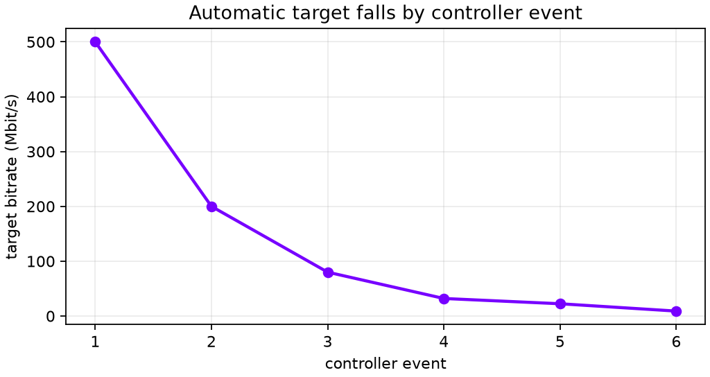
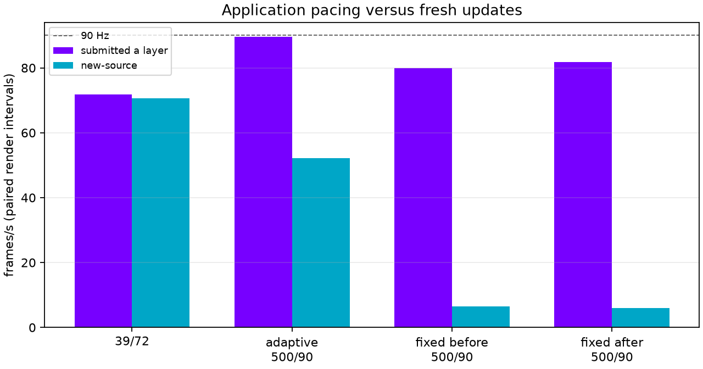

# NXDB direct live — 2026-09-22

This bundle contains telemetry-only results; private logs are not published.
The measurements use only paired lines of the form `render: ... iterations in
... s (.../s), ... submitted a layer, ... new-source`. “Submitted” and
“fresh” are each divided by that same render interval. Startup rows lasting
16.9 s and 19.9 s are disclosed in `summary.json` and excluded from the five
valid fixed-run two-second windows.

| run | submitted a layer | fresh `new-source` | valid windows |
|---|---:|---:|---:|
| 39 Mbit/s / 72 Hz | 71.8/s | 70.6/s | 107 |
| adaptive 500 / 90 Hz | 89.5/s | 52.2/s | 11 |
| fixed 500 before | 79.9/s | 6.4/s | 5 |
| fixed 500 after | 81.8/s | 6.0/s | 5 |

The automatic target event sequence is 500 → 200 → 80 → 32 → 22.4 → 9
Mbit/s. At 500/90, fresh delivery is not sustained despite near-refresh-rate
application submissions. The whole-frame band-deadline and incomplete-frame retirement changes are insufficient. The
logs cannot separate receiver CPU saturation from Wi-Fi loss, and do not
establish wire capacity or motion-to-photon latency.

At fixed 500, the server reports 473,488 bytes/frame at 90 Hz: 340.9 Mbit/s
raw payload against a 433.604 Mbit/s codec budget, with about 0.8 ms host
encode time per frame. The client reports roughly 0.028–0.035 ms per datagram.

`nxdb-live-motion-eye.png` is a deliberately coarse visual sanity capture from
the low-rate 39 Mbit/s run, not a quality claim. Run `python3 plot.py` to
regenerate both graphs.

High-rate render logging ceased after these short windows; the means are not
sustained-session FPS. Render durations are rounded to one decimal place.

[Experimental integration and configuration](https://github.com/nerdrx/wivrn-nx/blob/atlas-live/docs/DIRECT_BLOCKS.md)
