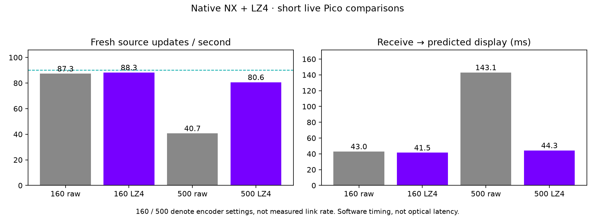

# Native direct streaming + LZ4: live Pico checks

**LZ4 is integrated, installed and exercised over the live transport.** On this
short synthetic scene, the 500 Mbit/s encoder setting improves from 40.7 fresh
updates/s without LZ4 to 80.6–82.3 with it. Software receive-to-predicted-display
delay falls from 143.1 ms to 43.5–44.3 ms. This does not prove 90 fresh FPS,
physical photon latency, or a 500 Mbit/s radio link.

## Matched settings, short runs

| Encoder setting / variant | Fresh updates/s¹ | Receive → predicted display² | Incomplete / closed units |
|---|---:|---:|---:|
| 160, raw | 87.3 | 43.0 ms | 0 / 2,064 |
| 160, LZ4 with CPU staging | 88.3 | 41.5 ms | 0 / 2,068 |
| 500, LZ4 with CPU staging | 82.3 | 43.5 ms | 0 / 2,069 |
| 500, raw | 40.7 | 143.1 ms | 1,015 / 2,001 |
| 500, LZ4 repeated, final APK | 80.6 | 44.3 ms | 0 / 2,067 |

¹ Paired `new-source` counts divided by their render intervals, excluding the
first window. Twelve render windows per successful run. Fresh source selection
is not proof of distinct panel images. ² Weighted sum of logged wire, queue,
decode, decode-to-selection and selection-to-predicted segments, over windows
with more than ten selections. Source rendering/encoding before the first
packet and actual scanout are outside this metric. Rounded log intervals limit
precision. Raw telemetry and the summarizer are included.

Each run lasts approximately 25 seconds. Both use the same headless full-field
hello_xr scene, 100% stream scale, 90 Hz, independent direct blocks, fixed
bitrate, no dense motion warp and no partial-history repair. Bitrate names are
settings: the 500 case budgets 433.604 Mbit/s for the direct codec, then its
discrete layout emits 473,008 bytes per stereo unit before LZ4. No additional
quality is spent from the compressed-byte saving. Normal adaptive bitrate is
restored for the user session afterward.

Order: raw160, failed direct-map LZ4-160, staged LZ4-160, staged LZ4-500, raw500,
then repeated staged LZ4-500. The final APK adds the bundled LZ4 license display;
codec logic is unchanged. Packaging/configuration work overlapped portions of
the first high-rate pair; the final LZ4 repeat ran after the build completed.
Wi-Fi conditions, CPU frequency and thermal state were not controlled. These
are short screens on one device, not a randomized sustained performance study.

## Actual compressed payload and cost

The final logged cumulative counters cover 1,980 compressed units per LZ4 run:

| Setting | Payload bytes saved³ | Pico decompression mean |
|---|---:|---:|
| 160 | 59.0% | 0.099 ms/unit |
| 500, first staged run | 75.3% | 0.260 ms/unit |
| 500, repeated | 75.3% | 0.257 ms/unit |

³ Compression envelope included; network headers, FEC and retransmission are
excluded. No raw fallbacks occurred in this simple scene. This content is much
more compressible than the [photo and noise fixtures](../lz4/README.md), which
show why these savings must not be generalized to arbitrary games.

## The failed version matters

The first integration fed mapped Vulkan output directly into LZ4. It reduced
payload size but host encode windows rose to roughly 18–23 ms/frame, and the
captured six render windows showed only 49.5 fresh updates/s. The log capture
covers less than the full run, so it cannot support a complete-session mean.
Those logs are retained as `lz4-on160*`.

LZ4 repeatedly revisits source bytes. Copying the mapped output once into a
reusable normal CPU buffer before compression reduced the logged combined host
encode time to approximately 0.9–1.0 ms at 160 and 3.0–3.2 ms at 500 in the
corrected runs. This is evidence for the staging change on this machine, not a
claim that a copy is free or that all Vulkan memory has the same behavior.

## Integration and validation

[WiVRn NX `atlas-live`, commit `33993ac5`](https://github.com/nerdrx/wivrn-nx/commit/33993ac5)
adds optional `"lz4":"true"`, 64 KiB independent chunks, and raw bypass unless
the full envelope saves at least 5%. Stream versions 3/4 advertise LZ4 with
legacy/trusted-LAN transport respectively; old clients reject them. The client
validates the bounded envelope, safely decompresses on its decode worker, then
validates the normal frame and uploads it to the existing presentation path.

Missing compressed units are dropped through existing loss feedback. Partial
history recovery is disabled for LZ4 streams, even when an individual unit uses
raw bypass. This avoids interpreting compressed holes as missing pixel tiles.
The normal FEC/retransmission path remains active. Chunk-level recovery and
presentation are not implemented.

ASan/UBSan checks pass for round trips, mixed raw/compressed chunks, raw bypass,
truncation, oversized output, bad lengths/flags/counts and damaged compressed
data. The production GPU encoder test reconstructs byte-identical NXDF output
with LZ4 enabled or disabled. Host server and Android release builds pass.
LZ4's BSD license is packaged in the headset's license list. Build hashes are
recorded in `builds.json`.

The user profile is launched at **160 Mbit/s ceiling, adaptive bitrate, 90 Hz,
100% stream scale, LZ4 enabled**. The smaller centre and wider peripheral source
averaging are included; filtering remains on the PC, with no extra Pico shader
pass. Coarse palette blocks can still be visible. No test scene is left running.
