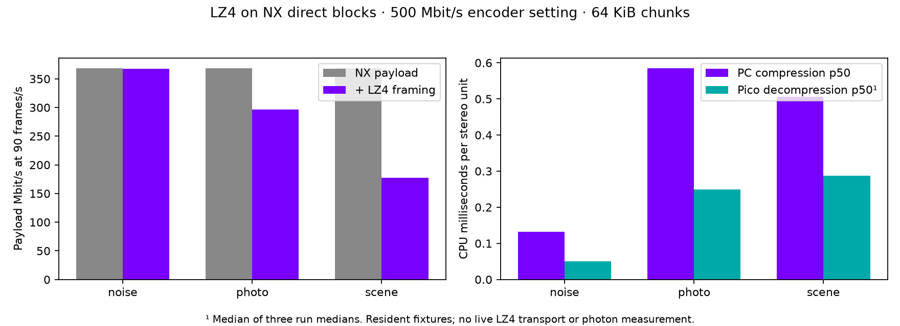

# LZ4 on production NX direct blocks — 22 September 2026

**Worth integrating experimentally: the scene and photo shrink substantially, with sub-millisecond Pico decompression in this fixture test. Noise needs a bypass. This is not yet a live LZ4 stream or a measured latency win.**



## Measured result

LZ4 1.10.0, independent 64 KiB input chunks, `LZ4_compress_default` on the host and `LZ4_decompress_safe` on Pico. Each chunk has a 12-byte experimental header; incompressible chunks are stored raw. Those headers are included below. FEC, network headers and control traffic are not.

At the **500 Mbit/s encoder setting**, the chosen discrete layout emits 511,408 bytes per stereo unit: **368.2 Mbit/s of image payload at 90 Hz**, not 500 Mbit/s of actual image data.

| Fixture | Bytes saved | Resulting payload at 90 Hz | PC compression p50 | Pico decompression p50¹ | Worst run p95 |
|---|---:|---:|---:|---:|---:|
| Photo | 19.5% | 296.3 Mbit/s | 0.584 ms | 0.249 ms | 0.253 ms |
| Rendered scene | 51.8% | 177.6 Mbit/s | 0.506 ms | 0.288 ms | 0.301 ms |
| Independent random noise | 0.09% | 367.9 Mbit/s | 0.133 ms | 0.050 ms | 0.166 ms |

¹ Median of three separate run medians. Runs reverse fixture order alternately. Every measured configuration passes a full byte-for-byte round trip. The checksum of each uncompressed fixture is supplied in `sha256.json`.

At 160 and 200 Mbit/s encoder settings, 64 KiB chunks save 13.8–15.7% on the photo and 34.4–36.0% on the scene. All 36 combinations (three images, three rate settings, four chunk sizes) and all Pico runs are recorded in the CSV files. We tested 1 KiB, 16 KiB, 64 KiB and whole-unit blocks. **64 KiB is a candidate, not a proven optimum.**

## What was actually tested

The production Vulkan encoder, compiled from WiVRn NX `atlas-live` commit `79fde4e`, encodes 2176×2176 per eye from NV12 input. This includes the new smaller centre and peripheral source averaging. The harness exercises the real encoder and validates the resulting NXDF unit with its parser; it does not simulate compressed byte distributions.

Inputs are three static fixtures, not a live game trace: the [existing public-domain astronaut photo](../../90fps-2026-09-11/motion-photo/README.md), the repository's rendered room image (`docs/assets/vrroom-mid.png`), and deterministic RGB noise. Photo and scene are resized to the test resolution; the second eye is shifted 23 pixels. Noise uses independent seeds per eye. These are deliberately different eyes, but are not a physically rendered stereo pair. The original sources are lower resolution than the test, so savings on native high-detail game output may differ.

Host: Radeon RX 7900 XTX encoder; CPU LZ4 timings on the current Linux host. Client: connected Pico, ARM64 Android binary built with NDK 29, `-O3`. Pico tests run alongside the existing user streaming session; workload and CPU frequency are uncontrolled. One thermal sensor read 45.3°C during testing; this is not a thermal study.

Each timing loop has 20 excluded warmup iterations and 100 measured iterations. Allocations, file/ADB I/O and first-use costs are excluded. Each run repeatedly uses resident buffers. Compression timing covers LZ4 calls; production framing, output allocation/copies and scheduling could add cost. Decompression timing includes copying raw fallback chunks. Safe decompression and output equality checks are retained.

## Why this could help latency

At an *assumed* usable link rate of 200 Mbit/s, the saved photo bytes represent about 4.0 ms of serialization; the scene represents about 10.6 ms. Subtracting the measured PC/Pico medians gives an illustrative 3.2 ms and 9.8 ms benefit. **This arithmetic is a model, not a live measurement:** encoding and transmission may overlap, Wi-Fi goodput varies, and queueing may dominate. Noise loses time even though it saves a few bytes.

Integration should compress only when the saving beats a threshold, preserve the raw path, and bound every decompressed chunk. Independent chunks limit dictionary dependencies, but a missing packet can still invalidate the entire compressed chunk. Current partial-tile recovery cannot simply read holes inside LZ4 bytes. Transport framing, chunk completion, recovery and bitrate feedback must be adapted together before enabling it live.

## Reproduce

The exact encoded payloads are in `payloads/`; reproducing CPU compression does not require a GPU. Obtain `lib/lz4.c` and `lib/lz4.h` from [LZ4 v1.10.0](https://github.com/lz4/lz4/tree/v1.10.0) (BSD 2-Clause; no upstream sources vendored here).

```sh
cc -O3 -c lz4.c -o lz4.o
c++ -O3 -std=c++20 -I. bench.cpp lz4.o -o bench
./bench encode payloads/photo-500.nxdf 65536
./bench decode payloads/photo-500.nxdf.65536.lz4b 65536
```

For Pico, cross-compile the same sources with the Android NDK ARM64 compiler, link the C++ runtime statically, and copy both original and compressed fixture files alongside the binary. Run the same `decode` command there. `encode_fixture.cpp` links against the integration build's `nxwarp_codec_direct.cpp.o`, generated shader object and Vulkan loader. `make_fixtures.py OUTPUT_DIR NX_WARP_ROOT` reproduces the NV12 inputs with NumPy and Pillow. The modified source profile is available in the integration commit above.

The earlier 500 Mbit/s streaming problem remains open. This test establishes useful lossless compression and a small measured CPU cost on these fixtures; it does not establish sustained 90 FPS, packet-loss behavior or physical photon latency.
