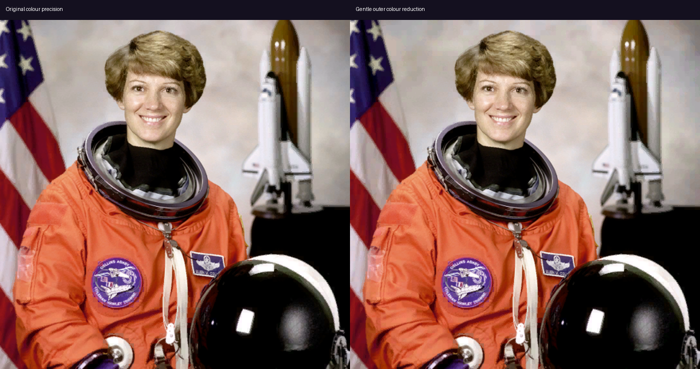

# Peripheral colour precision and LZ4 HC

Outer colour reduction was rejected by the user and removed from the live encoder. LZ4 HC remains an opt-in host experiment; normal LZ4 stays the default.

## Lossless HC results

Actual 2176×2176-per-eye NXDF fixtures, 64 KiB independent chunks, complete-envelope 5% fallback threshold. Eight warmups excluded; 32 measured host calls per case. Existing decoder output was byte-identical to the input. Times measure compression only, not full encoding or photon latency.

| 500-setting fixture | Additional saving, HC 2 | Normal LZ4 p50 | HC 2 p50 | HC 2 p95 |
|---|---:|---:|---:|---:|
| Scene | 10.3% | 0.544 ms | 1.181 ms | 1.226 ms |
| Photo | 3.5% | 0.619 ms | 2.182 ms | 2.210 ms |
| Noise | 0% | 0.165 ms | 2.193 ms | 2.259 ms |

HC 3 saves 17.7% on the scene and 8.4% on the photo, but costs 2.834/4.378 ms respectively. Levels 6 and 9 cost still more. These are fixed fixtures, not representative live averages or Pico measurements. The 500 setting is an admission budget, not actual wire throughput. See [all timings](hc.csv).

The compiled server accepts `NX_DIRECT_LZ4_HC=1` for level 2 when direct LZ4 is enabled. Unset it for the normal compressor. No protocol or client decoder changes. Full host server build and Vulkan safety-prefix encode/decode tests passed with HC both on and off. No headset restart or active-profile change was made for this experiment.

## Rejected colour experiment

Host shader reduced RGB565 endpoint precision only in coarse outer blocks, protected bright/high-contrast samples, refitted selectors, and bounded per-channel decoded change to 12/255. The central radius below 0.60 stayed byte-identical across all 15 image/rate pairs. Smooth radial error allowance did not imply continuous colour precision: endpoints still occupy a discrete lattice.

With normal LZ4 at the 500 setting: photo saved 0.97%, scene 2.38%, noise 0%; edge fixture grew 0.50%. Raw payload sizes stayed identical. User judged these savings insufficient; all production colour changes were removed. [Measurements](outer-color.json).

The HC fixtures predate the colour experiment and have slightly different palette bytes. Compare each experiment against its own baseline; do not combine the percentages.
