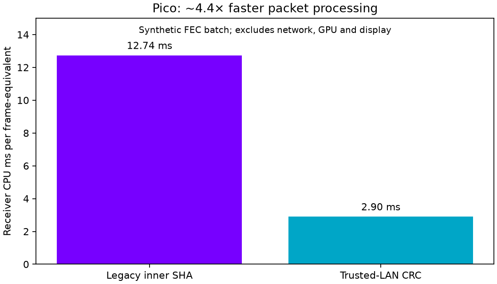

# Packet processing cost — 2026-09-22

The direct-block 500 Mbit/s live test exposed a receiver CPU/delivery bottleneck.
This experiment isolates transport processing; it does not measure Wi-Fi delivery,
GPU decoding, display FPS, or motion-to-photon latency.

## Changes

- Reuse plaintext scratch buffers between packets, including recursive FEC output.
- Parse tile directories without allocating a temporary list.
- Read previous-frame metadata in place instead of copying the entire vector.
- In WiVRn, only scan for window eviction when the newest frame advances.
- Opt-in trusted-LAN CRC32 framing replaces the inner SHA-256 counter-mode encryption
  and tag. This gives accidental-corruption detection, **not authentication or
  confidentiality**. WiVRn's outer socket settings remain unchanged.

The new mode is explicitly selected by NXDB stream version 2 and the server's
`"trusted-lan":"true"` direct-backend option. Version 1 remains the default.
Bounds checks and malformed packet rejection remain enabled.

## Workload and limits

`bench/receiver_hotpath_bench.cpp` constructs a 136×68 tile grid, 51 bytes/tile,
471,648 payload bytes/frame, a 1 KiB MTU, and one band. There are 544 packets/frame
without FEC or 709 with FEC. This is a synthetic payload of similar size to the
live direct-block frame, not a capture of its exact packet layout.

Each timed batch processes 16 fresh frame IDs. Twenty batches use fresh receivers
created outside the timer. Timing includes receive processing, tile-output checks,
and band feedback; it excludes packet generation, sockets and receiver construction.
Every batch checks output count and byte count. Baseline/current legacy-mode
checksums match. CRC-mode feedback differs by construction, so its aggregate
checksum is expected to differ.

The allocation/copy changes alone saved about 2% in the host no-FEC experiment;
FEC results were effectively unchanged. The final host run with FEC took
1,906.297 ms with legacy framing versus 456.886 ms with CRC framing (4.17× speedup).
These totals cover 320 frames, not one frame. Raw host results are included.

[Integration and configuration](https://github.com/nerdrx/wivrn-nx/blob/atlas-live/docs/DIRECT_BLOCKS.md)

## Pico receiver result

Two complete initial portable-SHA runs measured **12.74 ms per frame's worth of
packets** with the legacy wrapper versus **2.90 ms** with CRC32: about **4.39×
faster**, or 77% less receiver CPU time. Every run reported valid output.
These are 320-frame batch averages on the Pico, not display-frame timings.

The raw log includes subsequent experimental runs and repeated third-run labels
following a timeout; those are retained for transparency and excluded from this
summary. Acceleration labels alone are not evidence that hardware SHA executed.

Memory-sanitized receiver tests passed (118 checks), wire-format tests passed,
and matching host and Android release builds succeeded. No claim of sustained
90 Hz / 500 Mbit/s live delivery follows from this isolated result.
