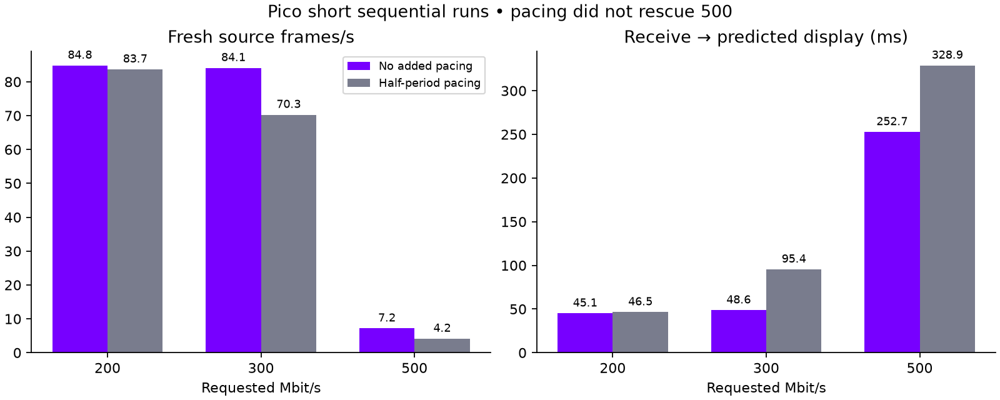

# Testing the 500 Mbit/s bottleneck

**500 Mbit/s is still not usable on the tested connection.** Spreading packets
with the existing pacer did not rescue it, so packet pacing remains opt-in and
all saved normal profiles retain their previous behavior. A short unpaced
300 Mbit/s run was promising: 84.1 fresh FPS and no incomplete frames in its
logged network windows. This is a candidate setting, not sustained proof.

| Requested rate | Added packet pacing | Fresh FPS after first window | Receive → predicted display | Incomplete / closed frames |
|---|---|---:|---:|---:|
| 200 Mbit/s | off | 84.8 | 45.1 ms | 0 / 1888 |
| 200 Mbit/s | half period | 83.7 | 46.5 ms | 0 / 2064 |
| 300 Mbit/s | off | 84.1 | 48.6 ms | 0 / 2067 |
| 300 Mbit/s | half period | 70.3 | 95.4 ms | 303 / 2069 |
| 500 Mbit/s | off | 7.2 | 252.7 ms | 2505 / 2584 |
| 500 Mbit/s | half period | 4.2 | 328.9 ms | 2020 / 2056 |

The 500-rate render telemetry stopped after six and four windows respectively,
while network telemetry continued. Its FPS/latency numbers cover only the
available early windows, not the complete run. This is a failure observation,
not a sustained performance estimate. Network counters cover their own logged
windows; do not divide them by the render window duration.

## Findings

- Direct NX packets bypassed the existing ordinary-video shard pacer. `pace`
  controls frame admission, not spacing between packets of an admitted frame.
- Added `packet-window` (0..0.5, default 0) reuses the existing pacer for direct
  frames. Half a 90 Hz period is about 5.6 ms. Packets are grouped, not delayed
  individually. The sender counts NX transport bytes including parity; outer
  protocol headers are not included in that pacing weight.
- Every run had zero new Pico UDP receive-buffer errors and zero new host UDP
  send-buffer errors in system counters. Increasing those buffers is not
  supported by this evidence. These counters do not identify every possible
  driver, access-point, network or application loss.
- Wi-Fi snapshots showed 5 GHz / Wi-Fi 6 with receive link rates of 432 and
  288 Mbit/s, despite transmit link rates of 864–960 Mbit/s. The receive rate
  matters for PC-to-headset video. These are instantaneous PHY reports, not
  measured application throughput. They provide no basis for expecting
  sustained 500 Mbit/s payload delivery plus overhead.
- Global host/Pico UDP counters diverged heavily at 500. They include unrelated
  traffic and their snapshots are not simultaneous, so they are not presented
  as an exact stream loss percentage.

## Decision and next work

Keep packet pacing disabled by default. The short comparison did not establish
a benefit, and the radio varied between runs. Keep the conservative saved
200 Mbit/s / 90 Hz preset; 300 without pacing is worth a user trial.

For reliable 500, first establish sustained **downlink goodput above the actual
video wire rate** with headroom. A PHY-rate snapshot is insufficient. For
resilience when capacity drops, the next representation change should allow
independently usable regions: retain only missing regions instead of repeating
a whole image. That requires safe layout/version handling and preservation of
stereo/frame metadata; it is not implemented by this pacing experiment.

## Method, validation and reproduction

Same matching Pico client and custom WiVRn NX direct backend, trusted-LAN mode,
2176×2176 encoded per eye, requested 90 Hz, fixed requested bitrate, animated
full-field OpenXR scene inside headless gamescope. No mouse interaction.
Sequence: unpaced 500 baseline (~30 seconds), then 25-second probes of paced
500, paced 200, paced 300, unpaced 300 and unpaced 200. Startup is included in
capture time; this is not a thermal soak or a randomized controlled benchmark.

Fresh FPS excludes only the first logged render window and uses rounded
logged durations. Latency weights windows by selected-frame count, excluding
windows with at most ten selections. **No actual photon latency was measured.**
The interval starts at first packet arrival and ends at predicted display time;
it excludes earlier rendering/encoding and actual scanout/panel response.

The server builds successfully; existing pacing tests plus direct-window checks
pass 89 assertions. Server integration: `5eac3307` on `atlas-live`.
Sanitized client telemetry, UDP counters and `summary.json` accompany this page.
Recompute numeric aggregates with `python3 analyze.py` from this directory.
All probes stopped; temporary test/wake properties cleared. No AP configuration,
network security or unrelated workspace changes were altered.
