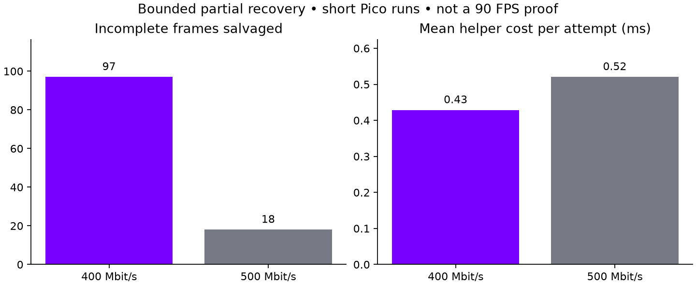

# Bounded tile-aware recovery on Pico

**Partial recovery now works on real incoming direct-frame data, but does not
make 500 Mbit/s usable.** The experimental client rebuilt 97 incomplete units
in the short 400 Mbit/s run and 18 in the 500 Mbit/s run. It remains off by
default because old regions can visibly lag during movement.



| Requested rate | Recovery attempts | Rebuilt units | Mean retained tiles in rebuilt units | Helper ms per attempt |
|---|---:|---:|---:|---:|
| 400 Mbit/s | 143 | 97 | 1.78% | 0.43 |
| 500 Mbit/s | 74 | 18 | 4.35% | 0.52 |

Counters record successfully rebuilt units before worker queuing/presentation;
they do not establish that every rebuilt unit was displayed. Mean helper time
includes failed attempts and excludes normal complete-history copies, upload,
and presentation. Full stereo geometry has 9,248 equal-area 32×32 tiles.

## What changed

The prior direct path rejected an entire image when any fixed transport chunk
was missing. The new opt-in path requires the current frame header, entire
descriptor table and view metadata. It checks each descriptor's full referenced
block range. Received ranges use current blocks; unavailable ranges reuse the
same tile from complete validated history. It repacks descriptors and blocks,
so a changed mode or offset cannot interpret unrelated history bytes as pixels.

Limits:

- At most 10% retained tiles in a rebuilt unit.
- History age at most 50 ms, measured from first packet arrival on the client
  clock. This excludes image age accumulated before arrival.
- Only complete frames become history; recovered output never extends it.
- Missing metadata, invalid bounds, stale history or excessive loss still fail.
- Raw packet holes remain in telemetry and bitrate-loss feedback. A concealed
  frame is not acknowledged as an exact codec reference.

No wire-format change or new GPU pass is required. Missing regions use old
pixels under the current frame's pose; they have no individual pose correction.
That can cause stale patches or motion discontinuities. There is no visual
comfort or jitter-free claim, and no optical photon measurement.

## Live results and limitations

Each probe ran for approximately 25 seconds including startup, with the animated
full-field OpenXR scene under headless gamescope, direct Vulkan display, fixed
requested rate, 90 Hz, 2176×2176 encoded per eye and added packet pacing disabled.
The 400 run logged about 47.5 new-source updates/s after the first window; these
include mixed-age concealed images and are **not fully fresh FPS**. The 500 run
logged about 10.2 updates/s over available early windows before render telemetry
ceased. Neither is a smooth-90 result. Wireless conditions were not controlled;
comparisons with earlier runs do not isolate a causal FPS improvement.

Recovery only attempts frames with recent complete history. Long loss bursts,
missing descriptor-table chunks, and sustained insufficient bandwidth remain
unsolved. This experiment targets scattered damage, not a link overloaded by
its requested rate. A representation with smaller independent metadata groups
would be the next architectural step for larger losses.

The final recovery-off check at 200 Mbit/s produced 83.7 fresh FPS after startup,
zero incomplete frames across its 1,888 logged closures, and 43.0 ms
receive-to-predicted-display telemetry. That last number is not motion-to-photon
latency. Saved settings are 200 Mbit/s / 90 Hz; all probes stopped and temporary
properties cleared.

## Validation and use

Integration commit: `c1a5c3e8` on WiVRn NX `atlas-live`. Matching Android release
build and installation passed. The standalone recovery tests passed with
AddressSanitizer and UndefinedBehaviorSanitizer: missing prefix/descriptor table,
missing block data, malformed offsets, absent history, invalid final chunk,
retention limit, no fresh blocks, changed modes and offsets, exact repacked
block-byte comparisons, and final parser validation.

Experimental activation before opening a stream:

```sh
adb shell setprop debug.wivrn.nx.partial_direct 1
```

Clear that property and reconnect to disable. Ordinary operation defaults off.
Sanitized logs and summary data accompany this report. Tests did not manipulate
the desktop mouse. No scene-quality screenshot or optical capture is claimed.
