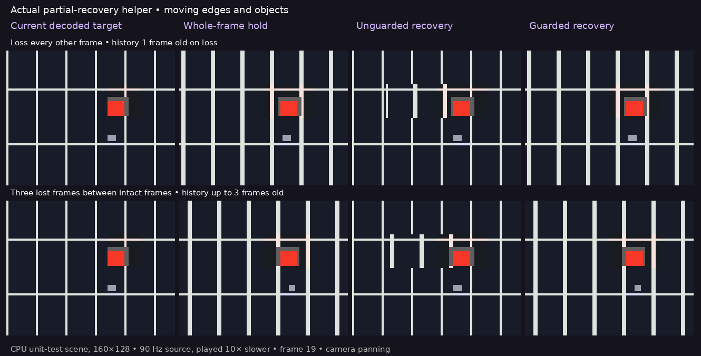
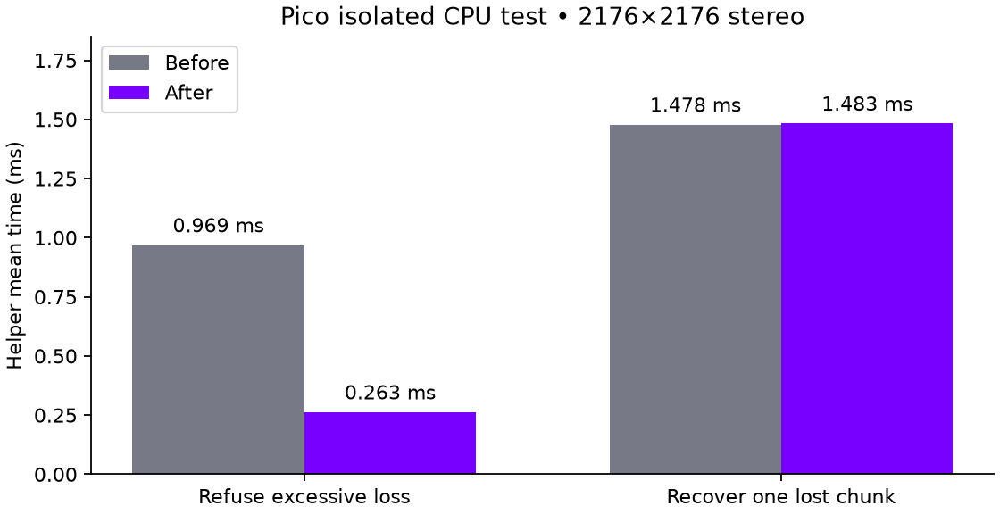

# Motion quality: why fewer repairs can look cleaner

The unguarded partial-recovery experiment can split a moving straight line at
the boundary of an old patch. Average pixel error improves, but the local
shape becomes discontinuous. The new opt-in guard refuses a patch if received
neighboring tiles changed. It keeps the whole previous image instead, trading
freshness for coherent shapes. **This does not solve sustained 500 Mbit/s.**

[Watch the four-way comparison (10 seconds, 10× slow motion)](recovery-motion.mp4)



Columns: current decoded target, whole-frame hold, unguarded partial recovery,
and guarded recovery. Top: one lost frame between intact frames. Bottom: three
lost frames between intact frames. The camera pans for the first half, then
stops while objects keep moving. Notice the broken lines in the bottom third
column; the guard refuses those repairs and preserves the whole old image.

## What the motion test actually exercises

`tests/direct_recovery_motion.cpp` in the integration checkout calls the real
`recover_partial()` helper. It encodes a deterministic small synthetic scene
into valid NXDF mode-1 blocks and decodes the output using the presentation
shader's block-index, palette and selector arithmetic on the CPU. It verifies
that the independent decode matches the encoder's decoded target exactly.
It is not the production GPU encoder, a 3D engine capture or headset footage.

The scene is 160×128 at a simulated 90 Hz. Videos enlarge pixels with nearest
sampling and play at 9 FPS so artifacts are inspectable. Metadata stays intact;
an 80-byte transport chunk crossing the moving object's tile is removed from
each selected loss frame. This affects 2/20 tiles, reaching the live 10% cap.
The chunk size and tiny image are deliberate unit-test parameters, not the live
1166-byte transport and headset resolution. Each comparison receives identical
intact frames; unavailable fresh images are never shown as a fallback.
History advances only on an intact frame, never from a concealed output.

The guard refused every attempted camera-pan repair in both scenarios, enforced
by an assertion. Over the complete 90-frame sequence it accepted 9 of 45 repair
opportunities in the one-gap case and 8 of 67 in the three-gap case. The rest
use the whole-image fallback. Raw frame metrics accompany this page. Unguarded
recovery has much lower mean squared pixel error against the decoded target,
yet visibly breaks lines: that score alone does not represent this quality goal.

## Guard and limitations

For each missing tile, received surrounding tiles must match complete history
in mode and encoded content. Descriptor offsets may move; comparisons follow
each frame's actual offsets. Neighbor checks never cross between eyes. The
missing tile's mode must match, and at least one received neighbor must exist.
The existing 10% area and 50 ms client-arrival-history limits remain.

This is a conservative change detector, not a motion estimator. Motion entirely
inside an unavailable region can escape it. Texture noise can cause extra
refusals. Holding the whole picture still reduces temporal smoothness, and
retained pixels are not separately pose-corrected. No universal edge continuity,
comfort, jitter-free output, or optical latency claim is made. Recovery remains
off by default; enabling `debug.wivrn.nx.partial_direct=1` now uses the guard.

## Cheaper rejection on Pico



Excessive loss is now detected before allocating/copying recovered output.
Three alternating before/after pairs, each 200 helper calls on Pico, measured:

| Isolated case | Before | After |
|---|---:|---:|
| Reject 50% missing payload | 0.969 ms | 0.263 ms |
| Recover one missing payload chunk, guard disabled | 1.478 ms | 1.483 ms |

The refusal path is about 73% cheaper; the successful unguarded path differs by
less than 1%. This synthetic maximum-quality 2176×2176 stereo unit is 2,996,368
bytes, with 1400-byte test chunks. It is much larger than the prior live payloads.
Numbers isolate CPU helper time and exclude networking, GPU work and photons.
The guard is not included in the successful-path cost comparison. Sources,
individual runs and means are supplied as `cost-benchmark.cpp`, `pico-cost.json`
and `cost-summary.json`. Before source is integration commit `c1a5c3e8`.

## Live smoke check

The matching Android release built and installed. A short fixed-400 Mbit/s
Pico run with the guard enabled logged 53 attempts, two rebuilt units and
13.660 ms total helper work. New-source updates averaged 67.5/s after startup
(including concealed output), with 306 incomplete units among 1,878 logged
closures. This is not steady 90 FPS. Conditions differed from prior runs;
these numbers do not isolate an FPS improvement caused by the guard.
The first timestamp-filtered capture failed to record app telemetry, so its
performance is not reported; the documented repeat selected the current app PID.

AddressSanitizer and UndefinedBehaviorSanitizer passed for the recovery tests
and complete synthetic motion sequence. Tests cover changed neighbor rejection,
static neighbor acceptance, stereo-seam exclusion and same-eye next-row checks,
as well as prior malformed-input and byte-exact recovery cases. Integration
commit: `9e4be0cf` on `atlas-live`.

The final normal-profile smoke check (200 Mbit/s, recovery disabled) delivered
85.8 new-source updates/s after startup, with zero holes across 1,882 logged
closures. Receive-to-predicted-display telemetry was 51.1 ms, not an optical
measurement. The short run is recorded in `pico-normal200.log`; it does not
prove sustained performance. Test streaming is stopped, experimental properties
are cleared, and the normal 200 Mbit/s / 90 Hz preset is restored.

## Reproduce the motion artifact

From the WiVRn integration checkout, with C++20 and assertions enabled:

```sh
c++ -std=c++20 -O2 tests/direct_recovery_motion.cpp -o /tmp/recovery-motion
/tmp/recovery-motion /tmp/recovery-motion-frames
```

Then run this folder's `render.py` with Pillow, DejaVu Sans and ffmpeg available:

```sh
python3 render.py /tmp/recovery-motion-frames /tmp/recovery-motion-media
```

No screenshots of private headset passthrough are included. The displayed
comparison is explicitly generated from the deterministic CPU test.
