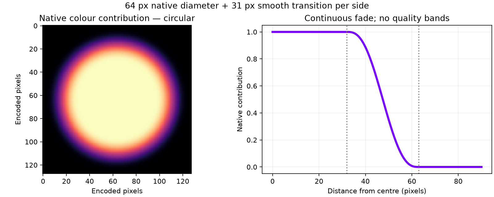

# Round native-colour fade

Replaces the rejected hard square centre with a circular, continuous host-side blend. Native core diameter: 64 encoded pixels. Between radii 32 and 63 pixels, a quintic smoothstep blends into the exact decoded baseline colour. Outside radius 63, output equals the baseline. There are no discrete quality rings; existing outer palette blockiness remains.

The PC computes the blended RGB888 payload. The Pico uses the same native-pixel draw path and existing wire allocation; no blur pass or new shader work. This change does not reduce the reserved native payload size. Geometry is round in encoded coordinates; the existing foveation mapping can reshape it in the final view.

## Short Pico smoke test

Connected Pico, headless moving scene, requested 90 Hz / 500 Mbit/s with adaptive bitrate unchanged. Steady sampled headset refresh was 89–90/90. Sender logged 119–120 fresh frames per 2 seconds (about 60 FPS), with roughly 1.9–2.0 ms average encode time in late windows. Do not confuse refresh with fresh source frames or call this proven 90 FPS delivery. Source footprint was 1×1 texels in the centre.

This is a short integration smoke test, not a paired performance comparison, photon-latency measurement, or human visual approval. Filtered server/client evidence is included; test bitrate overrides were cleared afterwards.

## Validation

Host build, CPU circular/symmetry/boundary/palette tests, AddressSanitizer/UndefinedBehaviorSanitizer, and real Vulkan encoder/LZ4/safety test passed. GPU fixture verifies exact native colour only inside the core. Integration commit: `1211878`. Active server restarted with the round centre enabled and saved user bitrate settings. Human headset review is still pending.
