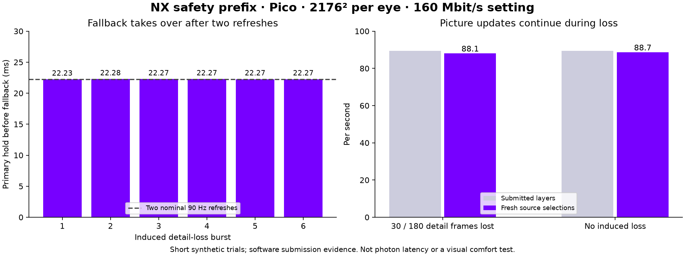

# Safety prefix: bridge detail loss while bitrate catches up

## Question

Can a small native image keep the picture updating when detailed frames fail, with a two-refresh fallback deadline and no extra hardware decoder?

## Method

Matched WiVRn NX server/client, Pico over ADB, native direct RGB blocks plus LZ4, 2176×2176 per eye, 90 Hz, fixed 160 Mbit/s encoder setting. Safety is 544×544 per eye, with up to 20 Mbit/s reserved **inside** the total budget. A headless synthetic moving scene supplies both images. Short trials last roughly 14 seconds after process launch. The first partial reporting window and the following startup window are excluded from throughput averages; five approximately two-second windows remain per final trial.

The client diagnostic deliberately discards detail-only transport chunks on 30 of every 180 source frames (roughly a 333 ms burst every two seconds), preserving the safety prefix. Repeated handovers are the test. This does **not** simulate arbitrary wireless loss, total outage, or measure automatic bitrate recovery time. The no-induced-loss trial uses the same safety-enabled path; it is not an overhead comparison against safety disabled.

## Results

| Metric | Induced detail loss | No induced loss |
|---|---:|---:|
| Fresh source selections/s, including safety | 88.08 | 88.68 |
| Submitted projection layers/s | 89.48 | 89.48 |
| Backwards source-frame selections | 0 | 0 |
| Non-startup fallback transitions | 6 | 0 |
| Primary hold before fallback | 22.235–22.282 ms | — |

All six tested bursts returned to detailed images. The two-refresh target is met in these software selection traces. These are not optical motion-to-photon measurements and do not establish sustained perfect 90 FPS.

The final no-loss trial uses a rebuilt APK with corrected LZ4 byte accounting and safety disabled for unpaired quad streams. Those changes do not change paired-view selection.

## Host and byte checks

The full-resolution Vulkan fixture validates raw/LZ4 decoding, both safety/detail layouts and red/blue eye separation. Its safety payload is 21,688 raw bytes/frame: 19.52 Mbit/s at 90 Hz including the planner's 25% transport allowance. LZ4 reduces that simple fixture to 2,643 bytes/frame; real images may compress much less. Total unit bytes are 25,740 at the 160 setting and 42,757 at the 500 setting. A bitrate setting is not measured radio throughput. [Single-call host timing output](host-gpu.txt) is retained for reproducibility; it is a uniform-color fixture, not a representative latency benchmark.

## Failed iterations retained

- `safety-loss.log`: an unreset window flag stopped repeated safety publication after startup. Fixed before subsequent trials.
- `safety-loss-v2.log`: runtime period rounding sometimes postponed takeover to about 33.4 ms. Final selection counts completed repeated refreshes as well as elapsed display time; the third-refresh delay disappeared in six final bursts.

## Limits and visual check

The Pico screenshot shows its **Environment Too Dark** tracking overlay, not the streamed scene: [captured overlay](tracking-overlay.png). We therefore cannot claim an in-headset visual comfort or quality pass. The app continued submitting layers beneath that overlay. No captured scene screenshot is presented as visual proof.

Safety goes first within each frame, but cannot jump ahead of older detail already queued in the network. Lost safety packets still cause a held image. At very low total bitrate, format overhead can reduce update cadence. Broader congestion patterns, moving-head comfort and long-session behavior remain unproven.

## Reproduce

Use the [integration guide](https://github.com/nerdrx/wivrn-nx/blob/atlas-live/docs/DIRECT_SAFETY.md), enable `safety=true` and `lz4=true`, and run the headless scene. `trial-driver.py` records the machine-specific launch/stop procedure (it requires the existing `/tmp/nx-live-probe.py` helper). Set `debug.wivrn.nx.safety_loss_test=1` only for the injected-loss trial and clear it afterward. Filtered logs retain selection/network evidence without unrelated session details. Run `python3 plot.py` here to regenerate the graph and summary.
