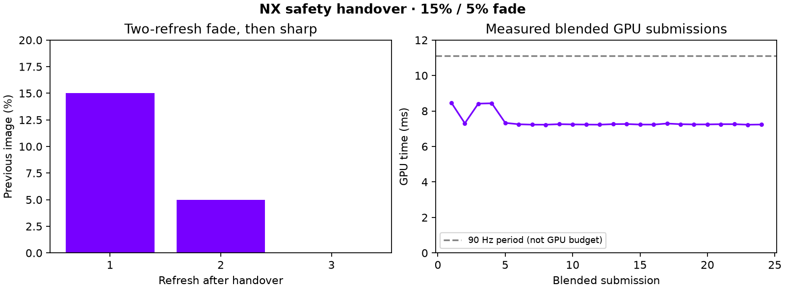

# Rejected experiment: two-refresh handover crossfade

**Decision: removed.** The user reported no noticeable visual improvement and rejected its GPU cost. The active implementation remains the unblended, two-refresh safety fallback. This experiment was tested locally but its rendering changes were never committed or pushed.

The temporary shader mixed 15% of the previous source on the first handover refresh, 5% on the second, then zero. It used the existing presentation pass, retained buffers through the GPU fence, and suppressed blending for larger head-pose differences. It added no intentional future-frame wait, but GPU work still cost time.

A short 90 Hz Pico test at the 160 Mbit/s setting injected detail loss for 30 of every 180 source frames. Twelve full transition sequences and one pose-suppressed startup sequence passed the logged phase check. The 24 blended app GPU submissions measured **7.255 ms median, 8.469 ms maximum**. Whole-run GPU window means were around 3.3–3.8 ms. These are whole app submission times, not isolated incremental shader costs or optical latency.

The sequential disabled run is retained too. It recorded more repeated source frames despite the same intended loss pattern; the cause was not established. The runs therefore do not support a causal claim that blending improves throughput, nor a precise incremental cost estimate. Both reported zero backwards source selections.

Raw filtered logs and extracted values are retained for the rejection decision. No visual benefit or production readiness is claimed. Source changes were reverted and the no-blend build restored.
