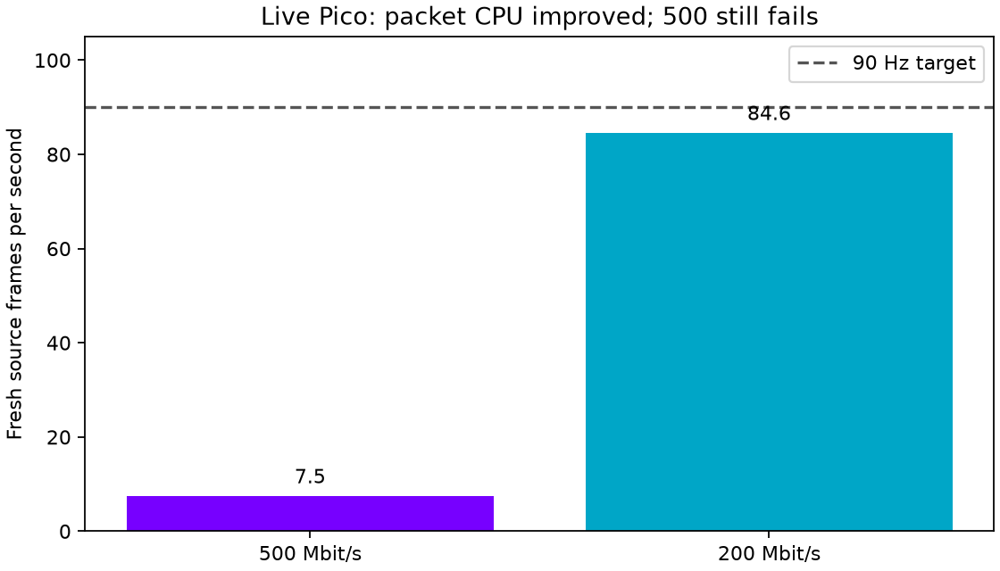

# Trusted-LAN live Pico test and latency limits

The matching trusted-LAN client/server ran an animated full-field OpenXR scene
in headless gamescope at 2176×2176 per eye, 90 Hz, with fixed requested bitrate.
Automatic bitrate was disabled for comparison. These are short runs, not soaks.

| Requested bitrate | Fresh frames/s | Receive to predicted display | Packet handling |
|---|---:|---:|---:|
| 500 Mbit/s | 7.5 over available windows | 207.0 ms | 7.3 µs/datagram |
| 200 Mbit/s | 84.6 | 64.6 ms | 8.1 µs/datagram |

The CPU optimization survives live integration: the old fixed-500 receiver cost
roughly 28–35 µs/datagram. The new 500 run averaged about 201 ms of packet work
per second, freeing substantial CPU headroom. However, most 500-rate frames
still have holes and 139 complete payloads were rejected by direct-frame bounds
validation. This rejection also existed before CRC mode (168 in the earlier
fixed-rate log); its cause remains unresolved. It must not be attributed solely
to Wi-Fi loss. The 500-rate render logs ceased after six available windows, so
that average is not a sustained FPS claim.

The 200 run had 18 approximately two-second render windows, 89.4 submitted
layers/s, 84.6 fresh source frames/s, and no direct-frame validation failures.
Its final three windows delivered 83.5, 81.5, and 81.0 fresh frames/s: it does
not prove a locked 90 fresh FPS.

## What was measured about latency

**No actual photon latency was measured.** No optical sensor or high-speed
camera captured physical movement and illuminated display pixels.

The reported interval adds the existing client-clock segments: first-to-last
packet arrival, decode queue, upload/decode, decoded-frame retention until
selection, and selection to the runtime's predicted display time. Values are
weighted by selected-frame count and include repeated images. They exclude
server rendering/encoding before packet arrival, actual scanout, panel response,
and the physical-motion timestamp. They are not motion-to-photon measurements.

The source-to-first-packet field sometimes becomes negative because the source
anchor is a predicted display timestamp. Therefore the logged total including
that field is not reported as end-to-end latency. Actual photon proof needs an
optical setup; faster CPU benchmarks cannot substitute for it.

Tests were stopped, temporary wake/test properties cleared, and the headset's
last saved setting is **200 Mbit/s / 90 Hz**. The trusted-LAN profile remains ready
for the next test. Raw sanitized render telemetry and aggregate values accompany
this page. No private addresses or connection credentials are published.
