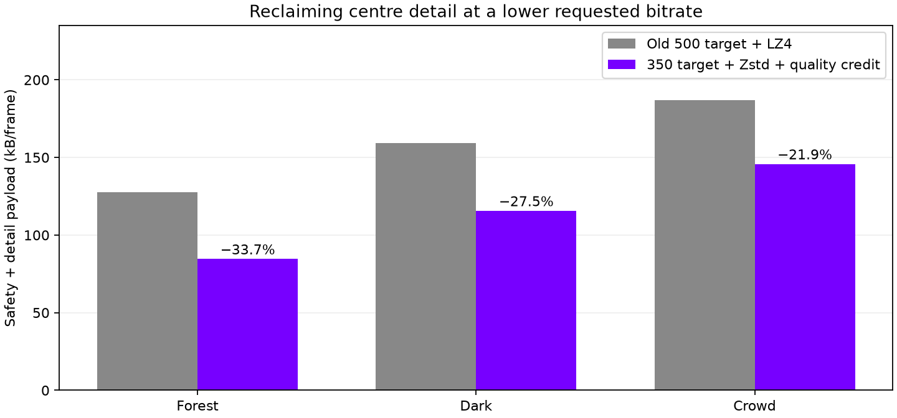

# Reusing compression savings for detail

Experimental, opt-in host planner. The goal is to preserve the earlier 500 Mbit/s allocation's appearance while requesting less network budget. It is not a new lossy representation: it changes which existing detail levels the encoder chooses.

## Policy

`NX_DIRECT_COMPRESSION_CREDIT=1` works with native RGB888 and Zstd. It starts at 1.0 and requires eight successful saving frames before growing. Credit uses 80% of the worst observed detail compression ratio, grows by at most 0.1 per window, and caps at 1.5. Complete payloads must leave at least 10% spare budget to authorize growth. More than 10% overshoot or no compression gain resets credit. A changed bitrate immediately changes planning, retains the established factor, and clears the growth sample window; refresh changes reset it.

Safety is reserved separately. Planning changes are deferred until the next frame to preserve returned metadata lifetimes. The feature stays off by default. A scene cut can still overshoot for one frame before feedback; this is not a hard wire-size guarantee. Existing transport, loss handling and automatic-rate controls remain active.

## Controlled image results

Same private fixtures and previous reference allocation as [scene-compression](../scene-compression/README.md). Eighty GPU-encoded frames per case; constant image, duplicated eyes, independent image units. The reported final frame follows convergence. The 500-reference raw payload was verified byte-identical to the earlier reference.

| Scene | Old 500 target, LZ4 | New 350 target, Zstd + credit | Saving |
|---|---:|---:|---:|
| Foliage | 127,585 B | 84,553 B | 33.8% |
| Dark patterns | 159,367 B | 115,590 B | 27.5% |
| Crowded group | 186,748 B | 145,757 B | 21.9% |

These sizes include safety and detail envelopes, but exclude FEC, network headers and control traffic. The new representation is not pixel-identical: it restores centre detail and slightly increases nearby baseline detail. Mean absolute RGB differences from the 500 reference inside a central 128-pixel-diameter circle were 0.008, 0.014 and 0.072 code values, respectively (8-bit channels). Full-image differences were 0.118, 0.234 and 0.976. Whole-image averages hide local changes, so regional results are included separately. None of these metrics proves subjective equivalence.

The credit itself increases encoded detail and bytes relative to the same lower target without credit. **Zstd provides the compression saving; credit spends part of it to restore quality.** There is no claim that credit alone compresses better.

## Validation limits

Initial discarded test outputs accidentally skipped input reads under `NDEBUG`. The corrected runner uses explicit read/decode checks. A separate preview renderer initially used a mono descriptor stride; it was corrected to the stereo stride and its distorted renders were discarded. Published metrics use actual source RGB PNG pixels, correct eye-interleaved descriptors, and verified decoded frames. Private photos and rendered comparisons are not redistributed.

State-machine sanitizer tests cover warmup, capped growth, worst-window ratio, budget changes, near-limit hold and overshoot retreat. Live Pico smoke and automatic-rate investigations are ongoing; this feature has not been promoted as a default.
