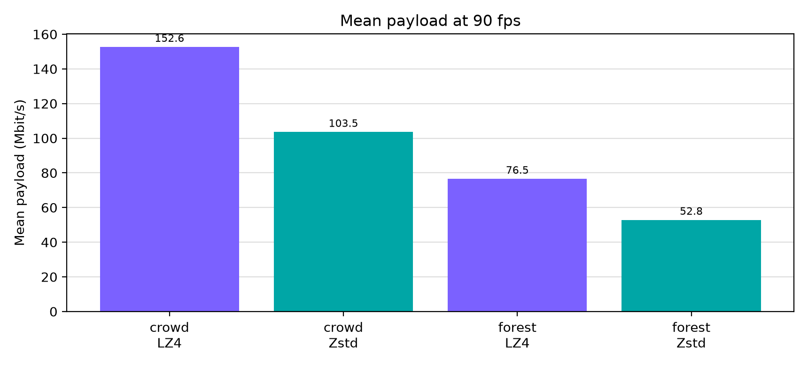

# 90 fps live lossless photo bench

This is a paired server/Pico throughput smoke test using synthetic photo scenes with a shifted source frame. It measures transport and codec cost; it is not a game workload, motion comfort result, or perceptual quality proof.

The run used native RGB888 capture, fixed 500 Mbps probing, compression credit disabled, and 64 tail packets in both codec modes. Each row is a full-frame lossless envelope, so the codec comparison does not introduce a quality tradeoff. Fixture byte identity is a separate proof and is intentionally not inferred from these throughput logs.

## Results

| Scene | Codec | Encoder fps | Payload Mbit/s | Encode ms | Source fps | Pico app-loop fps | Pico decode ms | Windows |
|---|---:|---:|---:|---:|---:|---:|---:|---:|
| crowd | LZ4 | 90.0 (p95 window mean 90.5) | 152.6 (p95 window mean 153.5) | 4.20 | 85.3 | 89.4 | 0.2 (p95 window mean 0.2) | 20 |
| crowd | Zstd | 90.1 (p95 window mean 90.5) | 103.5 (p95 window mean 104.0) | 5.08 | 85.4 | 89.5 | 0.6 (p95 window mean 0.6) | 20 |
| forest | LZ4 | 90.0 (p95 window mean 90.0) | 76.5 (p95 window mean 76.5) | 3.40 | 87.3 | 89.5 | 0.2 (p95 window mean 0.2) | 20 |
| forest | Zstd | 90.0 (p95 window mean 90.0) | 52.8 (p95 window mean 52.8) | 3.75 | 88.4 | 89.4 | 0.4 (p95 window mean 0.4) | 20 |

Zstd reduces mean payload from 152.6 to 103.5 Mbit/s on crowd (32.2%) and from 76.5 to 52.8 Mbit/s on forest (31.0%), while both modes sustain about 90 fps. Pico decode rises from 0.2 to 0.6 ms for crowd and from 0.2 to 0.4 ms for forest.



## Numeric window policy

The analyzer retained 20 complete two-second windows per case and discarded the first five server windows as warmup. The table reports means and nearest-rank p95 values of those window means, never frame-level p95 values. The bundled sanitized windows are the reproducible source for the numbers; regenerate this report with:

```text
python3 generate_report.py
```

Source analysis generated at 2026-09-23T00:16:45.983747+00:00.

The report contains no source images or private log paths.
