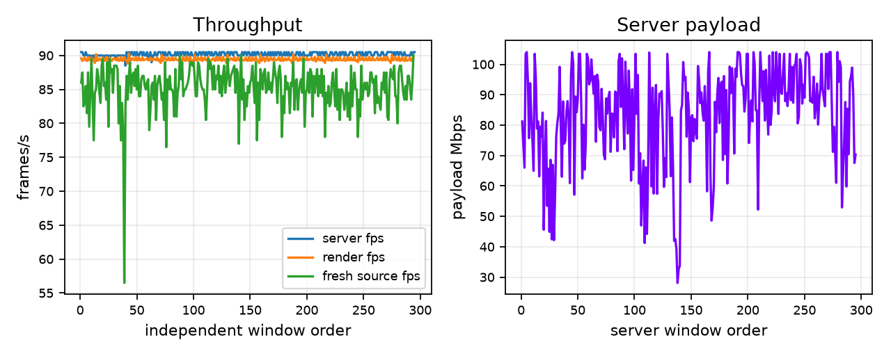

# Normal launch saved-settings validation

This artifact summarizes the completed `photo-saved-settings` run using saved SERVER auto configuration. The validation used native RGB888, Zstd3, compression credit off, tail padding 64, newest selection, and ready 0, with a 10-minute crowd-shift photo fixture. The headset retained saved 500/90 presets from prior runs; no debug bitrate or refresh override was used. The fixture is not a game or photon-latency measurement.

`windows.csv` contains sanitized numeric server and client windows. Server, client, and network windows are independent sequences; rows do not associate network holes with render windows. `summary.json` contains aggregate metrics. Fresh-source FPS mean/min and total network holes are reported there.

Payload is encoded codec output arithmetic, excluding transport, FEC, and optional padding; it is not a link-capacity measurement. Fresh-source FPS counts newly selected source frames and does not establish full physical display cadence.

Rebuild from the bundled files:

```text
python3 rebuild_report.py
```

Measured: **85.20 fresh selections/s mean**, **56.50 minimum two-second window**, **57 incomplete network units**. Encoder mean: 90.19 FPS; payload mean: 83.50 Mbit/s. These remaining losses are not a stable-90-FPS result.


