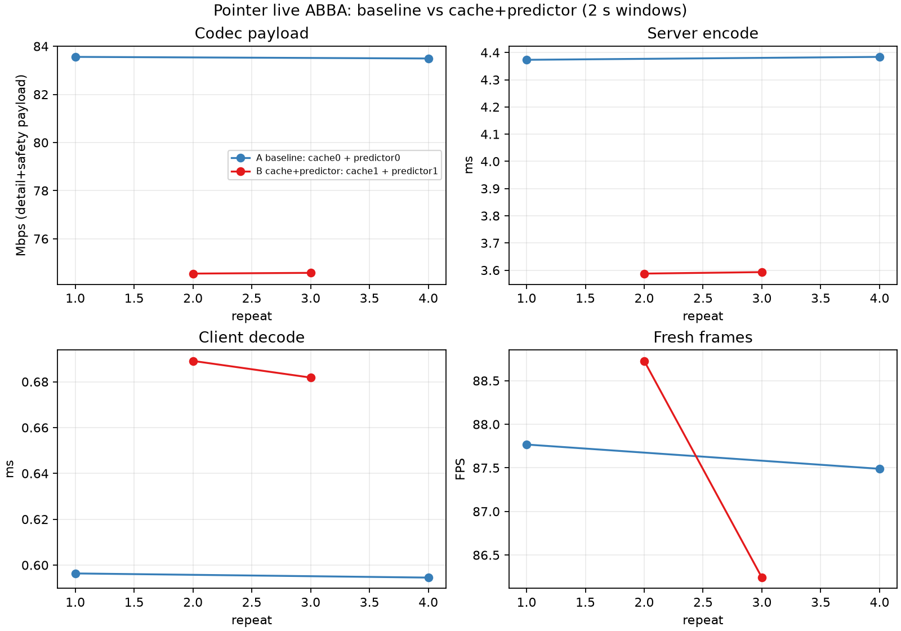
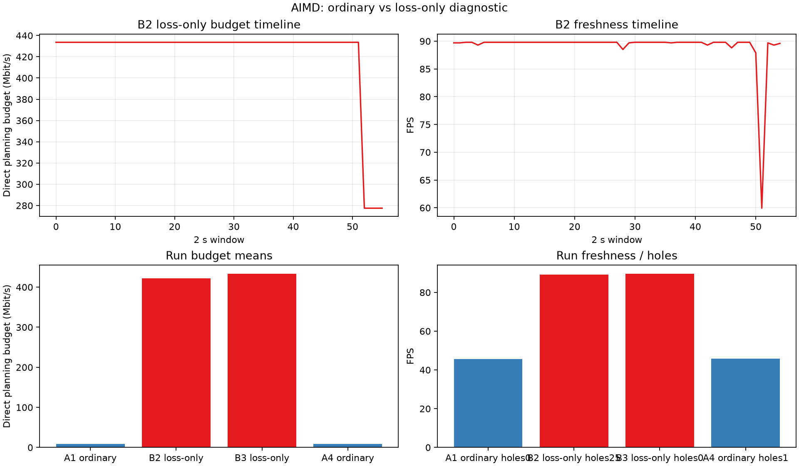
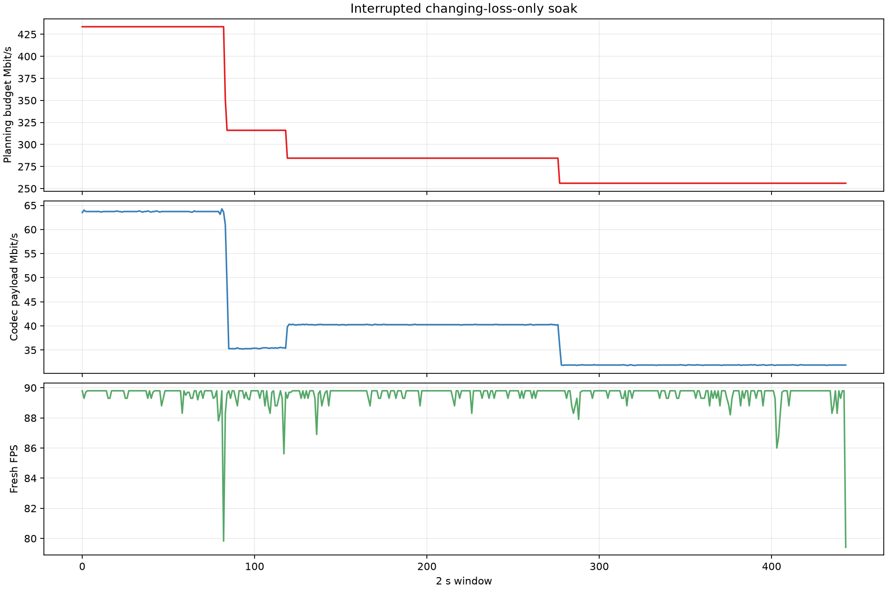

# Overnight: less traffic, measured tradeoffs

The native Vulkan path now has exact-repeat compression reuse and an optional
lossless byte predictor. The strongest result is fewer transmitted codec bytes
at the **same encoded representation**, rather than lowering image quality to
make a bandwidth graph look better.

[Method and measurement limits](METHOD.md) · [Final build hashes](build-manifest.json) · [Next experiments](NEXT.md)

## Results that held up

| Experiment | Measured result | Qualification |
|---|---|---|
| Lossless predictor, actual GPU codec fixtures | 8–11% less complete codec payload than ordinary Zstd | Same restored encoded bytes; excludes transport/FEC/padding |
| Exact-repeat cache | About 0.6–1.0 ms less host encode work on repeated fixtures | Changing content still needs compression |
| Paired live repeats | 83.53 → 74.57 Mbit/s; encode 4.38 → 3.59 ms | Pico decode 0.595 → 0.685 ms; bounded photo workload |
| Timing pair | 46.63 → 42.62 ms derived software delay; 88.52 → 89.54 fresh selections/s | Combined 5 ms JIT cap + 4 ms ready wait; not photon latency |
| Whole-picture changes | 71.24 → 63.74 Mbit/s (10.5% less) across four usable runs | Control replacement followed a longer capture; not contiguous ABBA |

[Compression and exact-byte checks](compression-report/README.md) ·
[Live compression repeats](pointer-live-report/README.md) ·
[Timing comparison](ready-abba-report/README.md) ·
[Changing-picture measurements](churn-pointer-report/README.md)

The predictor remains opt-in. Its extra PC work is visible on constantly changing
content: the changing-picture means were roughly 4.21 → 4.86 ms encode time
and 0.5 → 0.6 ms Pico decode telemetry, while fresh-source selection remained near
90/s. This is not a claim that every workload gets both faster and smaller.

## Automatic quality control is a separate problem

Ordinary AIMD and BBR both collapsed the planning budget on this fixture. The
opt-in loss-only AIMD diagnostic stops receive-span-only downward cuts while
retaining existing loss, late-frame, radio and ceiling rules. Two short candidate
runs selected 89.14 and 89.66 fresh sources/s versus about 45.7 for ordinary AIMD.
The first candidate encountered 25 incomplete units and lowered its requested
budget 500 → 400 → 320 Mbit/s; the second held its initial budget with none.

Receive timestamps are userspace handler timestamps. No next-frame completion
deferral was found, but scheduling/batching can contribute to the measured span.
That mechanism is not yet established. The unchanged healthy threshold can also
delay upward recovery after a real cut, so this is **not a finished automatic
controller or a new global default**.

[Controller baseline](controller-check-report/README.md) ·
[Loss-only diagnostic and loss-burst timeline](aimd-span-report/README.md)

## Longer capture and recovery limitation

An interrupted roughly 900-second changing-picture capture retained 444 telemetry
windows: mean fresh-source selection 89.55/s, minimum 79.41/s, and five incomplete
units. The controller request descended from 500 to 295.2 Mbit/s and did not
recover; therefore its lower mean payload does not prove retained quality. The
supervisor exited 143 without a normal completion marker, so this is descriptive
evidence, not a successfully completed soak.

[Timeline and interruption details](changing-soak-report/README.md).

## Experiments kept as evidence, not promoted

- [Earlier scalar predictor](live-predictor-report/README.md): greater decoder cost; distinct from the current pointer-local implementation. The production microbenchmark baseline is **ordinary Zstd v1**, not this scalar predictor.
- [Packet pacing](pacing-report/README.md): cadence/latency tradeoffs vary between repeats.
- [JIT cap alone](jit-clean-report/README.md): inconsistent; the combined ready-wait result must not be attributed to the cap alone.
- [Nominal BBR](nominal-live-report/README.md) and [guarded nominal BBR](nominal-paced-report/README.md): quality still collapsed; removed from production. The latter includes the archived rejected patch.
- [Copy bypass and pretransforms](compression-report/README.md): negative or too costly; not enabled. Contended NEON timings are excluded.

## Reproduction and privacy

Each report includes numeric CSV/JSON and a chart rebuild script. Private source
photos, raw device logs, addresses and device identifiers are not published.
An original changing-picture control disconnected before usable measurements;
it is marked invalid rather than treated as a successful idle-server run.

These results establish neither physical panel cadence nor physical photon
latency. Fresh source identifiers are not unique image content. The private-photo
fixtures duplicate views and do not replace a real game or wearer assessment.
