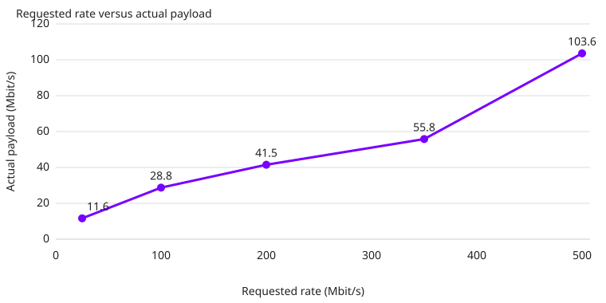

# Photo rate sweep

Fixed crowd scene, Zstd level 3, native RGB888, tail64, newest selection, compression credit off. Each requested rate ran 50 seconds after source upload. This measures requested encoder budget against actual compressed payload; fresh-source FPS is shown separately from encoder/render-loop FPS. It is a synthetic shifted-photo throughput smoke test, not a perceptual or game-quality proof.

| Requested Mbit/s | Payload Mbit/s | Encode ms | Fresh source fps | Encoder fps | Server/Client windows | Network holes |
|---:|---:|---:|---:|---:|---:|---:|
| 25 | 11.6 (p95 11.6) | 1.70 | 88.3 | 90.0 | 20/19 | 0 |
| 100 | 28.8 (p95 29.0) | 2.24 | 81.9 | 89.8 | 20/19 | 5 |
| 200 | 41.5 (p95 41.5) | 2.72 | 88.5 | 90.0 | 20/20 | 0 |
| 350 | 55.8 (p95 56.2) | 3.73 | 85.7 | 89.8 | 20/20 | 0 |
| 500 | 103.6 (p95 104.0) | 4.89 | 85.3 | 90.1 | 21/20 | 20 |

The report retains the complete server/client window counts shown in the table (the 50-second runs usually yield 20 server windows after warmup; the 500 case has 21 server windows). Network holes are reported explicitly, including nonzero cases; values report the mean plus nearest-rank p95 of window means. No private paths or source photos are bundled.

Regenerate with `python3 generate_report.py`.
