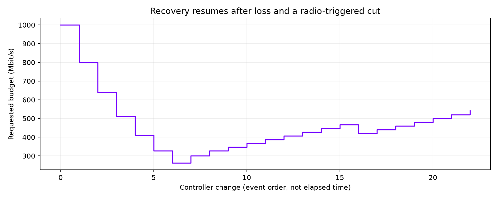

# Recovery gate: upward probing resumes

The loss-only AIMD experiment suppressed false congestion cuts but still required a receive span below 0.60 refresh periods to recover. The Pico commonly reported clean delivery spanning nearly one refresh, so quality could stay low indefinitely. The opt-in mode now permits recovery below 1.10 periods, with **zero lost and zero late frames**. Ordinary AIMD retains 0.60. Step sizes, ceilings, cooldowns, and radio holds are unchanged.

## Live Pico check

A completed 240-second changing-picture run at 90 Hz, 100% resolution, and the user's 1000 Mbit/s requested ceiling showed actual loss driving the budget from 1000 to 262.1 Mbit/s. Clean feedback then recovered to 467.7. A radio-triggered cut to 420.9 was followed by renewed probing to **540.9 Mbit/s**. These are controller budgets, not compressed payload throughput. The chart uses event order because server messages lack timestamps.

Across 115 retained client windows: mean fresh-source selection **88.04/s**, median **88.80/s**, minimum **51.88/s**. There were **175 incomplete units**; this is recovery evidence, not a loss-free result or proof of sustained 1000 Mbit/s. Mean codec payload was **53.48 Mbit/s** across 116 retained server windows; changing budgets also changed quality, so this is not a same-quality compression comparison.

Two private pictures alternated every stereo frame. Native RGB888, compression cache and predictor enabled, Zstd level 1, loss-only AIMD, JIT cap 5 ms, ready wait 4 ms. This is a short device test, not a matched live before/after, real-game motion test, or photon measurement. Rounded telemetry windows and the existing analysis warm-up exclusions apply. Source photos and raw device logs remain private.

## Validation

Focused virtual-clock tests pass in normal and NDEBUG builds. They fail against the old controller at the expected recovery assertion. Clean 0.96-period delivery recovers only in the opt-in mode; spans above 1.10, loss, and late feedback prevent increases. Persistent loss still cuts. Host server build passed; the tested binary hash is in run.json. The local build also contains unrelated NXFuse working-tree changes, so it is not a byte-identical build of the published integration commit.

Server and headset app were stopped after testing. No new APK was required. The fix remains opt-in through `WIVRN_BITRATE_AIMD_LOSS_ONLY=1`.

## Follow-up: stronger recovery (local simulation only)

Integration commit `ce7f9421` shortens the loss-only clean hold to 250 ms and
uses steady upward probes of at least 15% of the current budget. Fresh feedback
collection and evaluation intervals still add time between steps. Ordinary
AIMD, ceilings, loss/late/span gates, and radio holds are preserved.

A deterministic 90 Hz trace first supplies three seconds of missing frames,
then clean 0.96-period receive spans. Both controllers fall to 327.68 Mbit/s.
The previous `4435f051` controller reaches the full 1000 Mbit/s ceiling 55.21
seconds after the loss phase ends; the new controller takes 7.90 seconds.
Normal and NDEBUG regression checks pass, including loss/late/span guards;
the previous controller fails the new ten-second recovery bound. Host build
passes. These numbers are **simulated controller time, not live Pico timings**.
The user requested no restart, so the new policy has not been live-tested or
activated in their existing session. Faster probing may overshoot a variable
link more often; a paired device check remains necessary.

### Stronger clean probes

The next opt-in variant raises proportional recovery steps from 15% to 35%,
keeping the same clean-feedback gates, 250 ms hold, radio checks and ceiling.
The identical simulated 327.68 → 1000 Mbit/s recovery takes **4.01 s**
(15%: 7.90 s; original gate: 55.21 s). Normal and NDEBUG tests pass, including
continued-loss backoff and blocked recovery with late/slow feedback.
Larger steps increase overshoot risk on real Wi-Fi. No restart or live test
was performed; this remains a candidate for the next user test.
