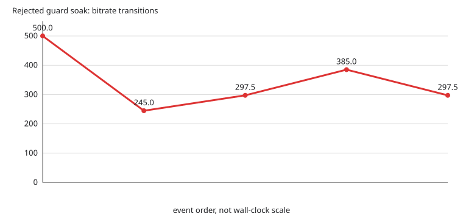

# Rejected controller guard experiment

**Disposition: rejected for live promotion.** The unit fix was correct in isolation, but the live soak was aborted after about four minutes because quality stayed stuck after the early backoff.

This report contains controller telemetry only. It has no source photos and makes no perceptual or full-session performance claim.

## Configuration

The run used a 500 Mbit/s ceiling, BBR v2, native RGB888, 64 tail packets, and compression credit disabled. The guard was reverted at commit `29f74462`; existing congestion and loss logic was preserved.

## Evidence

| Event line | Controller event |
|---:|---|
| 138 | backing off, 500.0 -> 245.0 Mbit/s (estimate 350.0 Mbit/s, gain 0.70, recent 0.0 Mbit/s over 0 samples, slowdown x1.00, p90 utilisation 1.03, 0 lost, 11 late over 180 frames) |
| 142 | steady, 245.0 -> 297.5 Mbit/s (estimate 350.0 Mbit/s, gain 0.85, recent 335.1 Mbit/s over 1 samples, slowdown x1.04, p90 utilisation 0.19, 0 lost, 0 late over 78 frames) |
| 155 | probing at gain 1.10, estimate 350.0 Mbit/s |
| 156 | probing, 297.5 -> 385.0 Mbit/s (estimate 350.0 Mbit/s, gain 1.10, recent 0.0 Mbit/s over 0 samples, slowdown x1.00, p90 utilisation 0.20, 0 lost, 3 late over 179 frames) |
| 157 | steady, 385.0 -> 297.5 Mbit/s (estimate 350.0 Mbit/s, gain 0.85, recent 0.0 Mbit/s over 0 samples, slowdown x1.00, p90 utilisation 0.29, 0 lost, 0 late over 30 frames) |
| 161 | no loaded frame for 10000 ms, dropping the bandwidth estimate |

The controller backed off from 500.0 to 245.0 Mbit/s on p90 utilization 1.03 with 11 late frames, recovered only to 297.5 Mbit/s, briefly probed to 385.0, then returned to 297.5. It later dropped the bandwidth estimate after 10 seconds without a loaded frame.

Unit validation remained green: 74 BBR checks passed, and the ASAN/UBSAN run passed 74 checks with no diagnostics. Those tests do not override the live quality result.

The soak was stopped intentionally once the quality target was clearly not recovering; it is incomplete evidence, not a 20-minute soak result.

Regenerate with `python3 generate_report.py` from this directory.
