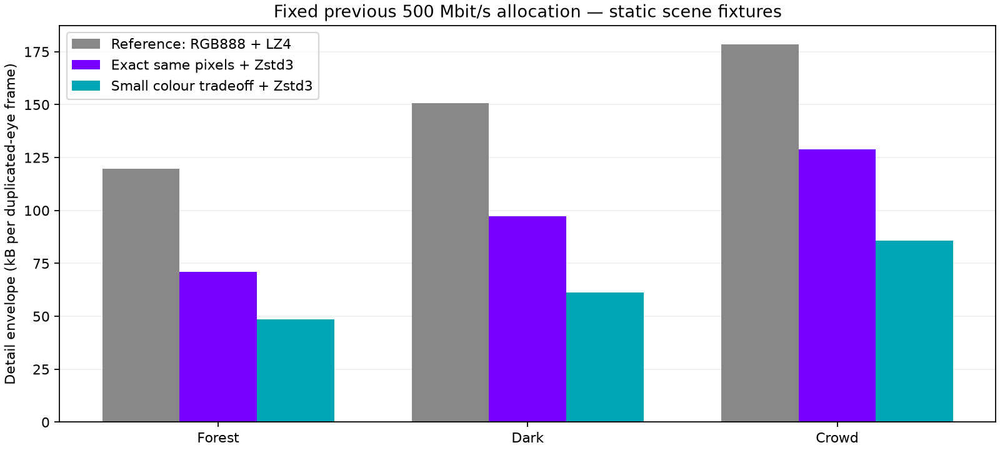
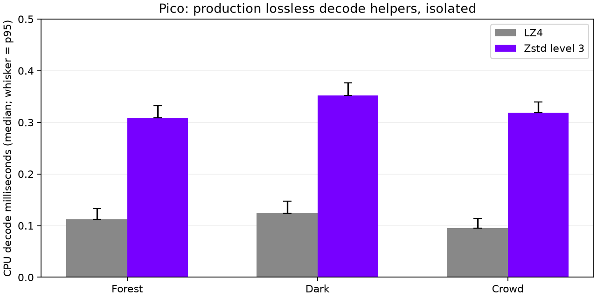

# Compression on supplied VRChat scenes

Goal: retain the previous 500 Mbit/s representation's quality while reducing transmitted detail bytes. Three user-provided screenshots cover foliage, dark gradients/fine patterns, and a crowded multicolour group. Original screenshots and decoded comparisons remain local; they are not published here.

## Controlled comparison

Actual Vulkan direct encoder. First two inputs retain their 1920×1080 resolution and receive 8 replicated padding rows. The 8141×2900 group image is resized to 2176 pixels wide, then padded to 2176×800. One image is duplicated for both eyes: these are static image fixtures, not real stereo motion or end-to-end throughput evidence.

We reproduce the previous 500 Mbit/s/90 Hz allocation: 20 Mbit/s safety reserve, native radius 103.695, 104 native tiles total, RGB888 native reserve 383.76 Mbit/s, leaving 96.24 Mbit/s for the baseline planner. The same baseline descriptors, native radius and source samples are held fixed across representation comparisons. Safety/FEC/packet headers are excluded from the reported detail-envelope sizes. Live rate control may choose a different allocation.

## Candidates

- **RGB888 + Zstd level 3:** byte-identical decoded frame, 27.7–40.9% smaller than RGB888 + LZ4 on these fixtures. This is the active quality-preserving experiment.
- **RGB565 + LZ4:** 30.6–40.3% smaller detail envelope; same spatial samples, at most four 8-bit channel code values changed by colour rounding. Additional colour loss means this is a separate experiment, not a lossless win.
- **RGB565 + Zstd level 3:** further savings; see exact sizes below. Optional, not the strict-quality live profile.
- Byte shuffling helps less; delta predictors add decode work without a consistent benefit. Zstd level 6 compresses a little more but adds encoder delay; level 3 is the initial latency-conscious choice.

## Pico evidence

`pico-isolated.txt` contains an actual Android arm64 CPU benchmark on the connected Pico. Each section lists plain LZ4, shuffle/delta candidates, whole-frame Zstd level 1, and a 64 KiB Zstd comparison. First three sections are baseline palette payloads, next three packed-colour payloads, final three RGB888 reference payloads. Identically named sections differ by that ordered format; do not combine them. All decoded bytes are checked.

RGB888 whole-frame Zstd level 1 decoded in roughly 0.35–0.38 ms median, 0.48–0.49 ms p95 in this isolated run. This is not a level-3 live render measurement or photon latency. Host level-3 encode p95 was 0.41–0.82 ms for the RGB888 reference, before the existing LZ4 candidate cost. Larger resolutions or busy scenes may cost more.

A short real Pico streaming smoke test negotiated the Zstd-capable format and reported successful lossless decompression and continued rendering. The network controller reduced the requested budget sharply, so this does not prove sustained 500 Mbit/s or preserved 500-quality during that live run. That controller behaviour remains under investigation. Read-only radio state was 5 GHz, RSSI -54 dBm, reported receive link rate 360 Mbit/s; link rate is not application throughput.

## Integration

New independently compressed NXDZ detail envelope; no new inter-frame dependency. Select Zstd only when its complete envelope beats LZ4 by at least 10%; otherwise use the existing fallback. Safety remains LZ4 and independent. Preserve RGB888 with `NX_DIRECT_NATIVE_RGB888=1`, enable the experiment with `NX_DIRECT_ZSTD=1`. Packed RGB565 has separate negotiated support. Legacy streams remain supported.

Bounds, corrupt/truncated payload, exact roundtrip, native layout, and real Vulkan encoding tests pass. Host and Android builds pass. The remaining goal is lower real-stream traffic at sustained useful image quality, not just a smaller synthetic benchmark.

## Fixed-rate moving-scene A/B smoke

Both runs use the same headless moving test scene and the Pico at a fixed requested 500 Mbit/s; automatic bitrate is disabled only in separate test configurations. Both retained RGB888 precision. The client counter proves Zstd units were actually decoded (the earlier backend label alone was insufficient evidence). Last samples showed 89–90 display refreshes/s and roughly 90 fresh encoder frames/s in both runs. The Zstd path reduced payload size while adding roughly 0.4–0.5 ms encoder time in observed windows. Detailed 2-second-window medians are in `live-summary.json`; these are not per-frame p95 values.

Runs have unequal lengths and unsynchronised scene phase; this is integration/performance smoke, not a frame-identical network comparison. The supplied-image comparison above is the controlled byte comparison. Automatic-controller backoff and raw-byte planning remain separate open issues; a fixed-rate success does not resolve them.

## Selected level 3: production decode path

`pico-production-decode.csv` measures the actual envelope helpers used by the client, including bounds/frame checks and a reused output vector. Columns: scene, method, raw bytes, envelope bytes, median ms, p95 ms, p99 ms. Twenty warmups precede 500 timed decodes per case, with byte-exact comparison after each timing. Same RGB888 reference payloads as the controlled table. Android arm64, pinned Zstd 1.5.7; isolated CPU test, no concurrent renderer.

| Scene | LZ4 median / p95 ms | Zstd3 median / p95 ms | Detail bytes saved |
|---|---:|---:|---:|
| Foliage | 0.113 / 0.133 | 0.309 / 0.332 | 40.9% |
| Dark patterns | 0.124 / 0.147 | 0.352 / 0.377 | 35.6% |
| Crowded group | 0.095 / 0.114 | 0.319 / 0.339 | 27.7% |

The extra median CPU decode cost is 0.20–0.23 ms in this run. This measures level 3 directly and supersedes level 1 as the relevant selected-mode decode estimate. It does not measure whole presentation cost, motion-to-photon latency, or decoding under concurrent GPU load. `production_decode.cpp` is the reproducible harness; private payload fixtures are not redistributed.

## Different-eye stress check

An additional fixture offsets the right-eye input horizontally by eight pixels. This is a synthetic disparity stress case, not captured binocular rendering. It removes exact eye duplication while retaining the same allocation. Production envelope results:

| Scene | LZ4 bytes | Zstd3 bytes | Saving | Pico Zstd3 median / p95 / p99 ms |
|---|---:|---:|---:|---:|
| Foliage, shifted eye | 195,851 | 121,748 | 37.8% | 0.521 / 0.983 / 1.715 |
| Dark patterns, shifted eye | 230,709 | 155,058 | 32.8% | 0.591 / 1.133 / 1.665 |

This isolated helper run followed live streaming, whereas the earlier duplicate-eye run was cooler. It changes both payload and device state: the latency difference cannot be attributed solely to eye disparity. The compression saving still holds for these less-redundant inputs. Decoder output was checked byte-for-byte on every iteration.
