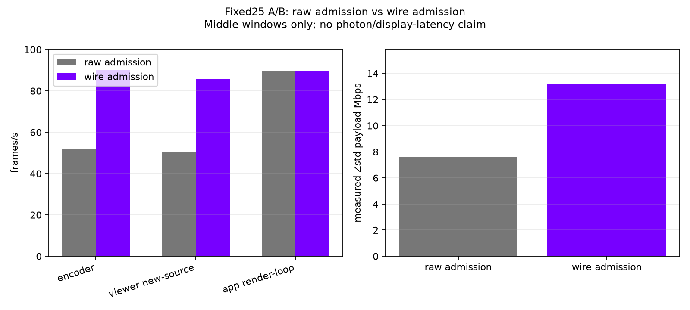

# Fixed25 wire-admission A/B

This report compares paired fixed25 runs from the same server tree (subsequently committed as `wivrn-nx` `cd4f1633`), scene, quality, and Zstd setting. The only requested change is raw admission versus actual-complete-compressed-wire admission. The experimental option was off by default during these captures.

The first five two-second windows and final partial window are excluded. Each series is summarized independently over its own remaining complete windows; one-second lossless counters are not mixed into two-second encoder windows.

| mode | encoder FPS | viewer new-source FPS | app render-loop FPS | encoded payload |
|---|---:|---:|---:|---:|
| raw admission | 51.71 | 50.16 | 89.68 | 7.60 Mbps |
| wire admission | 90.00 | 85.88 | 89.66 | 13.19 Mbps |

The encoded payload is calculated per server window as `frames × bytes_per_frame × 8 / seconds`. The first retained samples verify the arithmetic: raw `104 × 20,482 × 8 / 2 / 1e6 = 8.5205 Mbps`; wire `180 × 20,430 × 8 / 2 / 1e6 = 14.7096 Mbps`. The middle-window means are lower because later frames are smaller.

`Encoder FPS` is the server encoder counter. `Viewer new-source FPS` is the headset render log's `new-source` count divided by its two-second window. `App render-loop FPS` is render iterations per second; it is not a display-refresh or photon-latency measurement. Wire admission raises server production from about 52 to 90 FPS and viewer new-source delivery from about 50 to 86 FPS while the app loop stays near 90 FPS. This is an encoder/viewer throughput result, not photon-latency proof.

Net counters report no holes in raw-admission middle windows and 0.054 holes per two-second window for wire admission. That small nonzero result remains part of the promotion decision.

Filtered source evidence is in `raw-evidence.log` and `wire-evidence.log`; complete independent aggregates are in `results.json`; `comparison.png` is the summary plot. The complete source logs are under `/run/media/nerdrx/Lex/claude/nx-scratch/live/direct-20260922/` with the matching fixed25 names.

The corrected admission policy is now the default for compressed direct streams; `NX_DIRECT_WIRE_ADMISSION=0` is the diagnostic rollback. Quality credit remains off by default.

