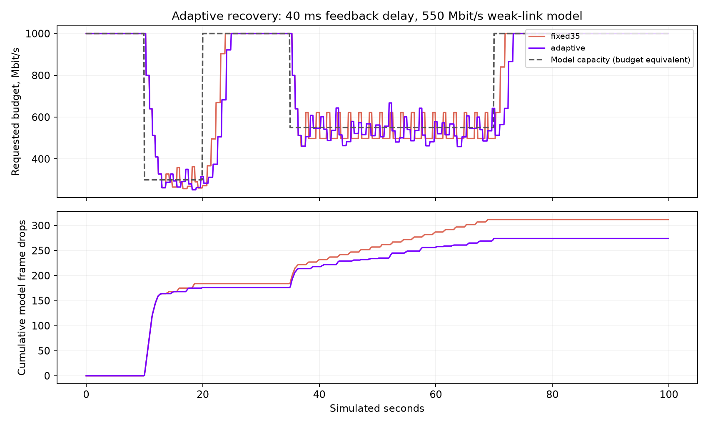

# Adaptive recovery after failed probes

**Local controller simulation only. Server and Pico remain untouched.**

Fixed 35% upward steps restored the requested budget quickly on a clean trace,
but repeatedly overshot limited capacity in a closed-loop model. The new
opt-in policy resets the next proportional probe to 10% after loss, then grows
it to 20% and 35% on clean upward steps. The existing additive minimum, rebound
target, 250 ms healthy hold, loss/late/span gates, radio holds, and ceiling remain.
Ordinary AIMD is unchanged.

## Results

Across nine deterministic scenarios, weak-link drops decreased **30–66%**,
Including all 100 seconds and transition losses, total drops decreased
**12–35%**. The mean requested weak-link budget changed by roughly **+0.3% to −5.5%**.
Recovery after capacity returned reached the full 1000 Mbit/s requested ceiling
in **1.7–3.3 simulated seconds**. Some recoveries are slower than fixed 35%;
this change trades a little probing speed for fewer repeated failures.

Values below are **fixed35 / adaptive**. Drops cover (40,70] seconds; mean
budgets cover [40,70). Recovery is first reaching 1000 after 70 seconds,
sampled every 0.1 s, and depends on the controller phase at restoration.

| Added feedback delay (ms) | Weak capacity, budget equivalent (Mbit/s) | Model frame drops | Mean requested budget (Mbit/s) | Recovery (s) |
|---:|---:|---:|---:|---:|
| 0 | 400 | 142 / 59 | 404.6 / 398.0 | 2.7 / 3.0 |
| 0 | 550 | 138 / 70 | 552.2 / 541.7 | 2.2 / 1.7 |
| 0 | 700 | 170 / 57 | 730.1 / 690.0 | 1.9 / 1.7 |
| 40 | 400 | 123 / 51 | 396.8 / 386.8 | 3.9 / 3.3 |
| 40 | 550 | 80 / 56 | 532.5 / 534.2 | 1.9 / 3.3 |
| 40 | 700 | 126 / 57 | 691.5 / 674.7 | 1.3 / 2.0 |
| 100 | 400 | 121 / 60 | 393.4 / 388.5 | 3.5 / 2.7 |
| 100 | 550 | 126 / 60 | 542.1 / 531.4 | 2.5 / 3.2 |
| 100 | 700 | 117 / 63 | 680.9 / 678.3 | 1.9 / 2.5 |

The earlier open-loop trace (three seconds of loss, then clean feedback)
recovers 327.68 → 1000 in **4.79 s**, versus 4.01 s for fixed 35%. Normal and
NDEBUG checks pass, including continued-loss backoff and recovery blocked by
late or slow feedback. These checks do not establish stable real-world Wi-Fi.

## Method and limits

The real C++ controller is driven by a deterministic FIFO model at 90 Hz for
100 seconds. Requested quality budget is mapped to wire bits at a constant
25% ratio. Capacity is expressed in *equivalent requested-budget units*;
for example, 550 Mbit/s here represents 137.5 Mbit/s modeled wire capacity.
There is no real compression or scene content in the model.

Capacity schedule: 1000 until 10 s, 300 until 20 s, 1000 until 35 s,
400/550/700 until 70 s, then 1000. Service capacity changes at frame boundaries.
A frame that would exceed a two-frame FIFO completion budget is discarded.
Synthetic receive spans have a 0.96-refresh floor; feedback is delivered after
three frame periods plus the stated 0/40/100 ms delay. No random packet loss,
retransmissions, radio report input, thermal behavior, decoder pressure, or
head-motion behavior is modeled. Zero configured delay therefore still includes
three frame periods. Whole-frame loss is a simplification of packet loss.

Raw numeric series for the 40 ms / 550 case include the initial and transition
losses, not just the quiet interval. summary.json includes total drops for all
scenarios. The comparison uses fixed baseline `3b142e1b` and the adaptive source
published as [66a5e6e6](https://github.com/nerdrx/wivrn-nx/commit/66a5e6e6). Reproduce using
`tests/run_bitrate_recovery_link.py` in the integration repository, as described
in its tests/README.md. The script checks all nine comparisons, including a
minimum 20% drop reduction, less than 10% budget sacrifice, and recovery within
six seconds. These are regression checks for this model, not universal bounds.

The next step is a paired Pico test when the user asks to reconnect. Neither
this chart nor an increased requested budget proves delivered bitrate, visual
quality, or photon latency.
