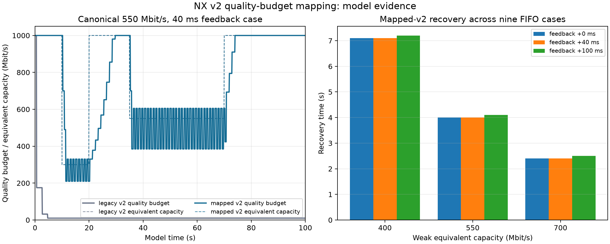

# v2 quality-budget mapping

This result isolates the existing Adaptive v2 units mismatch. Legacy v2 treats
compressed wire bytes as the quality target, so clean compressed traffic falls
to the 10 Mbit/s floor. The mapped path keeps the 1 Gbit/s quality budget while
tracking physical wire delivery separately, then cuts and recovers under the
modelled capacity phases.

The canonical trace uses 90 Hz updates, fixed actual bytes at 25% of the
quality budget, a near-refresh receive floor of 0.96 frame period, a two-frame
deadline, and feedback after three frames plus 0, 40, or 100 ms. The model runs
100 seconds with 1000 -> 300 -> 1000 -> 400/550/700 -> 1000 Mbit/s budget-
equivalent phases. Physical capacity is one quarter of each plotted budget-
equivalent value. The 550 Mbit/s, 40 ms case is the canonical trace shown in
the plot. Probes run at 500 ms; gain remains 1.10. A 1.25 gain was rejected
because it caused extra drops.

Across the nine mapped FIFO cases, recovery takes 2.4–7.2 s. The mapped path
has about 4.2% loss during seconds 40–70 of each run, when capacity remains
restricted. Repeated probing still overshoots; this is a remaining limitation. Legacy reports
zero losses because it abandons quality and settles at the floor; that is not
evidence of better congestion control. The mapped path is not universally
better than the previous AIMD behavior.

Baseline controller: [`66a5e6e6`](https://github.com/nerdrx/wivrn-nx/commit/66a5e6e6).
Reproduce from the integration checkout with a configured Monado/Boost build:

```sh
python3 tests/run_bitrate_recovery_link.py --v2 --baseline-ref 66a5e6e6 \
  --build-dir "$BUILD_DIR" --output-dir /tmp/nx-v2-budget
```



`plot.py` reproduces `v2-budget.png` and `v2-budget.svg` from the copied CSV
and `summary.json` files:

```sh
python3 plot.py
```

These are model results only. They do not prove Pico behavior, live network
performance, or physical motion-to-photon latency.

Validation: **4,346 budget checks** pass normally and with `-DNDEBUG`;
70 existing v2 checks, 50 radio checks, AIMD guards, and both nine-case model
matrices also pass. The host server builds successfully. Logs and source hashes
are in this directory; the host build includes unrelated local NXFuse work.
No server or headset was started. Select **Adaptive v2** to exercise this
server-side direct-stream mapping; it adds no wire fields or decoder work.

Implementation: [`186322ab`](https://github.com/nerdrx/wivrn-nx/commit/186322abc0c653ac6c8e7508f294e4161d7ffbae).
