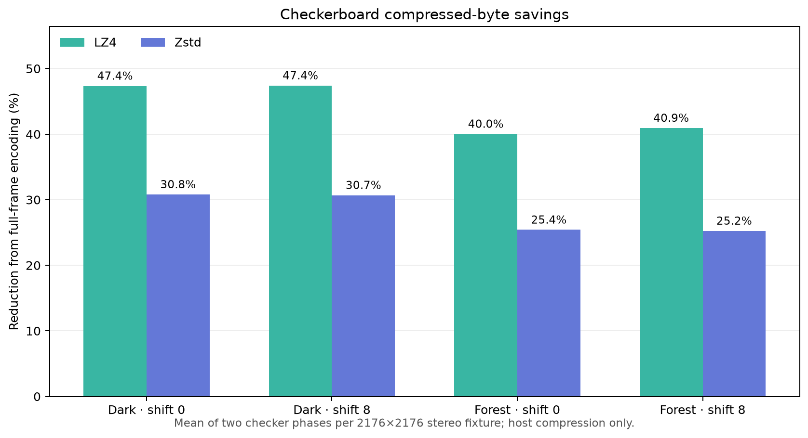
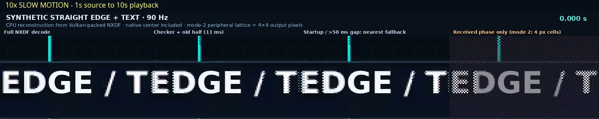
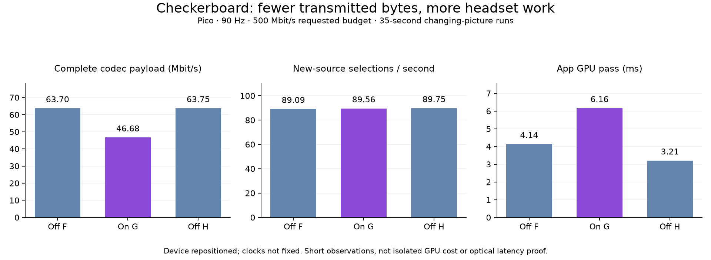

# NX Warp checkerboard half-refresh

This result covers the experimental direct NX Warp path. In the WiVRn headset
app, open Streaming settings → Advanced and enable **Checkerboard half-refresh
(experimental)**. It is off by default and applies after reconnecting. Use
matching builds. `debug.wivrn.test.nx_checkerboard=0` or `=1` is a non-persistent
Android A/B override; other values use the saved setting.

## Behavior and limits

After the initial full frame, each eye sends alternating encoded samples with
the same phase. The headset combines those samples with the opposite phase from
the adjacent prior frame in the existing presentation pass. This reuses older
pixels; it does not estimate motion or interpolate frames. Motion can shimmer
or lag.

Prior-frame samples are eligible only when their frame is adjacent, arrived no
more than 50 ms earlier on the headset transport clock, and has opposite phase
or is the initial full frame.
Changed tile modes fall back to the nearest current sample. Safety frames bypass
detail history without erasing it; checkerboard mode disables the existing partial-tile recovery path.
The 50 ms limit starts at packet arrival and does not bound source-image age.

Checkerboard stores half of the encoded samples. Shared palette endpoints and
fixed framing mean byte savings are lower: about 40% for palette payloads and
50% for native raw pixels in this layout. Those figures exclude transport,
headers, and the effect of compression, so total network bandwidth does not
necessarily halve. The server repacks data on the CPU; the headset retains and samples old
data, adding memory traffic and GPU work.

The direct stream header uses base version 1–20 plus 32 (33–52). Frame flag
`0x100` marks checker samples and `0x200` marks phase 1. Full frames remain
valid for bootstrap and may appear later.

## Host compression fixture

`codec-results.csv` records both phases for four 2176×2176-per-eye, RGB888
stereo NXDF fixtures (523,728 raw bytes each). The graph averages two phases
per fixture. Phase-averaged compressed-size reduction ranged from 40.0–47.4% with LZ4 and
25.2–30.8% with Zstd. These are host codec outputs and p50 compression timings;
they exclude checker transform time, transport, headset decode, and display.
They do not predict total wire savings.

The four codec input frames are local-only and are not copied here. Their
basename and SHA-256 are retained for provenance:

| Local-only fixture | SHA-256 |
| --- | --- |
| `dark-gpu-shift0.nxdf` | `4f352c1b11b0cbaa6a645b605c2de6f7360c3feea1f045aa5e11ddda9e8d8935` |
| `dark-gpu-shift8.nxdf` | `39f29f5978c554d478348ed8bf7d70d6b1e2738310f60c30f1819dd7dbda9774` |
| `forest-gpu-shift0.nxdf` | `ea0f52d69ff8a79b26f4fc78539da6d9056a8e06d31d6c400778672efeae5010` |
| `forest-gpu-shift8.nxdf` | `b43e52229b5a2c5187c8e02d91215f8dfd81809237d5a980a3a1ff56ec8208d5` |

`plot_codec_savings.py` regenerates the graph with Python, NumPy, and
Matplotlib. `testsrc/direct_checkerboard_bench.cpp` and the accompanying header
aliases preserve the benchmark source. Reproduce codec rows only when those
local fixtures are available; the CSV and graph are sufficient to inspect the
recorded values.

## Synthetic motion illustration

The included MP4s, generated source stills, archive of 90 Vulkan-packed synthetic
NXDF frames, and scripts form a reproducible moving-edge/text illustration. The
four-panel video is rendered by `testsrc/direct_checkerboard_motion.cpp` on the
CPU, using a CPU equivalent of the temporal sample selection rules. It is not
the headset shader, Pico playback, WiVRn transport, or a hardware image-quality
test. See [`motion/README.md`](motion/README.md) for regeneration steps.

[Normal-speed 90 Hz clip](motion/synthetic-motion-90fps.mp4) · [10x slow clip](motion/synthetic-motion-10x-slow-90fps.mp4)

## Connected Pico checks

The final client was tested with one off/on/off sequence, F/G/H. Each run
continued for 35 seconds after the source uploaded; client summaries exclude the
first 10 seconds. The source alternates two supplied pictures every frame, a
whole-image change stress case rather than natural movement. Both eyes receive
the same fixture image. Streaming targets 90 Hz and a 500 Mbit/s slider setting;
the reported direct byte budget is 433.604 Mbit/s in every arm. Adaptive bitrate
and compression credit are off; lossless predictor and exact-repeat caching
are on. The independent safety image remains enabled. The test uses a 5 ms JIT
sleep cap and 4 ms ready wait, identical in both modes.

| Run | Checkerboard | Complete payload (Mbit/s) | New-source selections/s | App GPU mean (ms) | Incomplete frames |
| --- | --- | ---: | ---: | ---: | ---: |
| F | Off | 63.696 | 89.093 | 4.136 | 0 |
| G | On | 46.678 | 89.555 | 6.164 | 0 |
| H | Off | 63.751 | 89.746 | 3.209 | 0 |

**Approximately 26.8% less complete codec payload**, with extra headset GPU
work. Payload includes the codec safety/detail framing and excludes packet
headers/FEC/link overhead. These counters count new selected image IDs; alternate
non-flat samples refresh at about 45 Hz when the stream supplies 90 updates/s.
Inline solid-colour tiles remain fresh every frame. This is not a 90 Hz refresh
of every pixel, and old samples add a source interval of temporal lag.

The G log reaches **3,061 eligible previous-frame uses** (logging is periodic,
so this is a lower bound). Early B/C prototypes erased history whenever a safety
job decoded; those experiments are excluded. The corrected client keeps detail
history separate from safety jobs. GPU sampling selects the descriptor/address
before decoding once, avoiding two divergent per-pixel decode paths. Ordinary
full-rate streams keep their existing cheap sampling path.

The device was repositioned during testing and had a tracking-warning overlay
in F/G; GPU clocks were not fixed. F/G clock snapshots reported 587 MHz, but
those are single samples, not a frequency trace. Therefore GPU/latency differences
are observations under varying conditions, not an isolated causal measurement.
These runs establish a working short streaming path and measured byte savings,
not sustained Wi-Fi capacity, moving-scene comfort or physical photon latency.
Raw private logs remain local; sanitized per-window counters, original-log hashes,
build hashes and device battery metadata are included.

### The settled headset picture

After relocation and a fresh start, the separate static-picture run I waited
12 seconds after live-source detection before capture. The screenshot showed
the actual decoded picture in both eyes with **no tracking warning**. This is
a visual smoke check; it does not assess moving-edge comfort. It measured 89.8
new-source selections/s with no incomplete units. Its private input photo and
headset capture are kept local; `checker-visual-i.json` records the capture hash
and observations. The public moving-edge clips use generated content instead.

## Build and validation

- Matching host server and Android release builds succeeded. Updated APK installed
  as `org.meumeu.wivrn.nx.warp`; checkerboard remains off by default.
- ASan/UBSan selector checks cover modes 0–2, both phases, native RGB888/RGB565,
  stream versions, truncation, offset overflow and reserved flags. Existing direct
  wire/LZ4/Zstd tests passed; the fragment shader compiled.
- Both LZ4/Zstd fixture decodes round-trip the packed bytes exactly.
- Feature source: [WiVRn NX 3d7afc7a](https://github.com/nerdrx/wivrn-nx/commit/3d7afc7a3426c40a63b1e0ca65deb8e0ed75f008).
  `build-hashes.json` identifies the tested APK, server and shader. The shared
  host checkout also contained unrelated NXFuse work, unchanged between arms;
  that work is not part of this feature commit.
- Test properties cleared and server stopped after testing. The headset test
  preset used 500 Mbit/s and 90 Hz; the checkbox itself was overridden without
  changing its saved preference.

Regenerate the plots with `python3 plot_codec_savings.py` and
`python3 plot_live.py` from this directory. Motion replay uses the shipped
synthetic archive; see [its instructions](motion/README.md).
