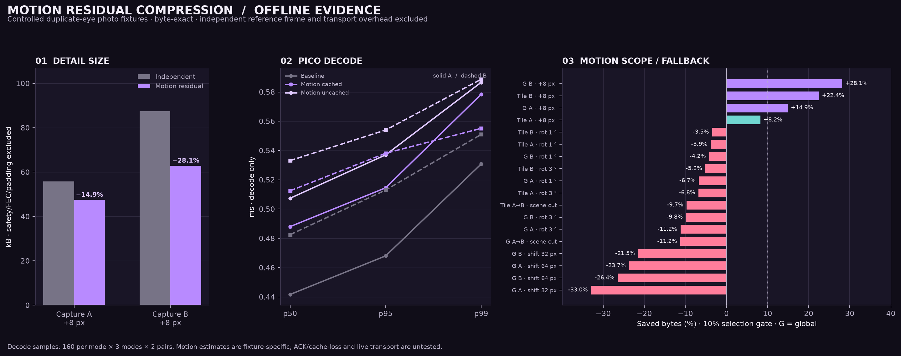

# Motion-residual compression: offline evidence

**Integration update:** the later [WiVRn NX integration check](INTEGRATION.md) covers the opt-in live path. The measurements below remain the original isolated experiment.

An experimental global integer-translation residual reduced changed-frame detail size by 14.86% and 28.12% on two controlled +8 px pairs, with byte-exact reconstruction. A local per-tile variant saved 22.42% on one pair but only 8.22% on the other, below its 10% gate. These are isolated prototype measurements; later integration results are reported separately above.

Inputs are duplicate-eye photographic captures and controlled transforms, not headset video; no source photographs are included. The test changes encoded native RGB tile payloads, not displayed pixels. Sizes include each proposal's 24-byte motion/reference header, but exclude the already-held reference frame, safety margin, FEC, packet padding, and transport headers. Thus they assume a valid prior reference and do not charge its acquisition/refresh.

## Main result

The baseline is the production independent-frame selector: LZ4 versus Zstd level 3, including its existing stride-4 byte predictor and selection gates. The candidate uses that same selector after computing the motion residual; savings are additional to existing compression.

| Pair / method | Existing detail | Proposal | Saved | Selection |
|---|---:|---:|---:|---|
| Capture A, +8 px / global | 55,787 B | 47,499 B | 14.86% | Proposal passes 10% gate |
| Capture B, +8 px / global | 87,477 B | 62,875 B | 28.12% | Proposal passes 10% gate |
| Capture A, +8 px / per-tile | 55,787 B | 51,199 B | 8.22% | Existing encoder retained |
| Capture B, +8 px / per-tile | 87,477 B | 67,862 B | 22.42% | Proposal passes 10% gate |

Global translation wins on both controlled pairs; scene cuts, 1°/3° rotations, and 32/64 px shifts grew the proposal and must fall back. The local-tile variant misses the gate on A, wins less on B, and adds per-tile work. Repeated-tile aliasing was deprioritized and is excluded.

An earlier oracle-only check supplied the known +8 px vector and measured the resulting residual size; it did not test motion estimation. The later prototype estimated +8,0 from 512 RGB samples on each pair. This small fixture result is not broad estimator validation; automatic estimation and confidence gating remain under development.

## Pico decode comparison

Latest device run uses an explicit AArch64 NEON byte-add inverse; scalar fallback remains. After 16 warmup rounds, each pair ran 160 samples per mode, with mode order shuffled each round using a fixed seed (baseline, cached reference, uncached reference): 480 samples per pair, 960 total. Every sample checked exact output after timing. These are decode-only timings, excluding motion estimation and encoding.

| Pair / decoder | p50 | p95 | p99 |
|---|---:|---:|---:|
| A, baseline | 0.442 ms | 0.468 ms | 0.531 ms |
| A, NEON candidate, cached reference | 0.488 ms | 0.515 ms | 0.578 ms |
| A, NEON candidate, uncached reference | 0.507 ms | 0.537 ms | 0.587 ms |
| B, baseline | 0.483 ms | 0.513 ms | 0.551 ms |
| B, NEON candidate, cached reference | 0.513 ms | 0.538 ms | 0.555 ms |
| B, NEON candidate, uncached reference | 0.533 ms | 0.554 ms | 0.589 ms |

Cached-reference candidate p50 adds 0.046/0.030 ms for A/B. Earlier non-NEON runs added about 0.31/0.29 ms. This demonstrates the inverse optimization on these fixtures, not an end-to-end latency improvement. A sender must run both encoders to apply the byte gate. Host p50 baseline/candidate encode was 1.175/1.510 ms for A and 1.672/1.637 ms for B; separate-median sums suggest 2.69/3.31 ms serial work, not a measured paired end-to-end path.

## Scope and fallback

| Global-motion case | A saved | B saved | Outcome |
|---|---:|---:|---|
| Controlled +8 px | 14.86% | 28.12% | Both pass gate |
| Scene cut A → B | — | -11.25% | Baseline; proposal larger |
| Rotation 1° | -6.72% | -4.22% | Baseline |
| Rotation 3° | -11.20% | -9.84% | Baseline |
| Translation 32 px | -32.95% | -21.50% | Baseline; search reaches edge |
| Translation 64 px | -23.72% | -26.45% | Baseline; search reaches edge |

Positive means fewer bytes; negative means growth. The estimator samples the image and searches integer translations only within ±16 px. Weak estimates, scene cuts, rotations, and larger translations must use the independent representation.

The 11 host pairs each ran 8 warmups and 32 measured trials. Host order was fixed (baseline then candidate), so encode costs are indicative rather than a randomized end-to-end comparison. Four malformed-envelope checks rejected truncation, wrong magic, and a wrong reference ID; these do not cover network recovery.

## Other compression attempts

| Attempt | Evidence | Decision |
|---|---|---|
| Zstd-3 `minMatch=3` | 7–585 B larger on 3/4 frames; only 7 B smaller on one; slower encode p50 | Reject |
| Zstd-3 `lazy2 + minMatch=3` | Saves 675–1,583 B (1–4.8%) at about 3–6× host encode p50 | Not default pending encode-budget case |
| Prior-frame raw/predicted Zstd dictionary | Two-frame production-format fixtures save 1.06–12.03%, including their independent anchor; scene cut grows 0.55–1.07%; synthetic sequence gains 34.50–41.07% | Deferred: needs reference/recovery protocol |
| Per-tile block-neighborhood residual | Exact offline decode, but 28.9–112.7% larger; host encode 5.7–13.9 ms | Reject |
| XOR, wider-stride deltas, shuffles, grouped deltas | No transform beat selector; grouped candidates 8.1–27.3% larger | Reject |

## Original prototype integration boundary

The archived prototype carries a reference ID but exercises one supplied prior frame; it does not validate wire-ID binding, ACK/cache lifetime, loss/reordering, or missing-reference handling. Production needs a bounded ring of exact raw NXDF frames keyed by receiver-held wire ID, per-frame reference signaling, and independent fallback for absent/stale entries. Never reference displayed/reprojected output. Transport, FEC-aware sizing, sustained Pico load, and live presentation remain untested.

## Reproduction and plot



The archived source uses matching `common/nxwarp_direct*.h` headers from the WiVRn integration revision. Set `WIVRN_ROOT` to that checkout root. Host build (C++20, Zstd, LZ4):

```sh
g++ -std=c++20 -O3 -Wall -Wextra -I "$WIVRN_ROOT/common" native_motion_bench.cpp -lzstd -llz4 -o native_motion_bench
./native_motion_bench --export ./motion-export OLD.nxdf CURRENT.nxdf [OLD2.nxdf CURRENT2.nxdf ...]
./native_motion_bench --decode-only OLD.nxdf CURRENT.nxdf BASELINE.bin PROPOSAL.bin [samples.csv]
```

Android arm64 uses the NDK C++20 compiler, pinned Android Zstd static library, and matching LZ4/LZ4HC objects and headers. Set `ANDROID_NDK`, `ZSTD_ROOT`, `LZ4_ROOT`, `ZSTD_ANDROID_LIB`, `LZ4_OBJECT`, and `LZ4HC_OBJECT` to those dependency builds:

```sh
"$ANDROID_NDK/toolchains/llvm/prebuilt/linux-x86_64/bin/aarch64-linux-android29-clang++" -O3 -DNDEBUG -std=c++20 -Wall -Wextra -fPIE -pie -static-libstdc++ -pthread -I "$WIVRN_ROOT/common" -I "$ZSTD_ROOT/lib" -I "$LZ4_ROOT/lib" native_motion_bench.cpp "$LZ4_OBJECT" "$LZ4HC_OBJECT" "$ZSTD_ANDROID_LIB" -lm -o native_motion_bench.arm64
adb push native_motion_bench.arm64 OLD.nxdf CURRENT.nxdf BASELINE.bin PROPOSAL.bin /data/local/tmp/
adb shell 'cd /data/local/tmp && chmod +x native_motion_bench.arm64 && ./native_motion_bench.arm64 --decode-only OLD.nxdf CURRENT.nxdf BASELINE.bin PROPOSAL.bin'
```

The harness is fixed to 2176×2176 per eye, two eyes, and these fixtures contain 104 native tiles. The sizing scenario assumes a nominal 500 Mbit/s stream budget; it is not a measured link or total bitrate. Original fixtures are private and hash-addressed in the run manifest, not included here; end-to-end reproduction requires matching user-provided NXDF fixtures and pinned dependencies. `summary.json` contains chart data; run `python3 plot.py` to render, or pass `--output /path/to/file.png`.

Final plotted Pico samples are `final-forest.csv` (A) and `final-dark.csv` (B). `run1`–`run4` and `run7`–`run8` preserve earlier scalar trials; `run5`–`run6` preserve earlier NEON trials. `host-results.txt` contains the final 11-pair run. `manifest.json` pins the archived harness hash and integration revision; `validation.json` records exactness and malformed-envelope outcomes. The device ran no WiVRn app or concurrent renderer and used no clock overrides. This is an isolated CPU helper measurement, not full headset decode/presentation cost.
