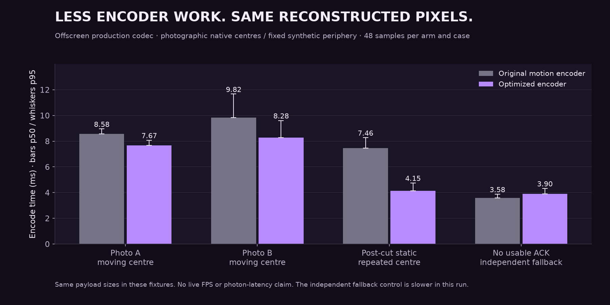
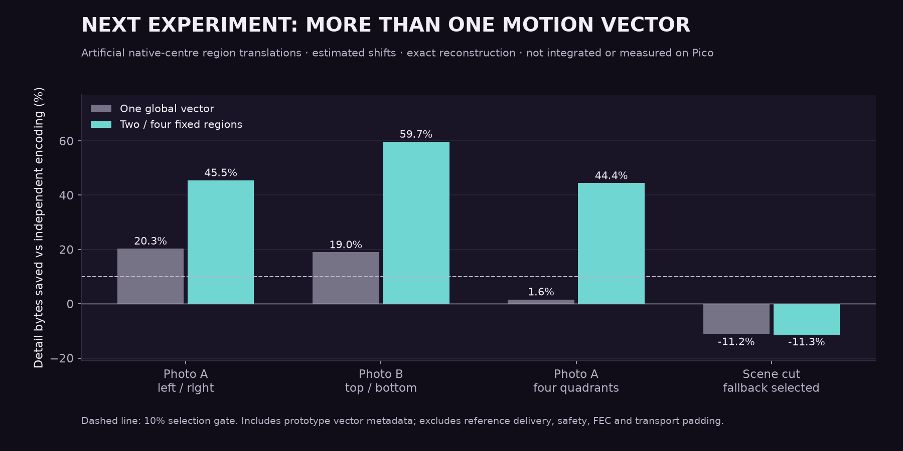

# Exact motion compression with less PC work

The optimized WiVRn NX encoder reduced median encode time by **10.6% and 15.7%** on two controlled moving-native-centre fixtures. The tested frame sizes and wire hashes stayed identical, and reconstructed bytes matched the independent production codec. This is offscreen encoder evidence, not a new live Pico FPS or latency result.

## What changed

The original motion path compressed an independent frame, estimated a shift, then tried LZ4, plain Zstd and predicted Zstd again for its residual. Profiling found compression dominated the motion search. The revised path tries only predicted Zstd for the residual. It keeps the full independent selector and sends motion only when the complete envelope saves at least 10%.

The encoder also caches current-pixel samples, stops motion candidates only when an integer bound proves they cannot win or tie, subtracts contiguous row spans, and reuses one Zstd workspace. These changes preserve exact reconstruction. The search optimizations preserve the selected vector; the single residual compressor can make a different representation choice on untested content. No stream-format or decoder update is required beyond the already integrated motion client.

Implementation: [WiVRn NX commit 070b671](https://github.com/nerdrx/wivrn-nx/commit/070b671), compared with the original integrated motion implementation at `143d621`.

## Measured result

| Controlled case | Original p50 / p95 | Optimized p50 / p95 | Median change |
|---|---:|---:|---:|
| Photo A, moving native centre | 8.577 / 8.954 ms | 7.671 / 8.075 ms | −10.6% |
| Photo B, moving native centre | 9.823 / 11.666 ms | 8.279 / 9.607 ms | −15.7% |
| Repeated static centre after a scene cut | 7.462 / 8.273 ms | 4.151 / 4.751 ms | −44.4% |
| No usable acknowledged reference | 3.581 / 3.873 ms | 3.897 / 4.323 ms | +8.8% |

The last control was slower in the main run. A bounded reversed-order repeat measured 3.898 versus 3.931 ms median, with p95 4.283 versus 4.586 ms. This does not establish a fallback improvement or a consistent regression; its variation limits broad performance claims. The static case is reported for completeness, not as representative VR motion.

The production Vulkan encoder processed photographic native centres over a fixed synthetic periphery at 2176×2176 per eye, with a 700 Mbit/s target and 90 Hz configuration. Each case has two runs per build, six warmups per run and 24 measured frames per run: 48 samples per build. Display refresh configuration does not imply measured presentation rate. Periodic independent anchors are included. A motion-disabled production codec supplied a byte-exact reconstruction oracle. ID-gap and delayed-reference checks are controlled protocol cases, not packet-loss or Wi-Fi tests.

See [production harness, measurements and build provenance](production/README.md), and the [five-input residual-compressor comparison](residual-codecs/README.md). The initial search/workspace-only candidate did not show a clear moving-frame median win; removing the extra compressor trials was the useful change.

## Separate experiment: independently moving regions

An offline prototype estimates two or four vectors over fixed native-centre regions. Three artificial opposing-shift cases saved **44–60%** of independent detail bytes, including prototype vector metadata. The scene-cut control made the candidates larger and selected independent coding. All reconstructions were exact.

This is a promising compression lead, **not integrated**. Regions are fixed rather than detected objects; the periphery remains unchanged. Reference delivery, safety, FEC and padding are excluded. Pico decoding and full-encoder cost have not been measured. [Regional harness, CSV and limitations](mixed-motion/README.md).

## Validation and limits

- Scalar-oracle tests cover sparse current/reference tiles, ties, non-grid shifts, boundaries and scene cuts; host and AArch64 Pico runs passed.
- Reused Zstd contexts produce the same bytes as fresh contexts on tested inputs; independent decode and incompressible fallback pass.
- Address/undefined-behavior sanitizers and existing wire/checkerboard tests passed.
- Production tests cover no-ACK fallback, exact acknowledged reconstruction, forgotten references, independent anchors and reset.
- The server remains stopped. There is no new live network, headset presentation, thermal-soak or photon-latency result.

Recreate the charts with `python3 plot.py` (Matplotlib and NumPy). The fixture photographs remain private; runners accept caller-supplied files.
