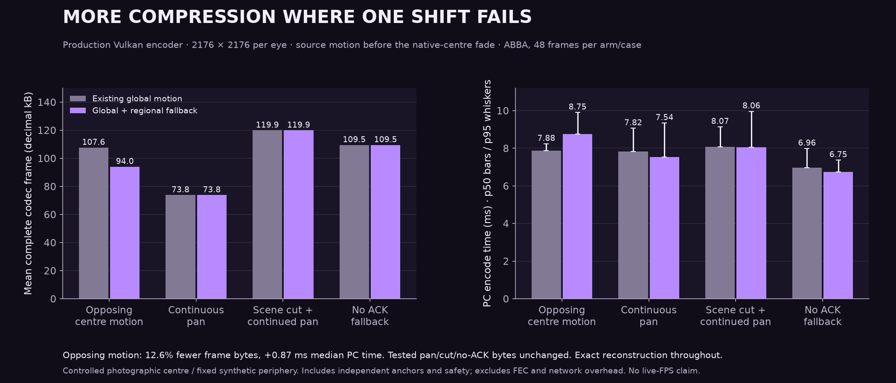
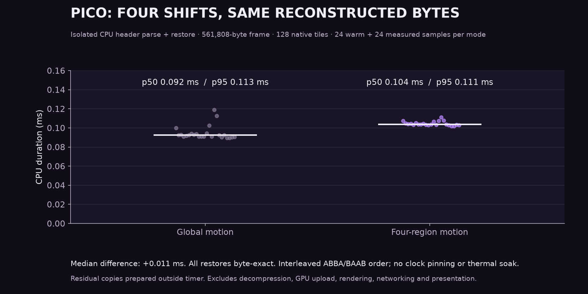

# Regional motion compression: integration and selection fix

The regional predictor reconstructs the same encoded NXDF bytes. It changes how those bytes travel, not the image's foveation or display warp. The matching Pico client is installed. The server stays stopped until a user session is requested.

## Measured result



| Controlled source | Existing global: mean frame bytes | Regional fallback: mean frame bytes | Existing global p50 / p95 | Regional fallback p50 / p95 |
|---|---:|---:|---:|---:|
| Opposing quadrant motion | 107,618 B | 94,006 B | 7.879 / 8.237 ms | 8.751 / 9.902 ms |
| Continuous pan | 73,822 B | 73,822 B | 7.823 / 9.065 ms | 7.538 / 9.343 ms |
| Scene cut, then continuing pan | 119,883 B | 119,883 B | 8.074 / 9.139 ms | 8.062 / 9.963 ms |
| No acknowledged reference | 109,492 B | 109,492 B | 6.963 / 7.986 ms | 6.754 / 7.370 ms |

Opposing motion saves **12.6% of complete codec frame bytes** (13.0% of detail), adding **0.87 ms median PC encode time**. Across the two candidate runs, 34 of 48 opposing-motion frames used regional v2, six used global v1 and eight remained independent. Every tested pan/cut/no-ACK frame retained its old byte count and mode. None of the 192 paired measured frames increased in size, and each production decode matched the independent encoder oracle byte for byte. The first scene-cut frame and periodic anchors were independent.

ABBA order, two runs per arm; each run uses six warmup frames and 24 measured frames per scenario. The four scenarios run in fixed order. Host clocks and temperature were not pinned. The unrelated controls vary in timing, so their lower medians do not establish speedups. The scene-cut row includes one cut followed by continuing pan; it is not a sequence of unrelated cuts. Percentiles use the sample median and nearest-rank p95; these short samples do not establish tail-latency reliability.



At 2176×2176 per eye, Pico CPU header-parse plus restore measured **0.092 ms global / 0.104 ms regional median**, a difference of **0.011 ms**. The fixture contains 128 native tiles and the same 561,808 raw bytes in both paths. Each mode has 24 warm and 24 measured calls in interleaved ABBA/BAAB blocks. Residuals and copies are prepared outside the timer; equality is verified after every call. This is restoration alone, not complete decoding. No clock pinning or thermal soak was used. An earlier 512×512 pilot was excluded from these charts and claims.

[All production samples](encoder-samples.csv) · [Pico raw warm and measured samples](restore-pico.csv) · [Host restore samples](restore-host.csv) · [Summary statistics](summary.json)

## Why the first selector was rejected

Estimating four motions before the global predictor looked attractive in the offline prototype. With photographic pixels shifted **before** the production encoder's fixed foveation blend, that selector increased continuous-pan detail bytes by **29.5%**. Each region could fit a different part of the fade, even though the source moved uniformly. A gate against independent compression did not prevent regression against the existing global predictor.

The final selector keeps the old global result whenever it meets the 10% savings gate. Only a failed global candidate opens regional search and one additional predicted-Zstd trial. This bounds the change: successful global packets remain unchanged; region attempts must beat independent detail by at least 10%. The extra trial costs PC CPU time on frames that fail the first gate.


## Protocol and recovery

Four fixed quadrants cover the native centre, with one vector per quadrant shared between eyes. Equal vectors use the existing global format. Regional vectors add 16 bytes over the global header. They are bounded to ±16 pixels. This is not object segmentation, and it does not improve the already encoded spatial quality.

Both endpoints need the new stream feature bit (128, alongside global-motion bit 64). Global version-1 packets remain valid; regional NXMV packets use version 2. Only positively acknowledged exact reference frames 1–8 frames old are usable. Every eighth frame remains independent. Safety remains independent. A missing reference rejects the dependent detail rather than substituting display history.

The decoder restores pixels on CPU, then uses the existing Vulkan path. There is no new GPU pass.

## Scope

The host uses an AMD Ryzen 9 9950X3D. The connected Pico reports model A8110 and platform `kona`. The run did not record Vulkan device identity or time-series clocks/thermals. Production measurements use 2176×2176 per eye, a 700 Mbit/s target and 90 Hz configuration. The scene combines private photographic native-centre pixels with a fixed synthetic GPU periphery. Source shifts are applied before the production native-centre blend. Both eyes receive the same source crop. This is controlled source motion, not a live game or head-motion capture.

A motion-disabled production encoder is the byte-exact oracle. The tests include periodic independent anchors, no acknowledged reference, a scene cut and continuing movement. Encoder bytes include the safety envelope, but exclude network packetization, FEC and retransmissions. Decoder helper timing excludes decompression, upload, GPU work, networking and presentation.

No new live FPS, Wi-Fi reliability, sustained thermal or photon-latency claim is made. The photographs remain private; reproduction uses caller-supplied inputs.

## Deployment and reproduction

Implementation: [WiVRn NX 08f55c16](https://github.com/nerdrx/wivrn-nx/commit/08f55c16af6e96980d5b5f522b70efc6ca8492dd), compared with `070b671b`. The host server was relinked using the new codec object and existing runtime libraries; `--help` passed. The matching signed Pico APK was installed, pulled back and hash-verified. The saved motion launch profile enables `NX_DIRECT_MOTION=1 NX_DIRECT_MOTION_REGIONS=1`. The server remains off. This deployment has not been exercised as a live stream.

[Source and deployed artifact hashes](provenance.json) · [Portable benchmark harness](harness/README.md)

Run correctness checks from the WiVRn NX checkout:

```sh
g++ -std=c++20 -O2 -Wall -Wextra -Werror -I . -I common tests/direct_motion_test.cpp -lzstd -llz4 -o /tmp/nx-motion-test
/tmp/nx-motion-test
g++ -std=c++20 -O2 -Wall -Wextra -Werror -I . -I common tests/direct_motion_regions_test.cpp -lzstd -llz4 -o /tmp/nx-regions-test
/tmp/nx-regions-test
```

Both pass. The regional suite also passed AddressSanitizer and UndefinedBehaviorSanitizer (`-O1 -g -fsanitize=address,undefined -fno-omit-frame-pointer`). It checks scalar-oracle prediction and restoration, sparse metadata, tied scores, aligned native origins at 512 and 544 pixels, malformed headers, invalid dimensions and vector bounds. Stream checks retain v1 compatibility and reject incompatible feature combinations.

Generate graphs with `python3 plot.py` (Matplotlib and NumPy).
