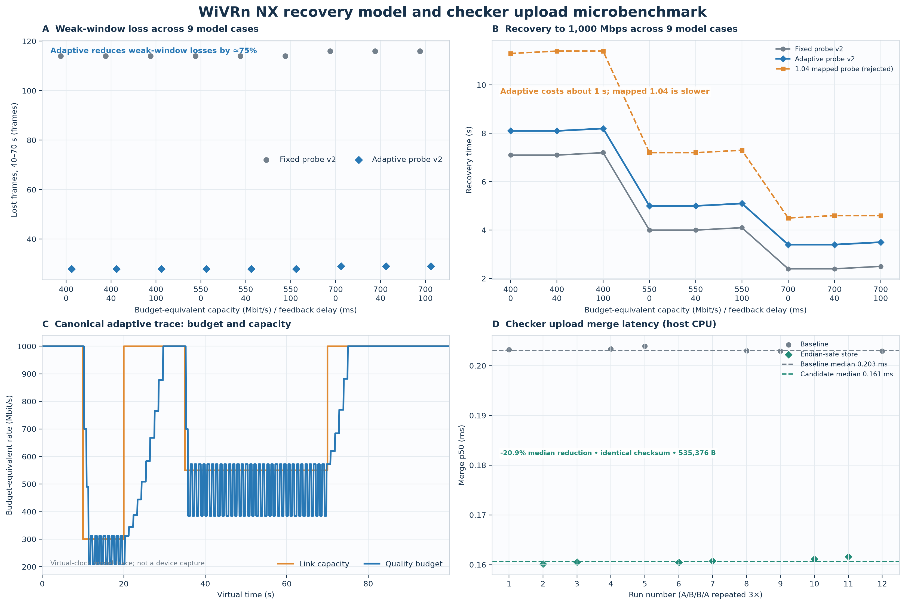

# Recovery headroom and checker upload results

**Scope.** Offline evidence for bitrate-recovery policy choices and checker upload packing. Baseline is WiVRn NX `11eff678`; the integrated implementation is [`5e91ca3`](https://github.com/nerdrx/wivrn-nx/commit/5e91ca3cdf8f9cdbf81f2a3947d4db0ab6cacc7b). No Pico run, real Wi-Fi link, full application path, or end-to-end latency measurement is included.

## Recovery model

The deterministic virtual-clock sweep starts at a 1,000 Mbit/s budget and crosses budget-equivalent weak capacities of 400, 550, and 700 Mbit/s with 0, 40, and 100 ms feedback delay: nine cases per policy. The model runs at 90 Hz, sends bytes at 25% of the quality budget, and scales physical capacity by the same factor. It uses a two-frame queue deadline, a 0.96-refresh receive-span floor, and feedback after three frames plus the listed delay. `lost_frames_40_70` measures losses in the 40–70 s weak window. Adaptive v2 lowers this weak-window count from 114–116 to 28–29 frames, about 75%, while mean weak-window quality budget costs about 3.2%. Recovery to 1,000 Mbit/s takes 3.4–8.2 s, roughly one second longer than fixed probe v2. Data: `v2-summary.json`, both `*-probe-v2.csv` traces, and `recovery-headroom.png`.

The canonical trace retains periodic budget swings around 385–572 Mbit/s during its 550 Mbit/s interval (roughly 38–70 s); residual loss and oscillation remain. A constant gain of 1.0 failed the recovery gate. The mapped 1.04 probe was rejected: its weakest-link recovery reached 11.4 s. Those comparison rows are in `gain104-summary.json` and `gain104-*.csv`.



## Checker upload CPU result

On an AMD Ryzen 9 9950X3D host with GCC 16.2.1 `-O3`, the endian-safe store cut median-of-run merge p50 from 0.203124 to 0.160647 ms (-20.91%); p95 fell from 0.207040 to 0.164723 ms (-20.44%). All twelve A/B/B/A runs produced the same checksum and 535,376-byte output. The ASan/UBSan parity test passed; see `checker-summary.csv`, `checker-metadata.json`, `checker-bench-runs.txt`, and sanitizer logs. These are host merge-only timings, not Pico decoder or presentation timings.

## Rejected mapped-buffer copy removal

The source-copy removal was rejected for production. On RX 7900 XTX / RADV, the production buffer type was HOST_VISIBLE|HOST_COHERENT (`HOST_CACHED=0`). Mapped-buffer LZ4 p50 was 22.054/23.037 ms versus 2.117/2.206 ms for copy-then-LZ4 over two fixtures, 20 warmups and 50 measurements each. Wire lengths and hashes matched, but the harness did not compare every byte. This measures CPU compression from a mapped Vulkan allocation; it does not exercise a GPU shader or end-to-end stream. Evidence and harness are under `source-copy-removal/`.

## Reproduce

Run the nine-case controller comparison from the integration checkout, with its configured dependency build:

```sh
python3 tests/run_bitrate_recovery_link.py --v2-probes --baseline-ref 11eff678 \
  --build-dir "$BUILD_DIR" --output-dir /tmp/nx-v2-probe-final
```

The regression gate requires at least 60% fewer weak-window losses, at least 95% of the previous quality budget, recovery within 1.5 seconds of baseline, and retention of the clean 1 Gbit/s quality ceiling. Existing budget (4,346), ordinary v2 (70), radio (50), and AIMD checks pass in normal and NDEBUG builds; budget checks also pass UBSan float-cast instrumentation. Logs and source hashes are in [validation](validation).

Regenerate the figure from bundled scalar data with `python3 plot.py`. Rebuild the checker summary from the saved logs with `python3 checker-summarize.py`.

To rerun the merge benchmark, use the same two compatible full NXDF fixtures (2176×2176 per eye) to reproduce these timings. Paths below are placeholders; raw fixture images are not included.

```sh
RESULT_DIR=/path/to/recovery-headroom
REPO_ROOT=/path/to/wivrn-nx
CURRENT_FULL=/path/to/current-full.nxdf
HISTORY_FULL=/path/to/history-full.nxdf
mkdir -p /tmp/checker-baseline
git -C "$REPO_ROOT" show 11eff678:common/nxwarp_direct_checkerboard_upload.h > /tmp/checker-baseline/nxwarp_direct_checkerboard_upload.h
g++ -std=c++20 -O3 -I/tmp/checker-baseline -I"$REPO_ROOT/common" "$REPO_ROOT/tests/direct_checkerboard_upload_bench.cpp" -o /tmp/bench-baseline
g++ -std=c++20 -O3 -I"$REPO_ROOT/common" "$REPO_ROOT/tests/direct_checkerboard_upload_bench.cpp" -o /tmp/bench-candidate
n=0
for build in baseline candidate candidate baseline baseline candidate candidate baseline baseline candidate candidate baseline; do
  n=$((n+1)); echo "RUN $n $build"
  "/tmp/bench-$build" "$CURRENT_FULL" "$HISTORY_FULL"
done | tee "$RESULT_DIR/checker-bench-runs.txt"
```

The benchmark warms 20 operations per phase and measures 180 alternating phases per run. `checker-summarize.py` reads the retained JSON log and metadata; keep both beside it. The plot separates virtual-clock model results from host CPU results.
