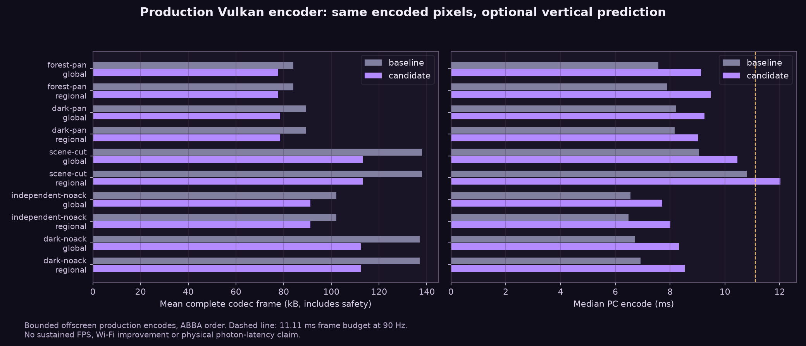
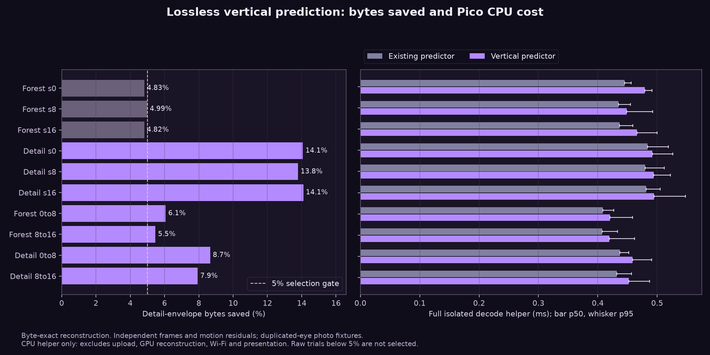

# More compression without changing encoded detail

The candidate uses a different spatial byte predictor inside native RGB888 tiles. It preserves the source image, foveation and decoded NXDF bytes. Each native tile keeps its first row literally, then stores differences from the preceding row. Zstd compresses those differences. Peripheral records and metadata retain the existing stride-4 predictor.

## Selection policy

The encoder first makes its existing independent/global/regional decision. It then tries vertical prediction on that exact winning body, accepting it only with **at least 5% fewer body-envelope bytes**. Failed trials retain the old bytes. This avoids replacing a smaller motion packet with a larger independent alternative through a different threshold. No new reference dependency or GPU pass is introduced.

NXDZ version 3 requires stream capability bit 256. It is restricted to native RGB888, 256-pixel native storage, full samples, Zstd and stride-4 prediction. Versions 1 and 2 remain valid fallbacks. The decoder recovers the descriptor prefix, checks bounds and rejects overlapping block ranges before applying the tile inverse. Existing ACK, anchor and safety rules still govern motion packets.

The initial design stacked a vertical predictor on top of stride-4 differences. Replacing native stride-4 prediction with vertical prediction proved better: more compression and less reconstruction work. The stacked design was not deployed. An internal scratch envelope used version 4 to distinguish that alternative during testing; the final, previously unshipped public format is version 3.

## Production encoder result

The saved profile uses regional fallback. Its measured results are:

| Repeated input pair | Complete codec frame, baseline → candidate | Saved | PC encode p50, baseline → candidate |
|---|---:|---:|---:|
| Forest pan | 84,055 → 77,713 B | 7.5% | 7.884 → 9.477 ms |
| Detailed-image pan | 89,456 → 78,531 B | 12.2% | 8.169 → 9.013 ms |
| Forest, no acknowledged reference | 102,116 → 91,221 B | 10.7% | 6.480 → 8.010 ms |
| Detailed image, no acknowledged reference | 136,996 → 112,399 B | 18.0% | 6.916 → 8.529 ms |
| Forest-to-detail scene cut | 138,065 → 113,209 B | 18.0% | 10.800 → 12.020 ms |

Both global-only and regional-fallback configurations were checked: **960 timed frames**, plus 240 warmup frames. Every payload was decoded/restored and byte-compared against an independent encode of the same source. All 480 matched measured candidate outputs retain the baseline decoded hash; none increases complete codec bytes. Pan cases keep their original global-motion decision and use a v3 body. No-ACK and scene-cut cases remain independent. These pan fixtures do not select regional envelopes; a separate regression test covers v3 inside a regional motion packet with distinct vectors in all four quadrants.

This costs about **0.8–1.6 ms extra median PC encoding**. The regional scene-cut candidate takes **12.02 ms**, exceeding the **11.11 ms** frame budget at 90 Hz before other pipeline stages. That is an unresolved cost, not a claim of sustained 90 FPS. The smaller payload may help a bandwidth-limited connection, but that benefit needs a live comparison.

The offscreen Vulkan harness uses 2176×2176 storage per eye at a **700 Mbit/s requested quality budget**, fixed synthetic peripheral pixels and native-centre crops from two photographs. Source shifts occur before native foveation; both eyes receive the same crop. Each sample resets references, encodes an anchor, then times one current frame. These are repeated two-frame pairs, not continuous VR movement. Compression caching is disabled. The independent oracle and exact comparison run outside the measured current-frame encode. Each case/configuration uses ABBA order, with six warm and 24 measured pairs per process, two runs per arm. Host clocks were not pinned. Host CPU is an AMD Ryzen 9 9950X3D; Vulkan device identity and time-series thermals were not captured.

The separate Pico corpus below uses full photographic inputs at a 500 Mbit/s quality budget. Its percentages must not be treated as the same workload as this encoder test. Complete codec bytes include safety but exclude packetization, FEC and transport padding.

[All encoder samples](encoder-samples.csv) · [Method, source and binary hashes](encoder-method.json) · [Portable encoder harness](harness/encoder/README.md)

## Isolated Pico result

Six full-photo frames and four derived motion residuals were tested. On the three detailed-image frames, vertical prediction saves **13.79–14.09% of the detail envelope**. On the four motion residuals, it saves **5.47–8.66%**. Forest full frames save **4.82–4.99%**, below the 5% production gate, so their incumbent bytes are retained.

For the seven accepted cases, complete isolated CPU decode p50 rises by **0.008–0.021 ms**. Across all ten raw trials, candidate p50 is 0.419–0.495 ms and p95 is 0.458–0.548 ms. This includes Zstd decompression and predictor restoration, with exact-byte checks outside the timer. It excludes motion-reference restoration, upload, GPU reconstruction, networking and presentation. It is not a new live FPS or latency measurement.

Each fixture uses twelve warm and twelve measured randomized ABBA/BAAB blocks: 24 warm and 24 measured calls per path, 960 calls total. Every call reconstructs the exact input. Percentiles use nearest rank; p95 from 24 measured calls is coarse. Device clocks were not pinned and time-series temperatures were not captured. The baseline is the actual existing lossless selector winner, confirmed to be predicted Zstd v2 for all ten inputs.

[Summary](pico-summary.csv) · [All warm and measured calls](pico-samples.csv) · [Method and hashes](pico-method.json) · [Baseline selector check](selector-probe.csv) · [Portable harness](harness/README.md)

## Alternatives rejected

- Four-lane byte shuffling: every tested raw frame or residual became larger (about 0.6–4.5%).
- Previous-frame Zstd dictionary: only 0.66% aggregate savings versus the current motion selector across four moving-photo pairs; most candidates were larger, and dictionary setup costs PC time.
- Stronger Zstd levels: small incremental residual savings, with substantially more PC compression time. No automatic level increase was shipped.
- Colour decorrelation: under 3.1% on dark frames and larger forest frames.
- A row predictor over the entire byte stream: 11–32% larger. Native pixels and peripheral records need different treatment.
- Peripheral record delta/XOR: no useful byte win on the two tested scenes.

## Corpus and experiment history

The corpus uses two private photographs uploaded through the production Vulkan encoder, with both the full source and native source shifted horizontally by 0, 8 and 16 pixels before foveation. Both eyes receive the same photograph. Requested quality budget is 500 Mbit/s at 90 Hz, with 2176×2176 storage per eye. These are image-derived fixtures, not an active VR game or a live Wi-Fi comparison.

The first generic stacked-row decoder cost about 0.8 ms extra on Pico. A vectorized row add reduced that to about 0.4 ms. A replacement vertical-only representation, with vectorized row addition and stride-4 restoration only outside native pixels, reduced the incremental helper cost to about 0.05 ms in the pilot. Final production-helper and encoder results are recorded separately below. One early scratch residual test mistakenly restored its residual in place before compressing it; those rows were discarded. Corrected tests preserve the residual and restore a separate verification copy.

No new live FPS, display-latency or wireless-recovery result is claimed. Fixture photographs and frame data remain private.

## Validation

Standalone Zstd, v1/v2 predictor, v3 vertical predictor, global motion, regional motion and compression-cache regression tests pass with strict compiler warnings. The v3 suite also passes AddressSanitizer and UndefinedBehaviorSanitizer. It covers mixed native/peripheral blocks, valid unsorted descriptors, gaps, nonzero padding, overlapping-range rejection, incompatible layouts, old-envelope compatibility and exact global/regional residual restoration. The unknown-capability test now uses bit 512 because bit 256 is explicitly supported.

Implementation: [WiVRn NX 89706e90](https://github.com/nerdrx/wivrn-nx/commit/89706e90). The measured codec snapshot was `6637aa10`; subsequent changes correct a startup-log percent sign and add regional regression coverage without changing the compression algorithm.

Regenerate the figures with `python3 plot.py` (Matplotlib and NumPy). Source photographs and encoded frame buffers remain private.

## Installed configuration

The matching signed Pico APK is installed and its pulled-back SHA-256 matches the built artifact. The saved server launch profile enables `NX_DIRECT_ROW_PREDICTOR=1`, alongside existing global/regional motion compression. The host server was rebuilt by relinking only the codec object with existing runtime libraries; its help smoke test passed. Previous server/APK artifacts and the launcher are preserved for rollback. **The server remains stopped.** No live game, Wi-Fi or presentation trial was run for this deployment.

The feature remains opt-in globally; [configuration and protocol details](https://github.com/nerdrx/wivrn-nx/blob/atlas-live/docs/DIRECT_NATIVE_CENTRE.md#optional-native-vertical-prediction) and [deployed hashes](deployment.json) are available.
