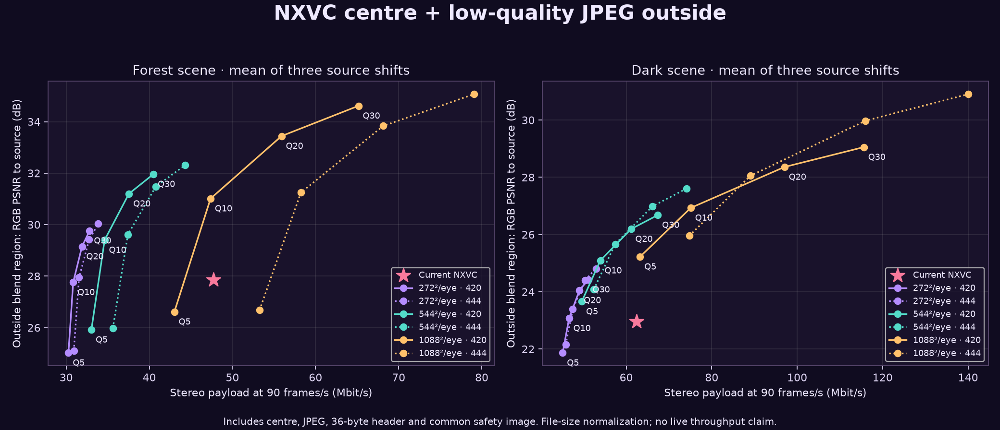
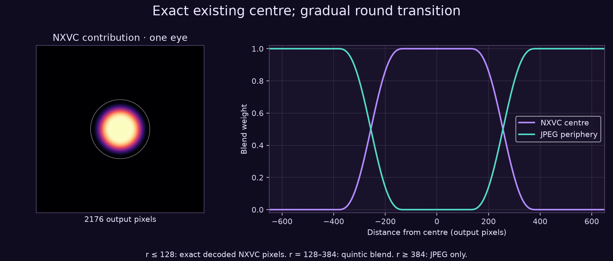
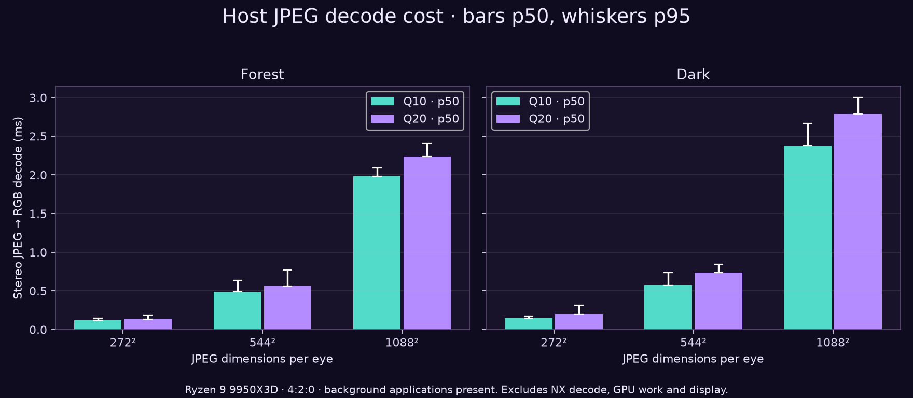

# NXVC centre, low-quality JPEG periphery

**Disposition: rejected for active use after the user's headset quality
verdict.** The active profile is pre-JPEG NXVC with standard foveation. This
directory remains a historical record; its offline Q20 preference does not
override that verdict.

**29 September 2026 — offline study.** The Q20 variant was subsequently
[integrated and checked live on Pico](live/README.md). That run delivered
**59.4 fresh frames/s**, so the hybrid is still experimental rather than the
90 FPS default.

A later [native-source 1088²/eye, no-foveation Pico test](native-1088/README.md)
shows the quality-first variant and a headset screenshot. It retains the most
recent JPEG for at most two frames to prevent sharp/soft flashing.

The hypothesis is useful on these two scenes: retain the existing NXVC centre,
then replace coarse outer tiles with a finer image compressed at low JPEG
quality. At **544×544 pixels per eye, JPEG Q10, 4:2:0**, total codec payload fell
**13.6–27.5%**, while outer-image RGB error decreased. The current NX-decoded
centre remains pixel-identical inside a round radius of 128 output pixels.

The acceptance criterion is **better-looking outer detail than the current
low-resolution outer image**, not freedom from JPEG artifacts. In local visual
inspection, Q10 retained more readable outer signs and more recognizable
silhouettes. It also flattened dark texture and produced visible quantization
blocks. Q20 preserved more texture. These are image observations, not a headset
quality verdict; the private comparisons remain available locally.

## Measured candidates

Means of three source shifts per scene, including compressed safety image.
All rates are `complete codec bytes × 8 × 90`, **not measured Wi-Fi throughput**.
The existing NXVC **500 Mbit/s setting is a quality budget**, not actual traffic
on these saved images.

| Representation | Forest Mbit/s | Dark Mbit/s | Outer RGB PSNR, forest / dark |
|---|---:|---:|---:|
| Existing independent NXVC frame | 47.75 | 62.43 | 27.86 / 22.97 dB |
| NXVC centre + JPEG 272²/eye, Q20, 4:2:0 | 31.90 | 49.05 | 29.15 / 24.05 dB |
| **NXVC centre + JPEG 544²/eye, Q10, 4:2:0** | **34.62** | **53.92** | **29.40 / 25.09 dB** |
| NXVC centre + JPEG 544²/eye, Q20, 4:2:0 | 37.55 | 61.12 | 31.20 / 26.19 dB |
| NXVC centre + JPEG 1088²/eye, Q10, 4:2:0 | 47.37 | 75.10 | 31.01 / 26.93 dB |

PSNR is measured against a source-derived RGB image **outside radius 384**,
where the hybrid uses JPEG alone. It does not measure centre quality or prove
subjective equivalence. Quality inside the transition can also change.

## What is actually sent

The centre branch remains an ordinary sparse NXDF representation. It retains
all original tiles intersecting the radius-384 disk, writes inline black for
unused outer descriptors, repacks offsets, and uses the existing independent
LZ4/Zstd selection gates. Both eyes retain 984 tiles in total. The resulting
centre envelope averages **29,507 bytes** for forest and **48,347 bytes** for
dark. The original decoded NX samples are restored exactly throughout the
blend region before compositing.

The JPEG branch comes from the original scene, not from the already-blocky NX
reconstruction. It contains both reduced-resolution eyes. Its redundant centre
is deliberately still encoded and fully counted. Q10 at 544²/eye averages
**8,000 / 15,172 JPEG bytes** for forest / dark. A 36-byte study header and the
unchanged compressed safety companion are also counted. Both eyes are encoded;
identical input eyes can favour ordinary LZ4/Zstd compression. No explicit
one-eye transmission or inter-frame reuse is modeled.

Presentation in the reference reconstruction uses:

- Radius **0–128**: unchanged decoded NXVC pixels.
- Radius **128–384**: a continuous quintic blend from NXVC to JPEG.
- Radius **384 onward**: the JPEG image, bilinearly sampled.

This does **not** enlarge the source-perfect native core: the existing NXVC
centre already has its own native-to-compressed falloff. “Unchanged centre”
means equality to the current NXVC output. There is no extra motion blur.

## Host cost and the remaining headset question

Native libjpeg-turbo 3.2.0, Ryzen 9 9950X3D; 12 warmups plus 24 measured samples
per job. Each timed call decodes one stereo JPEG containing both eyes into
preallocated RGB; output checks are outside the timer. Background game/desktop applications were present;
this was not an isolated machine. The process snapshots in the method file are
`ps` average CPU figures, not a sampled utilization trace.

| JPEG dimensions per eye | Forest stereo p50 / p95 | Dark stereo p50 / p95 |
|---|---:|---:|
| 272², Q10, 4:2:0 | 0.120 / 0.150 ms | 0.146 / 0.174 ms |
| **544², Q10, 4:2:0** | **0.489 / 0.634 ms** | **0.577 / 0.739 ms** |
| 544², Q20, 4:2:0 | 0.560 / 0.769 ms | 0.737 / 0.842 ms |
| 1088², Q10, 4:2:0 | 1.985 / 2.093 ms | 2.376 / 2.666 ms |

The separate centre-envelope helper takes about **0.128–0.152 ms p50** across
these six fixtures. It restores NXDF bytes, not an RGB framebuffer. Its timings
must not be added to JPEG percentiles and described as a measured full pipeline.

544² per eye produces **591,872 decoded JPEG pixels**, or **1,775,616 RGB bytes**
per stereo frame. Low JPEG quality reduces transmitted bytes; it does not reduce
that output-buffer size. The existing sparse NX frame also remains 481,008 raw
bytes before envelope compression. Pico JPEG decode and an independent offscreen
Vulkan upload/sample test are now reported [separately](pico-check/README.md).
No integrated compositor, networking, fresh-frame rate or photon latency was
measured here.

**Historical offline decision (superseded):** Q20 at 544²/eye was preferred
after side-by-side review; Q10 was the bandwidth fallback. Q20 saves **21.4%**
on forest and **2.1%** on dark against the current independent NXVC frames.
Standalone JPEG decode on the Pico is **1.31–1.51 ms p50** to stereo RGBA at Q20.
A separate offscreen Vulkan helper measures **0.203 ms p50** for both image
uploads and **1.092 ms p50** for a bilinear draw to full-size targets; these
timings are not additive proof of live frame latency. [Device results, method and
graphs](pico-check/README.md). The proposed next step was to transport the
peripheral JPEG beside the NXVC centre and sample it in the existing
presentation pass. This result supported that bounded
prototype; it did not justify replacing the default live path. The later
[opt-in live check](live/README.md) uses a different decoder and JPEG input.

## Method and validation

Two supplied 1920×1080 screenshots were regenerated with
`image.resize((2160,2160), Image.Resampling.LANCZOS).convert('RGBA')`.
Their raw hashes match the earlier production-fixture manifest. Each is tested
with horizontal source shifts 0, 8 and 16 pixels, applied before foveation, and
with duplicated eyes. These are six independent captures, not a motion video.

The outer reference uses the production shader's floored 2160-to-2176 coordinate
mapping. It omits the old lossy NV12 colour prefilter; JPEG receives original
RGB, while the existing NX periphery includes that earlier colour conversion.
Thus the comparison measures the two complete representations, not a controlled
comparison of only their entropy coders. JPEG downsampling uses Lanczos;
reconstruction uses independent per-eye bilinear sampling. The eye image is
2176×2176 throughout.

144 variants cover three JPEG sizes, Q5/10/20/30 and 4:2:0/4:4:4. All preserve
the decoded NX centre. Six sparse-frame reconstructions pass exact pixel checks
through radius 384 in both eyes; all selected envelopes restore their raw NXDF
bytes. Serialized component lengths and bytes are checked, including rejection
of truncated/trailing data. The 48 native JPEG timing jobs provide 1,728 rows;
`exact=1` in those timing rows means stable repeated decoder output, **not
lossless JPEG**. C++ centre helper passes `-Wall -Wextra -Werror`.

Source pictures, JPEGs, PPMs and example hybrid packets remain private. Public
artifacts contain scripts, hashes, measurements and numeric diagrams only.
The server stayed stopped during this offline study; the later live check is
reported separately.

- [Quality and byte counts](quality.csv), [source hashes](fixtures.json), [method](method.json), [checks](validation.json)
- [NX centre measurements](nx-centre-summary.json), [raw NX timings](nx-centre-samples.csv)
- [JPEG timings](jpeg-decode-summary.csv), [raw JPEG samples](jpeg-decode-samples.csv), [timing method](jpeg-timing-method.json)
- [Reproduction instructions](harness/README.md), [comparison harness](harness/compare.py), [plot generator](plot.py)
- [Previous JPEG experiment](../mjpeg-vs-nxvc/README.md): recompressing existing NX pixels, a different question
